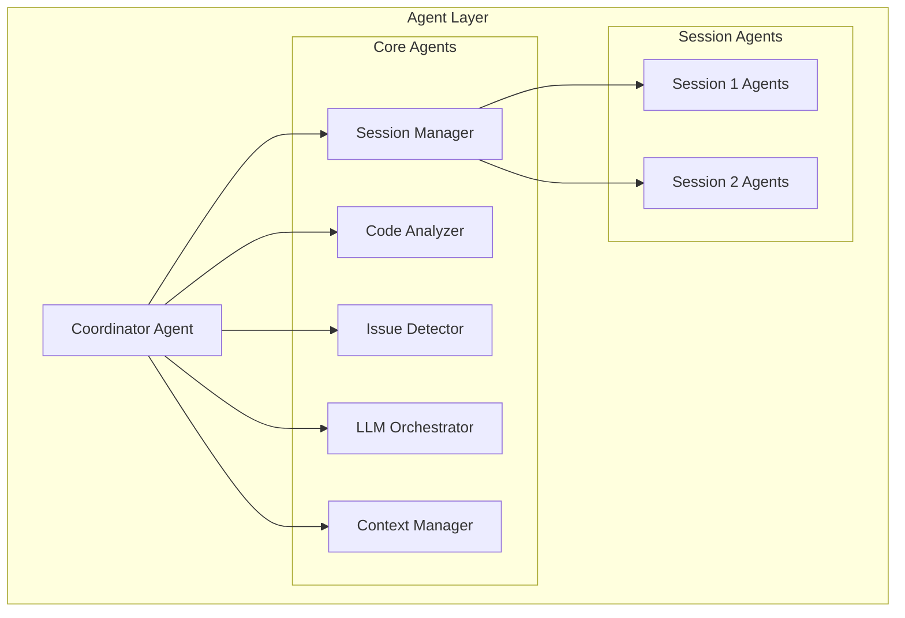
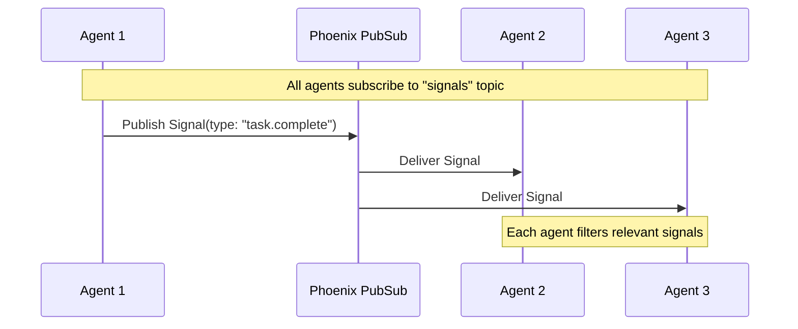
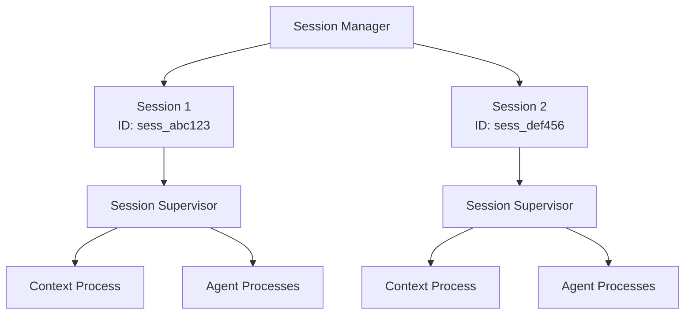
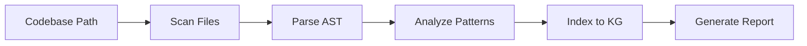
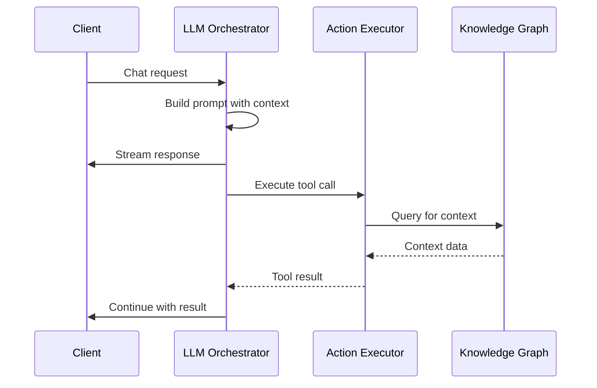
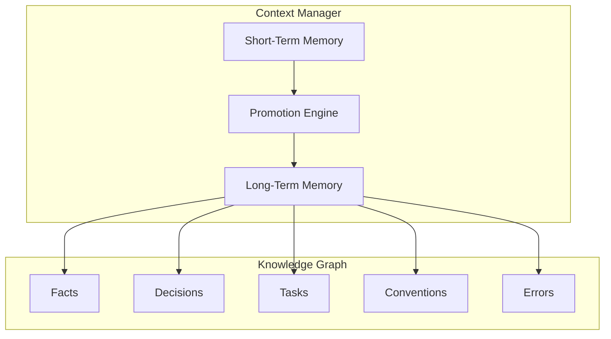
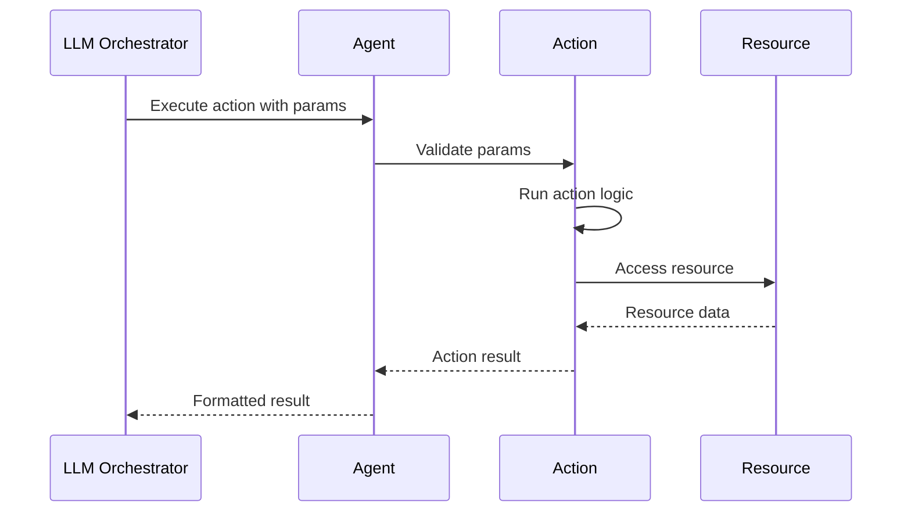
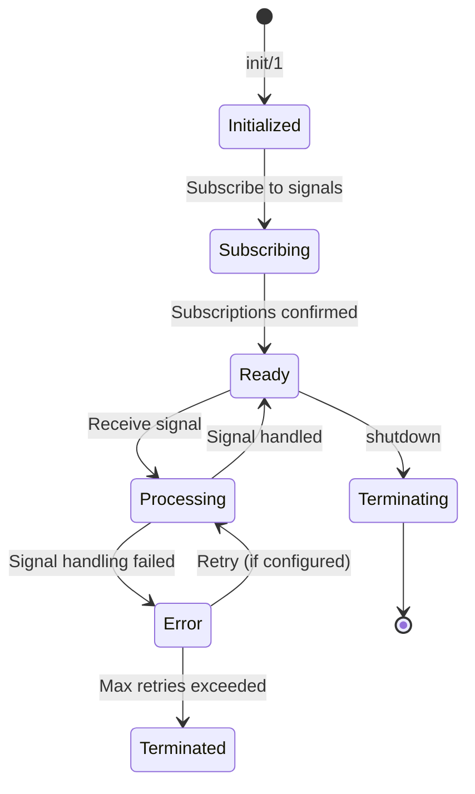

# Agent Layer Guide

## Table of Contents
- [Introduction](#introduction)
- [Agent Architecture](#agent-architecture)
- [Core Agents](#core-agents)
- [Actions](#actions)
- [Skills](#skills)
- [Agent Lifecycle](#agent-lifecycle)
- [Implementing Custom Agents](#implementing-custom-agents)
- [Testing Agents](#testing-agents)

## Introduction

The Agent Layer is the intelligence core of Jidoka. This guide covers the architecture and implementation of agents, actions, and skills - the fundamental building blocks of the Jido framework that powers Jidoka's agentic capabilities.

## Agent Architecture

### What is an Agent?

An **agent** in Jidoka is a GenServer-based process that:
- Has specific capabilities and responsibilities
- Communicates via signals (CloudEvents messages)
- Can execute actions (discrete units of work)
- Maintains its own state and lifecycle
- Can be supervised and restarted independently

### Agent Hierarchy



### Agent Communication Model

Agents use a publish-subscribe pattern via Phoenix PubSub:



### Base Agent Implementation

All agents extend the `Jidoka.Agent` behavior:

```elixir
defmodule Jidoka.Agent do
  @moduledoc """
  Base agent behavior for all Jidoka agents.

  Provides common functionality for signal handling,
  action execution, and state management.
  """

  @callback init(term()) :: {:ok, state()} | {:ok, state(), timeout()}
  @callback handle_signal(Jidoka.Signal.t(), state()) ::
    {:noreply, state()} | {:reply, reply(), state()}

  defmacro __using__(opts) do
    quote do
      use GenServer
      require Logger

      @behaviour Jidoka.Agent

      # Default implementations
      def start_link(init_arg) do
        GenServer.start_link(__MODULE__, init_arg, name: __MODULE__)
      end

      @impl true
      def init(init_arg) do
        # Subscribe to signals
        Phoenix.PubSub.subscribe(Jidoka.PubSub, "signals")
        {:ok, init_arg}
      end

      @impl true
      def handle_info(%Jidoka.Signal{} = signal, state) do
        handle_signal(signal, state)
      end

      # Override this in your agent
      def handle_signal(_signal, state) do
        {:noreply, state}
      end

      defoverridable(handle_signal: 2)
    end
  end
end
```

## Core Agents

### Coordinator Agent

**Module:** `Jidoka.Agents.Coordinator`

The central hub of the agent system. Responsibilities:
- Route signals between agents
- Broadcast events to clients
- Manage agent lifecycle
- Orchestrate multi-agent workflows

**Signal Handling:**
```elixir
defmodule Jidoka.Agents.Coordinator do
  use Jidoka.Agent

  @impl true
  def handle_signal(%Jidoka.Signal{type: "user.request"} = signal, state) do
    # Route to appropriate agent based on request type
    route_request(signal)
    {:noreply, state}
  end

  defp route_request(%{data: %{"type" => "analyze"}} = signal) do
    # Dispatch to Code Analyzer
    Jidoka.Agents.CodeAnalyzer.analyze(signal.data)
  end

  defp route_request(%{data: %{"type" => "chat"}} = signal) do
    # Dispatch to LLM Orchestrator
    Jidoka.Agents.LLMOrchestrator.chat(signal.data)
  end
end
```

### Session Manager

**Module:** `Jidoka.Agents.SessionManager`

Manages isolated work sessions:
- Creates session supervisors
- Tracks active sessions
- Handles session lifecycle
- Isolates session state

**Session Structure:**


**Creating a Session:**
```elixir
def create_session(user_id, metadata \\ %{}) do
  session_id = generate_session_id()

  # Create session-specific supervisor
  {:ok, _sup} = DynamicSupervisor.start_child(
    Jidoka.SessionSupervisor,
    {Jidoka.Session.Supervisor, session_id: session_id, user_id: user_id}
  )

  # Initialize session context
  {:ok, _ctx} = Jidoka.Session.Context.start_link(session_id)

  {:ok, session_id}
end
```

### Code Analyzer

**Module:** `Jidoka.Agents.CodeAnalyzer`

Analyzes codebases for structure, patterns, and metrics:
- Dependency analysis
- Code pattern detection
- Complexity metrics
- Architecture understanding

**Analysis Workflow:**


**Signal Interface:**
```elixir
# Request analysis
publish_signal(%Jidoka.Signal{
  type: "code.analyze.request",
  source: "client",
  data: %{
    "path" => "/path/to/project",
    "depth" => "full"
  }
})

# Receive results
subscribe_to("code.analyze.result")
```

### Issue Detector

**Module:** `Jidoka.Agents.IssueDetector`

Identifies code issues and potential problems:
- Code smells detection
- Security vulnerabilities
- Performance issues
- Anti-pattern detection

**Issue Categories:**
```elixir
defmodule Jidoka.Agents.IssueDetector do
  @issue_types [
    :code_smell,
    :security,
    :performance,
    :maintainability,
    :error_prone,
    :duplication,
    :unused_code
  ]

  def detect_issues(codebase_path, opts \\ []) do
    issues_types = Keyword.get(opts, :types, @issue_types)

    codebase_path
    |> scan_files()
    |> Enum.flat_map(&analyze_file/1)
    |> Enum.filter(fn issue -> issue.type in issues_types end)
  end
end
```

### LLM Orchestrator

**Module:** `Jidoka.Agents.LLMOrchestrator`

Manages LLM interactions:
- Prompt construction
- Tool calling
- Response streaming
- Context management

**Tool Calling Flow:**


### Context Manager

**Module:** `Jidoka.Agents.ContextManager`

Manages the two-tier memory system:
- Short-term memory (in-process)
- Long-term memory (triple store)
- Memory promotion
- Context retrieval

**Memory Architecture:**


## Actions

### What is an Action?

An **action** is a discrete unit of work that:
- Has defined input/output schemas
- Can be executed by agents
- Is exposed to LLMs as tools
- Returns structured results

### Action Definition

```elixir
defmodule Jidoka.Actions.ReadFile do
  @moduledoc """
  Action to read a file from the filesystem.

  Exposed to LLMs as a tool for file reading operations.
  """

  use Jido.Action,
    schema: %{
      "path" => %{
        type: :string,
        description: "The file path to read",
        required: true
      }
    }

  @impl true
  def run(params, context) do
    path = Map.get(params, "path")

    case File.read(path) do
      {:ok, content} ->
        {:ok, %{"content" => content, "path" => path}}

      {:error, reason} ->
        {:error, "Failed to read file: #{inspect(reason)}"}
    end
  end
end
```

### Action Categories

| Category | Description | Examples |
|----------|-------------|----------|
| **File Operations** | Read, write, search files | `ReadFile`, `WriteFile`, `SearchFiles` |
| **Code Operations** | Analyze, modify code | `AnalyzeCode`, `RefactorCode` |
| **Knowledge Queries** | Query knowledge graph | `QueryKnowledge`, `FindDefinitions` |
| **System Operations** | System-level tasks | `RunCommand`, `ListProcesses` |
| **Communication** | Send messages, notifications | `SendMessage`, `NotifyUser` |

### Action Execution



## Skills

### What is a Skill?

A **skill** bundles related actions with:
- Routing logic
- State management
- Action composition
- Reusable workflows

### Skill Definition

```elixir
defmodule Jidoka.Skills.CodeEditor do
  @moduledoc """
  Skill for code editing operations.

  Bundles file operations with code-specific routing and validation.
  """

  use Jido.Skill,
    actions: [
      Jidoka.Actions.ReadFile,
      Jidoka.Actions.WriteFile,
      Jidoka.Actions.SearchCode,
      Jidoka.Actions.AnalyzeCode
    ]

  def route(%{"action" => "read"} = request, context) do
    Jidoka.Actions.ReadFile.run(request, context)
  end

  def route(%{"action" => "write"} = request, context) do
    # Validate write permissions
    if authorized?(context) do
      Jidoka.Actions.WriteFile.run(request, context)
    else
      {:error, :unauthorized}
    end
  end

  defp authorized?(context) do
    # Authorization logic
    true
  end
end
```

## Agent Lifecycle

### Startup Sequence



### Lifecycle Callbacks

```elixir
defmodule Jidoka.Agents.Example do
  use GenServer

  # 1. Called when the agent starts
  @impl true
  def init(_init_arg) do
    Logger.info("Agent starting")
    {:ok, initial_state()}
  end

  # 2. Called for each signal/message
  @impl true
  def handle_info(%Jidoka.Signal{} = signal, state) do
    Logger.debug("Processing signal: #{signal.type}")
    new_state = process_signal(signal, state)
    {:noreply, new_state}
  end

  # 3. Called for synchronous calls
  @impl true
  def handle_call(:get_status, _from, state) do
    {:reply, {:ok, state.status}, state}
  end

  # 4. Called for asynchronous casts
  @impl true
  def handle_cast({:update_config, config}, state) do
    {:noreply, %{state | config: config}}
  end

  # 5. Called when the agent is terminating
  @impl true
  def terminate(reason, _state) do
    Logger.info("Agent terminating: #{inspect(reason)}")
    :ok
  end
end
```

## Implementing Custom Agents

### Agent Template

```elixir
defmodule Jidoka.Agents.CustomAgent do
  @moduledoc """
  Custom agent implementation template.

  Implement the required callbacks to create a functional agent.
  """

  use GenServer
  require Logger

  # Client API

  def start_link(opts) do
    GenServer.start_link(__MODULE__, opts, name: __MODULE__)
  end

  def get_state do
    GenServer.call(__MODULE__, :get_state)
  end

  def send_command(command, params) do
    GenServer.cast(__MODULE__, {:command, command, params})
  end

  # Server Callbacks

  @impl true
  def init(opts) do
    # Subscribe to relevant signals
    Phoenix.PubSub.subscribe(Jidoka.PubSub, "signals")

    # Initialize state
    state = %{
      id: Keyword.get(opts, :id, make_ref()),
      config: Keyword.get(opts, :config, %{}),
      status: :initialized
    }

    Logger.info("#{__MODULE__} started: #{inspect(state.id)}")
    {:ok, state}
  end

  @impl true
  def handle_call(:get_state, _from, state) do
    {:reply, state, state}
  end

  @impl true
  def handle_cast({:command, command, params}, state) do
    new_state = handle_command(command, params, state)
    {:noreply, new_state}
  end

  @impl true
  def handle_info(%Jidoka.Signal{} = signal, state) do
    new_state = handle_signal(signal, state)
    {:noreply, new_state}
  end

  @impl true
  def handle_info(msg, state) do
    Logger.debug("Unhandled message: #{inspect(msg)}")
    {:noreply, state}
  end

  @impl true
  def terminate(reason, state) do
    Logger.info("#{__MODULE__} terminating: #{inspect(reason)}")
    :ok
  end

  # Private Helpers

  defp initial_state, do: %{}

  defp handle_command(command, params, state) do
    # Implement command handling logic
    state
  end

  defp handle_signal(%Jidoka.Signal{type: type} = signal, state) do
    # Implement signal handling logic
    Logger.debug("Handling signal: #{type}")
    state
  end
end
```

### Registering Custom Agents

Add your agent to the supervisor:

```elixir
# In lib/jidoka/application.ex
defmodule Jidoka.Application do
  use Application

  def start(_type, _args) do
    children = [
      # ... other children ...
      {Jidoka.Agents.CustomAgent, [id: :custom_1, config: %{}]}
    ]

    opts = [strategy: :one_for_one, name: Jidoka.Supervisor]
    Supervisor.start_link(children, opts)
  end
end
```

## Testing Agents

### Unit Tests

```elixir
defmodule Jidoka.Agents.CustomAgentTest do
  use ExUnit.Case, async: true

  import Mox

  setup do
    # Start the agent for testing
    {:ok, pid} = start_supervised!(Jidoka.Agents.CustomAgent)
    %{pid: pid}
  end

  describe "handle_signal/2" do
    test "processes valid signals", %{pid: pid} do
      signal = %Jidoka.Signal{
        type: "test.signal",
        data: %{"key" => "value"}
      }

      # Send signal to agent
      send(pid, signal)

      # Assert expected behavior
      assert :sys.get_state(pid).status == :processed
    end
  end

  describe "commands" do
    test "executes commands successfully" do
      assert :ok = Jidoka.Agents.CustomAgent.send_command(:test_cmd, %{})
      # Verify state changes
    end
  end
end
```

### Integration Tests

```elixir
defmodule Jidoka.AgentIntegrationTest do
  use ExUnit.Case

  setup do
    # Start the entire supervision tree for testing
    start_supervised!(Jidoka.Application)
    :ok
  end

  describe "agent communication" do
    test "agents can communicate via signals" do
      # Publish a signal
      Jidoka.Signals.publish(%Jidoka.Signal{
        type: "test.request",
        source: "test",
        data: %{"message" => "hello"}
      })

      # Assert that the signal was received and processed
      assert_receive %Jidoka.Signal{type: "test.response"}, 1000
    end
  end
end
```

## See Also

- **[Architecture Guide](architecture.md)** - Overall system architecture
- **[Signals Guide](signals.md)** - Signal-based communication
- **[Memory System Guide](memory-system.md)** - Context and memory management
