# Jidoka Architecture Guide

## Table of Contents
- [Introduction](#introduction)
- [Architectural Principles](#architectural-principles)
- [System Layers](#system-layers)
- [Component Overview](#component-overview)
- [Design Patterns](#design-patterns)
- [Communication Flow](#communication-flow)
- [Supervision Tree](#supervision-tree)
- [Deployment Patterns](#deployment-patterns)

## Introduction

This guide provides a comprehensive deep-dive into the Jidoka system architecture. It covers the design principles, component relationships, communication patterns, and structural decisions that make Jidoka a robust, scalable agentic coding assistant core.

## Architectural Principles

### 1. Headless Design

Jidoka is designed as a **headless core** - it has no built-in user interface. All UI is provided by pluggable clients that connect via the Client API.

**Benefits:**
- Core functionality remains stable regardless of UI changes
- Multiple clients can connect simultaneously
- UI can be developed independently of core logic
- Easy to test and validate core functionality

### 2. Process Isolation

Each agent and service runs as an independent BEAM process:

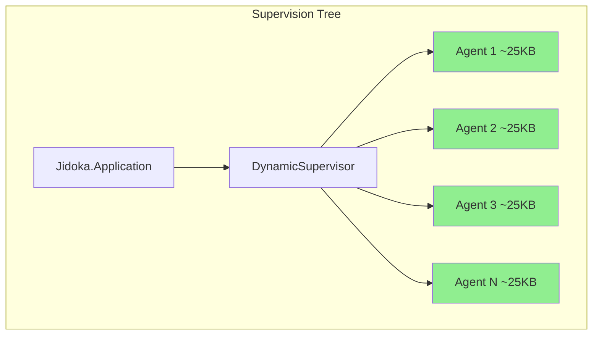

**Benefits:**
- Fault containment - failures don't cascade
- Independent scaling
- Hot code upgrades per process
- Predictable resource usage

### 3. Signal-Based Communication

All inter-process communication uses **signals** (CloudEvents-compliant messages) via Phoenix PubSub:

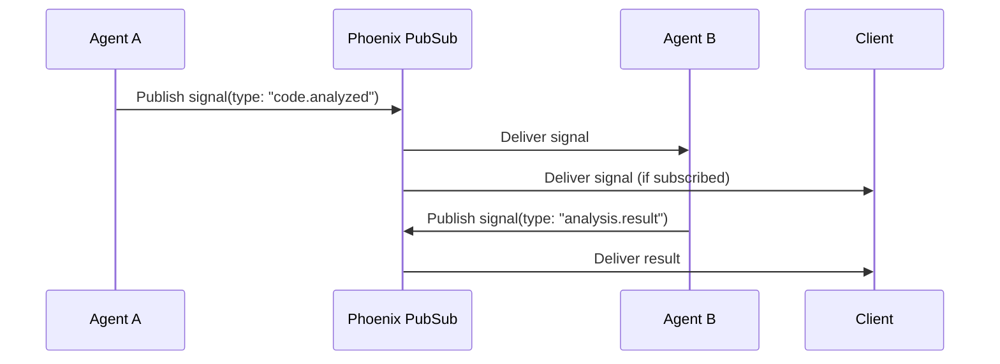

### 4. Semantic Memory

Knowledge is stored as RDF triples with SPARQL query capabilities, enabling:
- Semantic relationships between concepts
- Complex queries across knowledge domains
- Inference and reasoning capabilities

### 5. Client-Agnostic API

All clients communicate through the same well-defined PubSub event API:
- No client-specific logic in core
- Uniform event structure
- Easy client development

## System Layers

Jidoka is organized into four distinct layers:

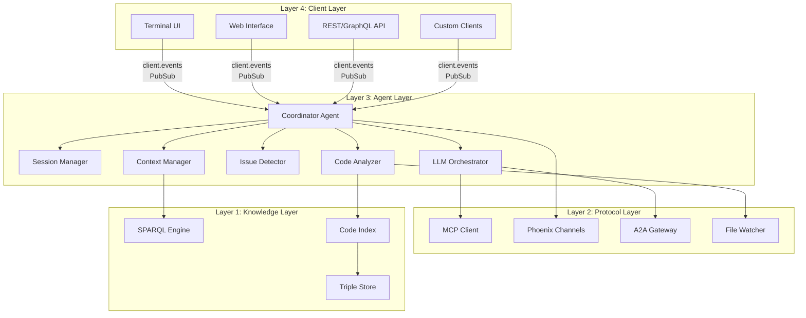

### Layer 1: Knowledge Layer

The foundation of the system - handles all persistent storage and semantic understanding.

**Components:**
- **Triple Store** - RDF triple storage (SPARQL endpoint)
- **SPARQL Engine** - Query engine for semantic data
- **Code Index** - Indexed representation of code structure

**Responsibilities:**
- Persistent knowledge storage
- Semantic querying
- Code relationship understanding

### Layer 2: Protocol Layer

Handles all external integrations and communication protocols.

**Components:**
- **MCP Client** - Model Context Protocol for tool integration
- **Phoenix Channels** - Real-time bidirectional communication
- **A2A Gateway** - Agent-to-Agent cross-framework communication
- **File Watcher** - File system change detection

**Responsibilities:**
- External tool integration
- Real-time communication
- File system monitoring
- Cross-framework messaging

### Layer 3: Agent Layer

The intelligence core - contains all agent logic and orchestration.

**Components:**
- **Coordinator Agent** - Central hub for inter-agent communication
- **Session Manager** - Multi-session isolation and management
- **Code Analyzer** - Codebase structure and pattern analysis
- **Issue Detector** - Code issue identification
- **LLM Orchestrator** - LLM interaction and tool calling
- **Context Manager** - Memory and context handling

**Responsibilities:**
- Task execution
- Agent coordination
- Context management
- LLM interaction

### Layer 4: Client Layer

Pluggable UI layer - all clients are optional.

**Client Types:**
- **Terminal UI** - Command-line interface
- **Web Interface** - Browser-based UI
- **API** - REST/GraphQL for integrations
- **Custom** - Any client implementation

## Component Overview

### Core Application

**Module:** `Jidoka.Application`

The root of the supervision tree. Starts and supervises all core services.

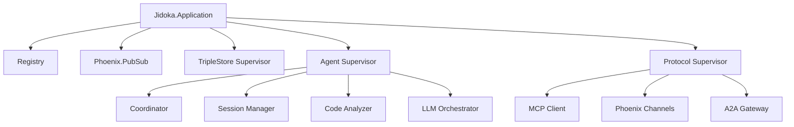

### Coordinator Agent

**Module:** `Jidoka.Agents.Coordinator`

The central hub that:
- Routes signals between agents
- Broadcasts events to clients
- Manages agent lifecycle
- Handles session orchestration

**Signal Flow:**
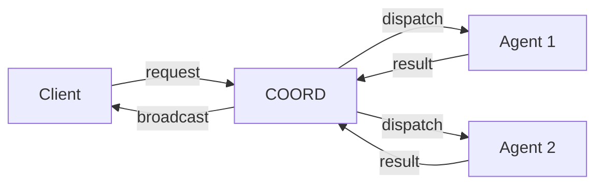

### Session Manager

**Module:** `Jidoka.Agents.SessionManager`

Manages isolated work sessions:
- Creates session supervisors
- Tracks active sessions
- Handles session lifecycle
- Isolates session state

**Session Structure:**
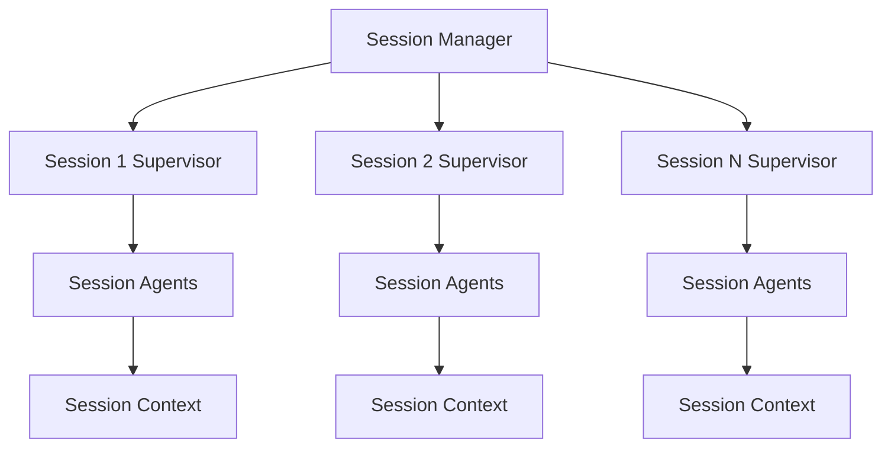

### Code Analyzer

**Module:** `Jidoka.Agents.CodeAnalyzer`

Analyzes codebases for:
- Structure and organization
- Dependency relationships
- Code patterns
- Metrics and complexity

### LLM Orchestrator

**Module:** `Jidoka.Agents.LLMOrchestrator`

Manages LLM interactions:
- Prompt construction
- Tool calling
- Response streaming
- Context management

### Context Manager

**Module:** `Jidoka.Agents.ContextManager`

Handles the two-tier memory system:
- Short-term memory (conversation buffers)
- Long-term memory (triple store)
- Memory promotion
- Context retrieval

## Design Patterns

### Supervisor Pattern

Every component has a supervisor with appropriate restart strategies:

```elixir
# Example from the codebase
defmodule Jidoka.Agents.Supervisor do
  use Supervisor

  def start_link(init_arg) do
    Supervisor.start_link(__MODULE__, init_arg, name: __MODULE__)
  end

  @impl true
  def init(_init_arg) do
    children = [
      {Jidoka.Agents.Coordinator, []},
      {Jidoka.Agents.SessionManager, []},
      {Jidoka.Agents.CodeAnalyzer, []},
      {Jidoka.Agents.LLMOrchestrator, []},
      {Jidoka.Agents.ContextManager, []}
    ]

    # one_for_one - if one child crashes, only that child is restarted
    Supervisor.init(children, strategy: :one_for_one)
  end
end
```

### GenServer Pattern

All agents implement the GenServer behavior:

```elixir
defmodule Jidoka.Agents.ExampleAgent do
  use GenServer
  require Jidoka.Signals

  @impl true
  def init(_init_arg) do
    # Subscribe to relevant signals
    Phoenix.PubSub.subscribe(Jidoka.PubSub, "signals")
    {:ok, %{}}
  end

  @impl true
  def handle_info(%Jidoka.Signal{} = signal, state) do
    # Process signal
    {:noreply, state}
  end
end
```

### Signal-Subscription Pattern

Agents subscribe to specific signal types:

```elixir
# Subscribe to specific signal types
defp subscribe_to_signals do
  Phoenix.PubSub.subscribe(Jidoka.PubSub, "signals")
end

# Filter signals in handle_info
@impl true
def handle_info(%Jidoka.Signal{type: "code.analyzed"} = signal, state) do
  handle_code_analyzed(signal)
  {:noreply, state}
end

@impl true
def handle_info(%Jidoka.Signal{}, state) do
  # Ignore unhandled signals
  {:noreply, state}
end
```

### Registry Pattern

Process registration for discovery and messaging:

```elixir
# Register process
Registry.register(Jidoka.Registry, {:agent, :coordinator}, pid)

# Lookup process
case Registry.lookup(Jidoka.Registry, {:agent, :coordinator}) do
  [{pid, _}] -> GenServer.call(pid, :status)
  [] -> {:error, :not_found}
end
```

## Communication Flow

### Request Flow

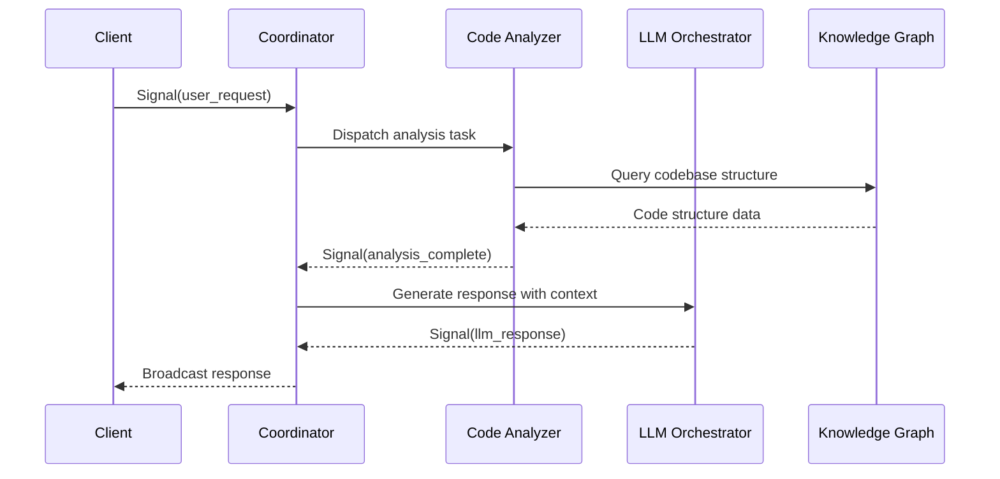

### Event Broadcasting

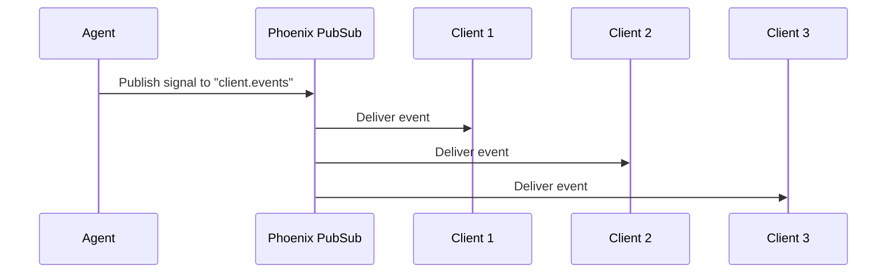

## Supervision Tree

The complete supervision tree of a running Jidoka system:

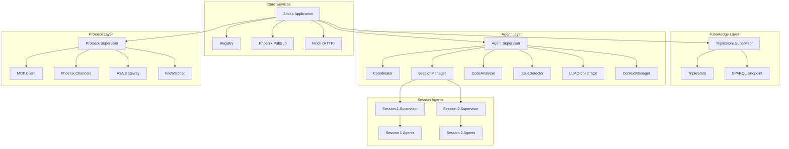

## Deployment Patterns

### Single Node Deployment

For development and small deployments:

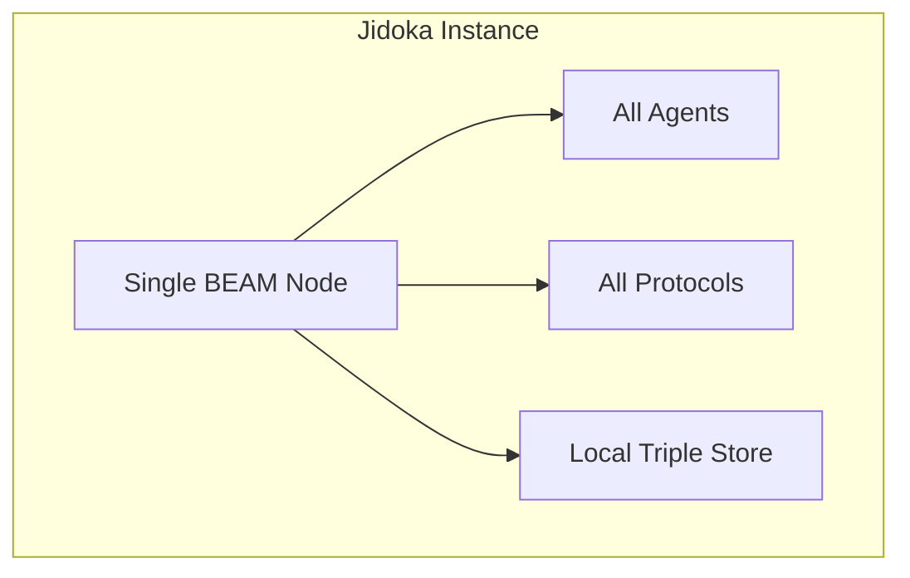

### Distributed Deployment

For production and scaling:

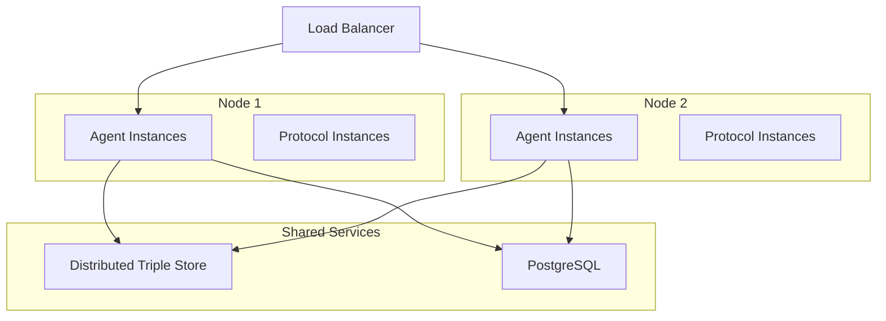

### Horizontal Scaling

Agents can be scaled independently:

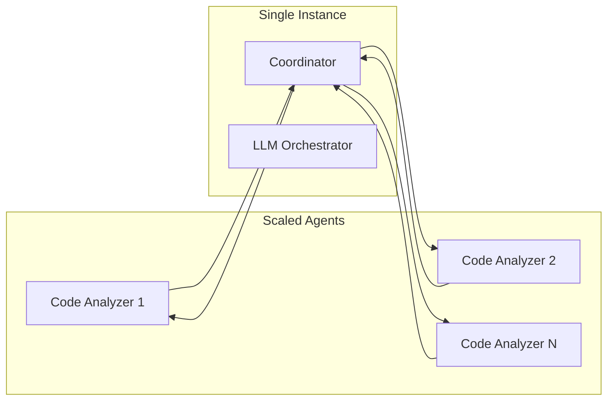

## See Also

- **[Agent Layer](agent-layer.md)** - Deep dive into agent implementation
- **[Protocol Layer](protocol-layer.md)** - Protocol integration details
- **[Signals](signals.md)** - Signal-based communication system
- **[Memory System](memory-system.md)** - Knowledge graph architecture
