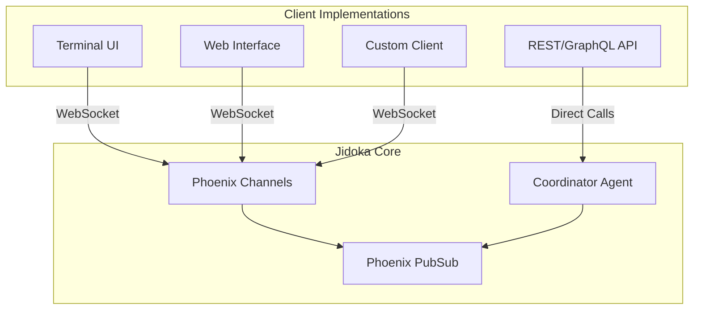
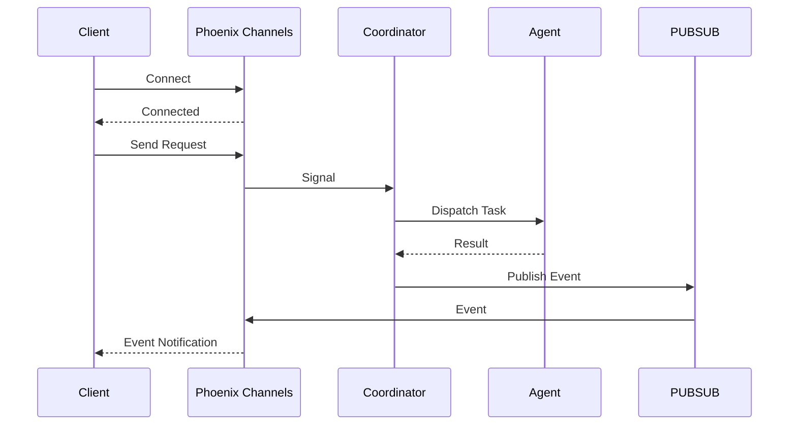
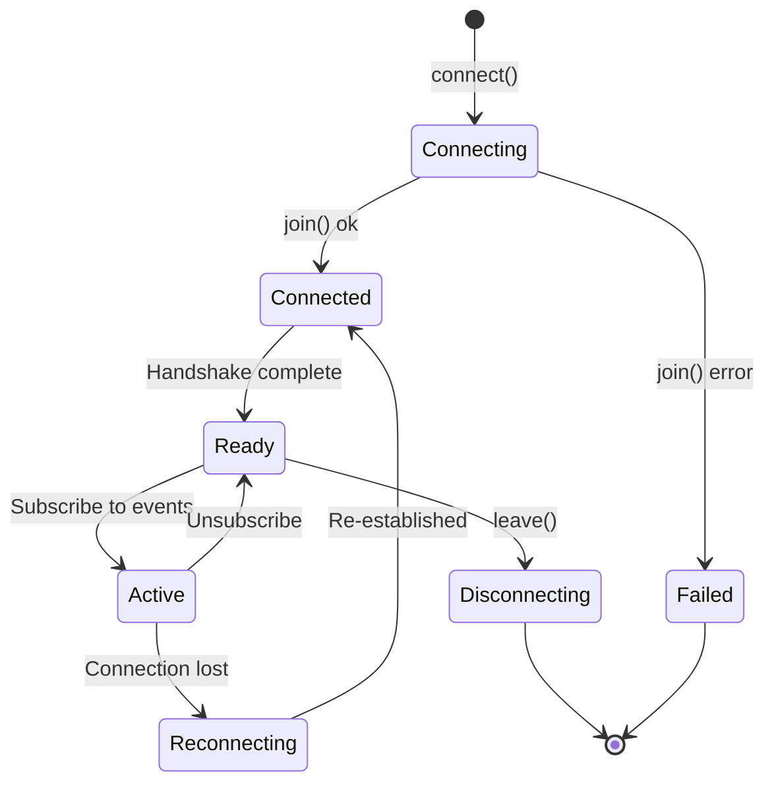
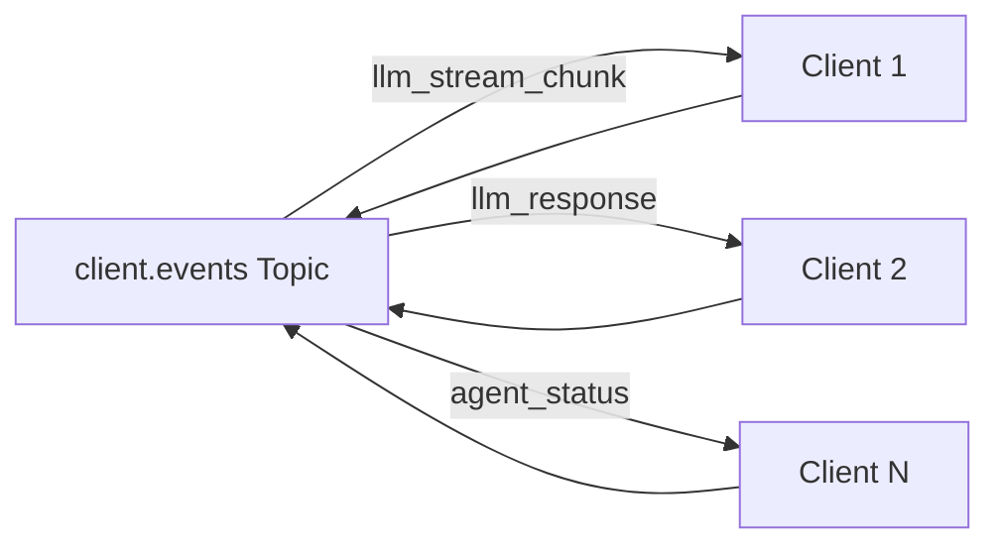
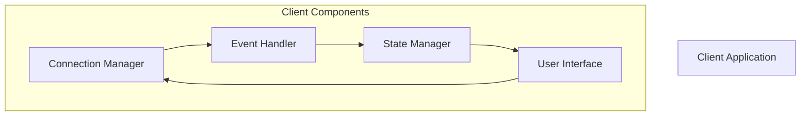

# Client API Guide

## Table of Contents
- [Introduction](#introduction)
- [Client Architecture](#client-architecture)
- [Connection Protocol](#connection-protocol)
- [Event API](#event-api)
- [Command API](#command-api)
- [Building Clients](#building-clients)
- [Client Examples](#client-examples)

## Introduction

The Client API provides a well-defined interface for building clients that connect to Jidoka. This guide covers the protocol, events, and patterns for implementing clients across different platforms.

## Client Architecture

### Client-Agnostic Design

Jidoka is designed as a **headless core** - it has no built-in user interface. All clients communicate through the same API:



### Communication Flow



## Connection Protocol

### WebSocket Connection

Clients connect via Phoenix Channels over WebSocket:

```javascript
// Example JavaScript client
import {Socket} from "phoenix";

const socket = new Socket("ws://localhost:4000/socket", {
  params: {client_id: generateClientId(), client_type: "web"}
});

socket.connect();

const channel = socket.channel("client:" + clientId, {});

channel.join()
  .receive("ok", (resp) => {
    console.log("Connected to Jidoka", resp);
  })
  .receive("error", (resp) => {
    console.error("Connection failed", resp);
  });
```

### Connection Parameters

| Parameter | Type | Required | Description |
|-----------|------|----------|-------------|
| `client_id` | string | Yes | Unique identifier for this client instance |
| `client_type` | string | Yes | Type of client (`tui`, `web`, `api`, `custom`) |
| `session_id` | string | No | Resume existing session |
| `capabilities` | array | No | Client capabilities (e.g., `["stream", "file-edit"]`) |

### Connection Lifecycle



### Elixir Client Example

```elixir
defmodule Jidoka.Client.Terminal do
  @moduledoc """
  Terminal client for Jidoka.
  """

  use GenServer
  require Logger

  def start_link(opts) do
    GenServer.start_link(__MODULE__, opts, name: __MODULE__)
  end

  @impl true
  def init(opts) do
    client_id = Keyword.get(opts, :client_id, generate_client_id())
    server_url = Keyword.fetch!(opts, :server_url)

    # Connect to Phoenix server
    {:ok, socket} = Phoenix.Socket.Client.start_link(
      url: server_url,
      params: %{client_id: client_id, client_type: "tui"}
    )

    # Join client channel
    Phoenix.Socket.Client.channel(socket, "client:#{client_id}",
      Jidoka.Client.TerminalChannel
    )

    {:ok, %{socket: socket, client_id: client_id}}
  end

  def send_request(type, data) do
    GenServer.call(__MODULE__, {:send_request, type, data})
  end

  @impl true
  def handle_call({:send_request, type, data}, _from, state) do
    Phoenix.Socket.Client.push(state.socket, "request", %{type: type, data: data})
    {:reply, :ok, state}
  end
end
```

## Event API

### Client Events Topic

All clients subscribe to the `"client.events"` Phoenix PubSub topic to receive:



### Event Types

#### `llm_stream_chunk`

Streaming LLM response chunks for real-time display.

```elixir
%{
  event: "llm_stream_chunk",
  data: %{
    "content" => "Hello, how can I",
    "session_id" => "sess_abc123",
    "chunk_index" => 1
  }
}
```

#### `llm_response`

Final LLM response when complete.

```elixir
%{
  event: "llm_response",
  data: %{
    "content" => "Full response here...",
    "session_id" => "sess_abc123",
    "model" => "claude-3-opus",
    "tokens_used" => 450
  }
}
```

#### `agent_status`

Agent lifecycle and status updates.

```elixir
%{
  event: "agent_status",
  data: %{
    "agent" => "code_analyzer",
    "status" => "working",
    "progress" => 0.5,
    "message" => "Analyzing lib/jidoka/"
  }
}
```

Status values: `idle`, `working`, `error`, `complete`

#### `analysis_complete`

Code analysis results.

```elixir
%{
  event: "analysis_complete",
  data: %{
    "summary" => %{
      "files" => 150,
      "modules" => 45,
      "functions" => 320
    },
    "issues" => [
      %{"type" => "warning", "message" => "Unused import", "file" => "..."}
    ]
  }
}
```

#### `tool_call`

Notification when an agent calls a tool.

```elixir
%{
  event: "tool_call",
  data: %{
    "tool" => "read_file",
    "agent" => "llm_orchestrator",
    "params" => %{"path" => "lib/jidoka.ex"}
  }
}
```

#### `tool_result`

Result of a tool execution.

```elixir
%{
  event: "tool_result",
  data: %{
    "tool" => "read_file",
    "result" => %{"content" => "defmodule Jidoka..."},
    "status" => "success"
  }
}
```

#### `error`

Error notifications.

```elixir
%{
  event: "error",
  data: %{
    "type" => "agent_error",
    "message" => "Failed to analyze file",
    "agent" => "code_analyzer",
    "details" => %{"file" => "nonexistent.ex"}
  }
}
```

### Event Subscription

```javascript
// Subscribe to all events
channel.on("event", (event) => {
  switch(event.type) {
    case "llm_stream_chunk":
      handleStreamChunk(event.data);
      break;
    case "llm_response":
      handleResponse(event.data);
      break;
    case "agent_status":
      handleAgentStatus(event.data);
      break;
    // ... handle other event types
  }
});

// Subscribe to specific event type
channel.on("llm_stream_chunk", (data) => {
  appendToTerminal(data.content);
});
```

## Command API

### Sending Commands

Clients send commands through the `"request"` channel event:

```elixir
%{
  event: "request",
  data: %{
    "type" => "chat",
    "params" => %{
      "message" => "Analyze this codebase"
    }
  }
}
```

### Command Types

#### `chat`

Send a message to the LLM.

```elixir
%{
  "type" => "chat",
  "params" => %{
    "message" => "How do I implement X?",
    "stream" => true
  }
}
```

#### `analyze`

Request codebase analysis.

```elixir
%{
  "type" => "analyze",
  "params" => %{
    "path" => "/path/to/project",
    "depth" => "full"
  }
}
```

#### `search`

Search the codebase.

```elixir
%{
  "type" => "search",
  "params" => %{
    "query" => "defmodule Jidoka",
    "file_pattern" "*.ex"
  }
}
```

#### `edit`

Edit a file.

```elixir
%{
  "type" => "edit",
  "params" => %{
    "path" => "lib/jidoka.ex",
    "edits" => [
      %{
        "old_string" => "old code",
        "new_string" => "new code"
      }
    ]
  }
}
```

#### `start_session`

Start a new session.

```elixir
%{
  "type" => "start_session",
  "params" => %{
    "project_path" => "/path/to/project",
    "session_type" => "coding"
  }
}
```

#### `end_session`

End the current session.

```elixir
%{
  "type" => "end_session",
  "params" => %{
    "session_id" => "sess_abc123",
    "save_context" => true
  }
}
```

## Building Clients

### Client Structure

A well-structured client follows this pattern:



### Minimal Client Implementation

```elixir
defmodule Jidoka.Client.Minimal do
  @moduledoc """
  Minimal Jidoka client implementation.
  """

  require Logger

  defstruct [:socket, :channel, :client_id, :handlers]

  def start(server_url \\ "ws://localhost:4000/socket") do
    client_id = UUID.uuid4()

    {:ok, socket} = Phoenix.Socket.Client.start_link(
      url: server_url,
      params: %{client_id: client_id, client_type: "minimal"}
    )

    Phoenix.Socket.Client.channel(socket, "client:#{client_id}",
      Jidoka.Client.MinimalChannel
    )

    %__MODULE__{
      socket: socket,
      client_id: client_id,
      handlers: %{}
    }
  end

  def send(client, type, params) do
    Phoenix.Socket.Client.push(client.socket, "request", %{
      type: type,
      params: params
    })
  end

  def on(client, event_type, callback) do
    %{client | handlers: Map.put(client.handlers, event_type, callback)}
  end

  def chat(client, message) do
    send(client, "chat", %{message: message, stream: true})
  end
end

defmodule Jidoka.Client.MinimalChannel do
  use Phoenix.Channel.Client

  def handle_event("event", payload, state) do
    # Forward to event handler
    {:noreply, state}
  end

  def handle_event("phx_reply", payload, state) do
    {:noreply, state}
  end
end
```

### Client State Management

```elixir
defmodule Jidoka.Client.State do
  @moduledoc """
  Client state management.
  """

  defstruct [
    :client_id,
    :session_id,
    :connection_status,
    :active_requests,
    :event_history,
    :ui_state
  ]

  def new(client_id) do
    %__MODULE__{
      client_id: client_id,
      session_id: nil,
      connection_status: :disconnected,
      active_requests: %{},
      event_history: [],
      ui_state: :idle
    }
  end

  def update_connection(state, status) do
    %{state | connection_status: status}
  end

  def add_request(state, request_id, request) do
    %{state | active_requests: Map.put(state.active_requests, request_id, request)}
  end

  def remove_request(state, request_id) do
    %{state | active_requests: Map.delete(state.active_requests, request_id)}
  end

  def record_event(state, event) do
    %{state | event_history: [event | state.event_history]}
  end
end
```

## Client Examples

### Terminal Client

```elixir
defmodule Jidoka.Client.TUI do
  @moduledoc """
  Terminal UI client for Jidoka.
  """

  use GenServer
  require Logger

  def start_link(opts) do
    GenServer.start_link(__MODULE__, opts)
  end

  @impl true
  def init(opts) do
    server_url = Keyword.get(opts, :server_url, "ws://localhost:4000/socket")

    # Start connection
    {:ok, client} = Jidoka.Client.Minimal.start(server_url)

    # Setup event handlers
    client = client
    |> Jidoka.Client.on("llm_stream_chunk", &handle_stream/1)
    |> Jidoka.Client.on("llm_response", &handle_response/1)
    |> Jidoka.Client.on("agent_status", &handle_status/1)

    # Start input loop
    spawn_link(fn -> input_loop(client) end)

    {:ok, %{client: client}}
  end

  defp input_loop(client) do
    case IO.gets("> ") do
      :eof -> :ok
      {:error, _} -> :ok
      input ->
        Jidoka.Client.chat(client, input)
        input_loop(client)
    end
  end

  defp handle_stream(data) do
    IO.write(data["content"])
  end

  defp handle_response(data) do
    IO.puts("\n")
    IO.puts("Tokens: #{data["tokens_used"]}")
  end

  defp handle_status(data) do
    IO.write("\r[#{data["status"]}] #{data["message"] || ""}")
  end
end
```

### Web Client (React)

```javascript
// JidokaClient.js
import {Socket} from "phoenix";

export class JidokaClient {
  constructor(url = "ws://localhost:4000/socket") {
    this.clientId = this.generateId();
    this.socket = new Socket(url, {
      params: {
        client_id: this.clientId,
        client_type: "web"
      }
    });
    this.channel = null;
    this.listeners = {};
  }

  connect() {
    this.socket.connect();
    this.channel = this.socket.channel(`client:${this.clientId}`, {});

    this.channel.join()
      .receive("ok", () => this.emit("connected"))
      .receive("error", (err) => this.emit("error", err));

    this.channel.on("event", (event) => this.emit(event.type, event.data));

    return this;
  }

  chat(message) {
    this.channel.push("request", {
      type: "chat",
      params: {message, stream: true}
    });
  }

  analyze(path) {
    this.channel.push("request", {
      type: "analyze",
      params: {path, depth: "full"}
    });
  }

  on(event, callback) {
    if (!this.listeners[event]) {
      this.listeners[event] = [];
    }
    this.listeners[event].push(callback);
    return this;
  }

  emit(event, data) {
    const callbacks = this.listeners[event] || [];
    callbacks.forEach(cb => cb(data));
  }

  generateId() {
    return 'xxxxxxxx-xxxx-4xxx-yxxx-xxxxxxxxxxxx'.replace(/[xy]/g, c => {
      const r = Math.random() * 16 | 0;
      return (c === 'x' ? r : (r & 0x3 | 0x8)).toString(16);
    });
  }
}

// React Hook
import {useState, useEffect} from 'react';

export function useJidokaClient(client) {
  const [isConnected, setIsConnected] = useState(false);
  const [messages, setMessages] = useState([]);
  const [agentStatus, setAgentStatus] = useState({});

  useEffect(() => {
    client
      .on("connected", () => setIsConnected(true))
      .on("llm_stream_chunk", (data) => {
        setMessages(prev => {
          const last = prev[prev.length - 1];
          if (last && last.type === "stream") {
            return [
              ...prev.slice(0, -1),
              {...last, content: last.content + data.content}
            ];
          }
          return [...prev, {type: "stream", content: data.content}];
        });
      })
      .on("llm_response", (data) => {
        setMessages(prev => [
          ...prev,
          {type: "complete", content: data.content}
        ]);
      })
      .on("agent_status", (data) => {
        setAgentStatus(prev => ({
          ...prev,
          [data.agent]: data
        }));
      })
      .connect();

    return () => client.socket.disconnect();
  }, [client]);

  return {isConnected, messages, agentStatus};
}
```

### API Client (REST/GraphQL)

```elixir
# For clients that prefer HTTP over WebSocket
defmodule Jidoka.Client.REST do
  @moduledoc """
  REST API client for Jidoka.

  Provides HTTP endpoints as an alternative to WebSocket connections.
  """

  use Plug.Router

  plug Plug.Parsers, parsers: [:json], pass: ["application/json"], json_decoder: Jason
  plug :match
  plug :dispatch

  post "/chat" do
    %{body: body} = conn
    message = body["message"]

    # Send signal to Coordinator
    Jidoka.Signals.publish(%Jidoka.Signal{
      type: "client.chat",
      source: "rest_api",
      data: %{"message" => message}
    })

    send_resp(conn, 202, Jason.encode!(%{status: "accepted"}))
  end

  post "/analyze" do
    # Similar pattern for analyze requests
  end

  get "/sessions/:id" do
    session_id = id

    case Jidoka.SessionManager.get_session(session_id) do
      {:ok, session} ->
        send_resp(conn, 200, Jason.encode!(session))

      {:error, :not_found} ->
        send_resp(conn, 404, Jason.encode!(%{error: "Not found"}))
    end
  end
end
```

## See Also

- **[Architecture Guide](architecture.md)** - Overall system architecture
- **[Signals Guide](signals.md)** - Signal-based communication
- **[Protocol Layer Guide](protocol-layer.md)** - Protocol implementation
