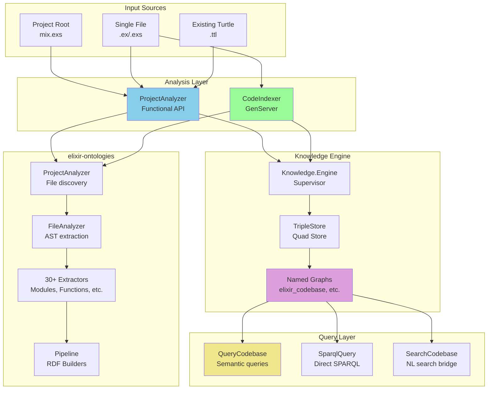
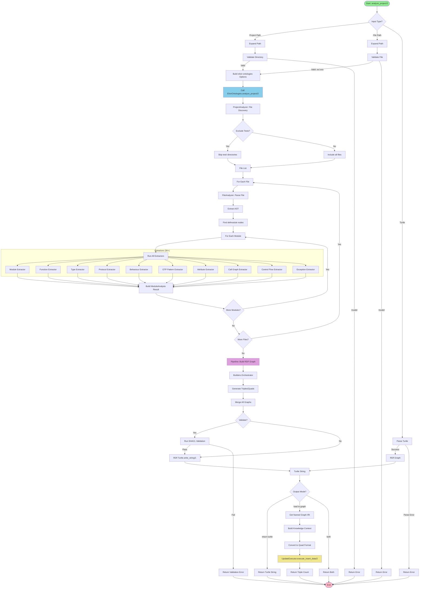
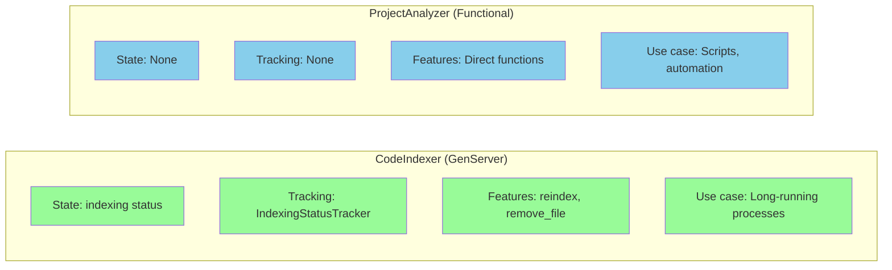
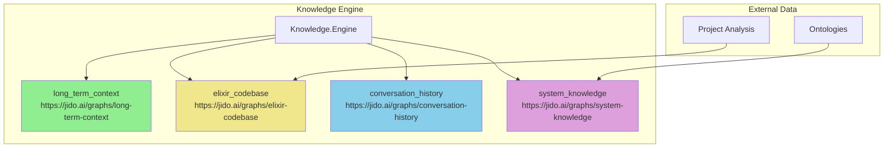
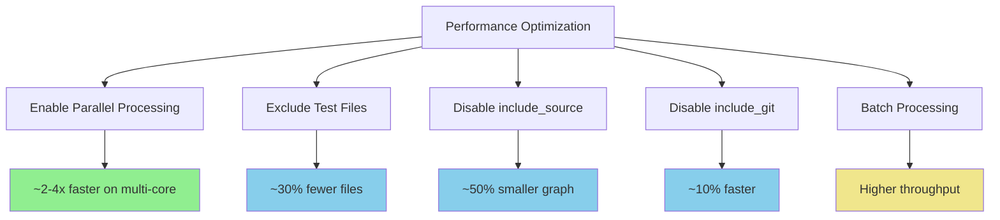

# Code Analysis Pipeline Guide

## Table of Contents
- [Introduction](#introduction)
- [Architecture Overview](#architecture-overview)
- [Components](#components)
- [Analysis Pipeline](#analysis-pipeline)
- [ProjectAnalyzer API](#projectanalyzer-api)
- [Comparison: CodeIndexer vs ProjectAnalyzer](#comparison-codeindexer-vs-projectanalyzer)
- [Named Graph Integration](#named-graph-integration)
- [Usage Patterns](#usage-patterns)
- [Configuration Options](#configuration-options)
- [Error Handling](#error-handling)
- [Performance Considerations](#performance-considerations)

## Introduction

The Code Analysis Pipeline is responsible for converting Elixir source code into semantic RDF knowledge graphs. This enables the system to understand code structure, relationships, and semantics through SPARQL queries rather than text processing.

The pipeline integrates three key libraries:
- **elixir-ontologies** - Elixir AST parsing and RDF generation
- **TripleStore** - Quad-store with named graph support
- **Jidoka** - Orchestration and tool integration

## Architecture Overview



## Components

### 1. ProjectAnalyzer

**Location:** `lib/jidoka/indexing/project_analyzer.ex`

A functional, stateless API for analyzing Elixir projects and loading results to named graphs. Provides direct programmatic control without GenServer overhead.

**Key Characteristics:**
- Stateless functional design
- No process overhead
- Direct return values
- Ideal for scripts, automation, and one-time operations

### 2. CodeIndexer

**Location:** `lib/jidoka/indexing/code_indexer.ex`

A GenServer-based indexer that maintains state across operations and tracks indexing status.

**Key Characteristics:**
- Long-running process
- Status tracking via IndexingStatusTracker
- Re-indexing capabilities
- Background processing support

### 3. elixir-ontologies Integration

The analysis leverages the elixir-ontologies library for:

| Component | Purpose |
|-----------|---------|
| `ProjectAnalyzer` | Discovers all .ex/.exs files in a Mix project |
| `FileAnalyzer` | Parses files and extracts AST |
| 30+ Extractors | Extract modules, functions, types, protocols, etc. |
| `Pipeline` | Converts extracted data to RDF triples |
| `Graph` | Wraps RDF.Graph with metadata |
| `Validator` | Optional SHACL validation |

## Analysis Pipeline



### Pipeline Stages

| Stage | Component | Output |
|-------|-----------|--------|
| 1. Input | ProjectAnalyzer | Validated path |
| 2. Discovery | elixir-ontologies ProjectAnalyzer | List of .ex/.exs files |
| 3. Parsing | FileAnalyzer | AST for each file |
| 4. Extraction | 30+ Extractors | ModuleAnalysis structs |
| 5. Building | Pipeline/Orchestrator | RDF.Graph |
| 6. Serialization | RDF.Turtle | Turtle string |
| 7. Loading | UpdateExecutor | Quads in named graph |

## ProjectAnalyzer API

### Main Functions

```elixir
# Analyze project, get Turtle
{:ok, turtle} = ProjectAnalyzer.analyze_project_to_turtle(project_path, opts)

# Analyze file, get Turtle
{:ok, turtle} = ProjectAnalyzer.analyze_file_to_turtle(file_path, opts)

# Analyze and load in one call
{:ok, result} = ProjectAnalyzer.analyze_and_load(project_path, opts)
# result.triple_count, result.metadata, result.errors

# Load existing Turtle to named graph
{:ok, count} = ProjectAnalyzer.load_turtle_file(turtle_file, opts)

# Load Turtle string
{:ok, count} = ProjectAnalyzer.load_turtle_string(turtle_string, opts)

# Clear a named graph
:ok = ProjectAnalyzer.clear_graph(opts)
```

### Function Matrix

| Function | Input | Output | Use Case |
|----------|-------|--------|----------|
| `analyze_project_to_turtle/2` | Project path | `{:ok, turtle_string}` | Export for external use |
| `analyze_file_to_turtle/2` | File path | `{:ok, turtle_string}` | Single file analysis |
| `analyze_and_load/2` | Project path | `{:ok, result}` | Direct indexing |
| `analyze_and_load_file/2` | File path | `{:ok, count}` | Single file indexing |
| `load_turtle_file/2` | .ttl file | `{:ok, count}` | Load pre-generated analysis |
| `load_turtle_string/2` | Turtle string | `{:ok, count}` | Load from memory |
| `clear_graph/1` | - | `:ok` | Reset graph |

## Comparison: CodeIndexer vs ProjectAnalyzer



| Aspect | CodeIndexer | ProjectAnalyzer |
|--------|-------------|-----------------|
| **Type** | GenServer | Functional module |
| **State** | Maintains indexing state | Stateless |
| **Status tracking** | IndexingStatusTracker | None |
| **Re-indexing** | Built-in | Manual (clear + load) |
| **Path validation** | Built-in PathValidator | Manual |
| **Use case** | Background services | Scripts, automation |
| **Error handling** | Status per file | Returns errors |
| **Overhead** | Process (~25KB) | None |

### When to Use Which

**Use CodeIndexer when:**
- Building a long-running indexing service
- Need to track indexing status across operations
- Want automatic re-indexing on file changes
- Need incremental updates

**Use ProjectAnalyzer when:**
- Running one-time analysis
- Building scripts or automation
- Want direct control without process overhead
- Need simple, synchronous operations

## Named Graph Integration

### Standard Named Graphs



### Loading to Custom Graphs

```elixir
# Load to default elixir_codebase graph
{:ok, result} = ProjectAnalyzer.analyze_and_load(".")

# Load to custom graph
{:ok, result} = ProjectAnalyzer.analyze_and_load(".",
  graph_name: :my_project_codebase,
  clear_existing: true
)

# Clear specific graph
:ok = ProjectAnalyzer.clear_graph(graph_name: :my_project_codebase)
```

## Usage Patterns

### Pattern 1: One-Time Project Analysis

```elixir
defmodule MyScript do
  def analyze_project do
    project_path = "/path/to/project"

    case ProjectAnalyzer.analyze_project_to_turtle(project_path,
      exclude_tests: true,
      include_git: false
    ) do
      {:ok, turtle} ->
        File.write!("analysis.ttl", turtle)
        {:ok, "analysis.ttl"}

      {:error, reason} ->
        {:error, reason}
    end
  end
end
```

### Pattern 2: Direct Indexing

```elixir
defmodule MyIndexer do
  def index_project do
    {:ok, result} = ProjectAnalyzer.analyze_and_load(".",
      base_iri: "https://myapp.org/code#",
      exclude_tests: true
    )

    IO.puts("Indexed #{result.metadata.file_count} files")
    IO.puts("Loaded #{result.triple_count} triples")
  end
end
```

### Pattern 3: Multi-Project Setup

```elixir
defmodule MultiProjectIndexer do
  @projects [
    {"/path/to/project_a", :codebase_a},
    {"/path/to/project_b", :codebase_b},
    {"/path/to/project_c", :codebase_c}
  ]

  def index_all do
    Enum.each(@projects, fn {path, graph_name} ->
      {:ok, result} = ProjectAnalyzer.analyze_and_load(path,
        graph_name: graph_name,
        clear_existing: true
      )

      IO.puts("#{graph_name}: #{result.triple_count} triples")
    end)
  end
end
```

### Pattern 4: Incremental Updates

```elixir
defmodule IncrementalIndexer do
  def update_modified_files(project_path) do
    # Get list of modified files (e.g., from git)
    modified_files = Git.modified_files(project_path)

    Enum.each(modified_files, fn file ->
      # Remove old triples for this file
      # Then re-index
      {:ok, count} = ProjectAnalyzer.analyze_and_load_file(file,
        graph_name: :elixir_codebase
      )

      IO.puts("Re-indexed #{file}: #{count} triples")
    end)
  end
end
```

## Configuration Options

### Analysis Options

| Option | Type | Default | Description |
|--------|------|---------|-------------|
| `:base_iri` | string | `"https://jido.ai/code#"` | Base IRI for generated resource URIs |
| `:include_source` | boolean | `false` | Include full source code in graph |
| `:include_git` | boolean | `true` | Include git provenance (branch, commit, author) |
| `:exclude_tests` | boolean | `true` | Skip files in test/ directories |
| `:validate` | boolean | `false` | Run SHACL validation against schema |

### Loading Options

| Option | Type | Default | Description |
|--------|------|---------|-------------|
| `:engine_name` | atom | `:knowledge_engine` | Knowledge engine to use |
| `:graph_name` | atom | `:elixir_codebase` | Target named graph |
| `:clear_existing` | boolean | `false` | Clear graph before loading |

### Option Effects

```mermaid
graph TD
    OPTS[Configuration Options] --> BASE_IRI[base_iri]
    OPTS --> SOURCE[include_source]
    OPTS --> GIT[include_git]
    OPTS --> TESTS[exclude_tests]
    OPTS --> VALIDATE[validate]
    OPTS --> CLEAR[clear_existing]

    BASE_IRI -->|Affects| URIS[Generated Resource URIs]
    SOURCE -->|Affects| GRAPH_SIZE[Graph Size (2-3x larger)]
    GIT -->|Affects| PROVENANCE[Provenance Triples]
    TESTS -->|Affects| FILE_COUNT[Files Analyzed]
    VALIDATE -->|Affects| VALIDATION_TIME[Processing Time (+20%)]

    CLEAR -->|Affects| GRAPH_STATE[Graph State (clean vs merge)]

    style URIS fill:#F0E68C
    style GRAPH_SIZE fill:#FFB6C1
    style PROVENANCE fill:#90EE90
    style FILE_COUNT fill:#87CEEB
    style VALIDATION_TIME fill:#DDA0DD
    style GRAPH_STATE fill:#98FB98
```

## Error Handling

### Error Types

| Error | Cause | Resolution |
|-------|-------|------------|
| `{:not_a_directory, path}` | Project path is not a directory | Provide valid Mix project path |
| `{:file_not_found, path}` | File doesn't exist | Check file path |
| `{:invalid_file_type, ext}` | Non-.ex/.exs file | Use Elixir source files only |
| `{:validation_failed, violations}` | SHACL validation failed | Check violations list, fix source |
| `{:turtle_parse_error, reason}` | Invalid Turtle syntax | Fix Turtle file |
| `{:file_read_error, reason}` | Can't read file | Check permissions |
| `{:insert_failed, reason}` | TripleStore insert failed | Check knowledge engine status |
| `{:clear_failed, reason}` | Graph clear failed | Check graph exists |

### Error Handling Pattern

```elixir
defmodule SafeAnalyzer do
  def safe_analyze(project_path, opts \\ []) do
    with :ok <- validate_project_path(project_path),
         {:ok, result} <- ProjectAnalyzer.analyze_and_load(project_path, opts) do
      {:ok, result}
    else
      {:error, {:not_a_directory, _}} ->
        {:error, "Path must be a valid Mix project directory"}

      {:error, {:validation_failed, violations}} ->
        {:error, "Validation failed: #{inspect(violations)}"}

      {:error, {:insert_failed, reason}} ->
        {:error, "Failed to load to knowledge graph: #{inspect(reason)}"}

      {:error, reason} ->
        {:error, "Analysis failed: #{inspect(reason)}"}
    end
  end

  defp validate_project_path(path) do
    cond do
      !File.dir?(path) -> {:error, {:not_a_directory, path}}
      !File.exists?(Path.join(path, "mix.exs")) -> {:error, :not_a_mix_project}
      true -> :ok
    end
  end
end
```

## Performance Considerations

### Performance Characteristics

| Project Size | Files | Modules | Analysis Time | Triples | Memory |
|--------------|-------|---------|---------------|---------|--------|
| Small | <50 | <20 | ~2s | ~5K | ~50MB |
| Medium | 50-200 | 20-100 | ~10s | ~50K | ~200MB |
| Large | 200-1000 | 100-500 | ~60s | ~500K | ~1GB |
| Very Large | >1000 | >500 | ~5min | ~2.5M | ~3GB |

### Optimization Tips



**Best Practices:**

1. **Exclude tests** unless needed - saves ~30% analysis time
2. **Disable `include_source`** - reduces graph size by ~50%
3. **Disable `include_git`** if provenance not needed - saves ~10%
4. **Use `clear_existing: false`** for incremental updates - avoids full graph rebuild
5. **Load to separate graphs** per project - enables targeted clearing

### Memory Management

```elixir
# For very large projects, process in chunks
defmodule ChunkedAnalyzer do
  @chunk_size 50

  def analyze_large_project(project_path) do
    # Get list of files
    files = ElixirSource.files(project_path, exclude_tests: true)

    # Process in chunks
    files
    |> Enum.chunk_every(@chunk_size)
    |> Enum.with_index()
    |> Enum.each(fn {chunk, index} ->
      # Create temp graph for this chunk
      graph_name = :"chunk_#{index}"

      # Load chunk
      {:ok, _} = ProjectAnalyzer.analyze_and_load(project_path,
        graph_name: graph_name,
        # Filter to only this chunk's files...
      )
    end)
  end
end
```

## Querying the Analyzed Code

Once code is loaded to the `:elixir_codebase` named graph, use the query tools:

```elixir
# Semantic queries via QueryCodebase
{:ok, modules} = QueryCodebase.run(%{
  query_type: "list_modules"
}, context)

{:ok, func} = QueryCodebase.run(%{
  query_type: "analyze_function",
  module_name: "MyApp.User",
  function_name: "find",
  arity: 1,
  include_call_graph: true
}, context)

# Direct SPARQL via SparqlQuery
{:ok, results} = SparqlQuery.run(%{
  query: """
    SELECT ?m ?f WHERE {
      GRAPH ?g {
        ?m a struct:Module ;
           struct:moduleName "MyApp.User" ;
           struct:definesFunction ?f .
        ?f struct:functionName "find" .
      }
    }
  """
}, context)
```

## See Also

- [Architecture Guide](architecture.md) - System architecture overview
- [Memory System Guide](memory-system.md) - Named graph management
- [Agent Layer Guide](agent-layer.md) - Using analysis in agents
- [elixir-ontologies Documentation](https://hexdocs.pm/elixir_ontologies) - Detailed extraction schema
