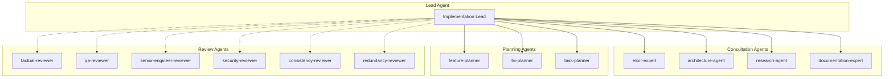
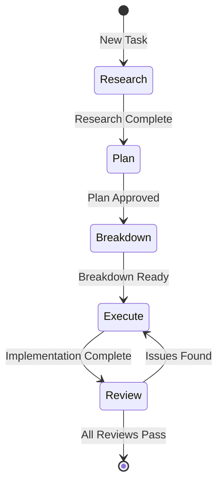
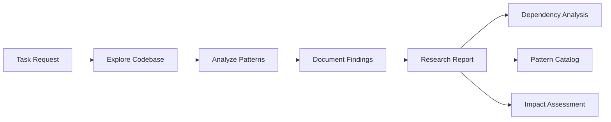
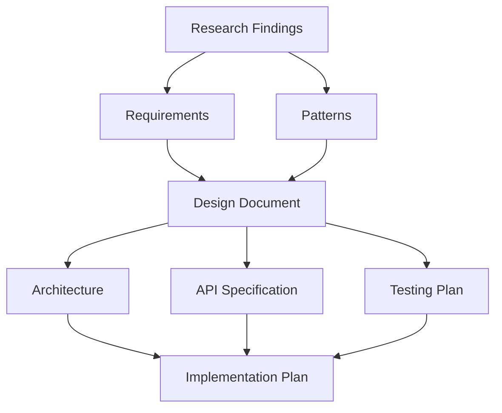
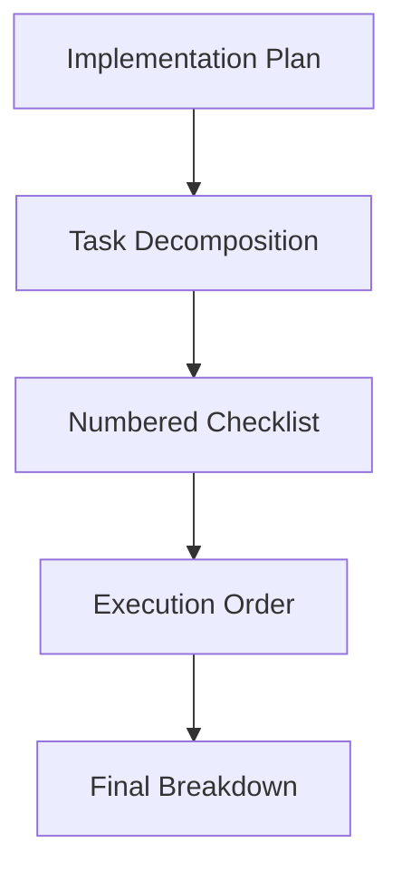
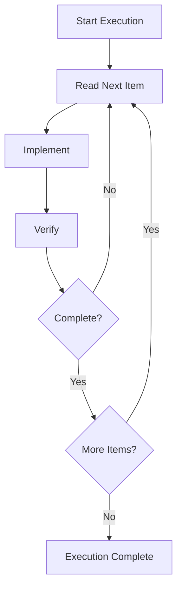
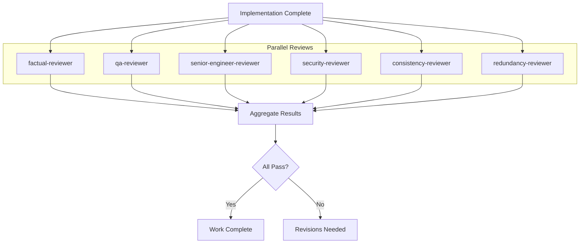

# Development Workflow Guide

## Table of Contents
- [Introduction](#introduction)
- [Workflow Architecture](#workflow-architecture)
- [The Four-Phase Workflow](#the-four-phase-workflow)
- [Agent Orchestration](#agent-orchestration)
- [Agent Definitions](#agent-definitions)
- [Command Definitions](#command-definitions)
- [Extending the Workflow](#extending-the-workflow)

## Introduction

The Development Workflow system orchestrates specialized agents to guide development work from research through execution. This guide covers the workflow architecture, agent definitions, and command system.

## Workflow Architecture

### Agent Orchestration System

Jidoka uses specialized agents that are consulted based on task requirements:



### Workflow Phases



## The Four-Phase Workflow

### Phase 1: Research

The research phase analyzes the codebase for impact and integration points.

**Purpose:**
- Understand existing patterns
- Identify third-party dependencies
- Find related code
- Document integration points

**Agent:** `research-agent`

**Output:** `notes/[topic-name]/research.md`



**Research Template:**

```markdown
# Research: [Topic]

## Codebase Impact
- Modified files: ...
- Affected modules: ...
- Integration points: ...

## Third-Party Integrations
- Dependencies: ...
- External APIs: ...
- Version constraints: ...

## Existing Patterns
- Similar implementations: ...
- Architectural patterns: ...
- Code conventions: ...

## Recommendations
- Implementation approach: ...
- Potential risks: ...
- Testing strategy: ...
```

### Phase 2: Plan

The planning phase creates detailed specifications using research findings.

**Purpose:**
- Define feature specifications
- Design implementation approach
- Identify acceptance criteria
- Plan testing strategy

**Agent:** `feature-planner` (or `fix-planner` / `task-planner`)

**Output:** `notes/[topic-name]/plan.md`



**Plan Template:**

```markdown
# Implementation Plan: [Topic]

## Requirements
- Functional requirements: ...
- Non-functional requirements: ...

## Architecture
- Module structure: ...
- Data flow: ...
- Integration points: ...

## Implementation Steps
1. Create module X with function Y
2. Add handler for event Z
3. ...

## API Design
- Public functions: ...
- Data structures: ...
- Error handling: ...

## Testing Strategy
- Unit tests: ...
- Integration tests: ...
- Edge cases: ...
```

### Phase 3: Breakdown

The breakdown phase creates numbered checklists for implementation.

**Purpose:**
- Decompose work into actionable steps
- Provide clear implementation order
- Enable progress tracking
- Support parallel execution where possible

**Agent:** Implementation agent

**Output:** `notes/[topic-name]/breakdown.md`



**Breakdown Template:**

```markdown
# Implementation Breakdown: [Topic]

## Setup
- [ ] 1. Create module file
- [ ] 2. Add tests file
- [ ] 3. Update configuration

## Core Implementation
- [ ] 4. Implement data structure
- [ ] 5. Implement core functions
- [ ] 6. Add error handling

## Integration
- [ ] 7. Connect to existing systems
- [ ] 8. Update documentation
- [ ] 9. Add deprecations if needed

## Testing
- [ ] 10. Add unit tests
- [ ] 11. Add integration tests
- [ ] 12. Test edge cases

## Cleanup
- [ ] 13. Run formatter
- [ ] 14. Run dialyzer
- [ ] 15. Update CHANGELOG
```

### Phase 4: Execute

The execute phase implements following the breakdown checklist.

**Purpose:**
- Execute implementation steps
- Verify each step completion
- Handle discovered issues
- Maintain code quality

**Agent:** Implementation agent

**Execution Flow:**



## Agent Orchestration

### Consultation Rules

**Mandatory Consultations:**

| Situation | Agent | Purpose |
|-----------|-------|---------|
| Elixir/Phoenix/Ash work | **elixir-expert** | Patterns, usage, documentation |
| Code placement/structure | **architecture-agent** | Structural guidance |
| Unknown libraries/APIs | **research-agent** | Technical research |
| After Elixir changes | **elixir-reviewer** | Code quality validation |
| Complex new features | **feature-planner** | Comprehensive planning |
| Bug fixes | **fix-planner** | Focused problem resolution |
| Simple tasks | **task-planner** | Lightweight planning |

### Parallel Review Execution

After implementation, run ALL review agents in parallel:



**Review Agents:**

| Agent | Focus |
|-------|-------|
| **factual-reviewer** | Implementation vs plan verification |
| **qa-reviewer** | Test coverage and quality assurance |
| **senior-engineer-reviewer** | Architecture and design assessment |
| **security-reviewer** | Security vulnerability analysis |
| **consistency-reviewer** | Codebase pattern consistency |
| **redundancy-reviewer** | Duplication and refactoring opportunities |

## Agent Definitions

Agent definitions are stored in `.claude/agent-definitions/`:

```
.claude/agent-definitions/
├── elixir-expert.md
├── architecture-agent.md
├── research-agent.md
├── documentation-expert.md
├── elixir-reviewer.md
├── feature-planner.md
├── fix-planner.md
├── task-planner.md
├── factual-reviewer.md
├── qa-reviewer.md
├── senior-engineer-reviewer.md
├── security-reviewer.md
├── consistency-reviewer.md
└── redundancy-reviewer.md
```

### Agent Definition Template

```markdown
# [Agent Name]

## Role
[One-line description of the agent's role]

## Responsibilities
- [Responsibility 1]
- [Responsibility 2]
- [Responsibility 3]

## When to Use
[Guidance on when this agent should be consulted]

## Expertise
- [Area of expertise 1]
- [Area of expertise 2]

## Input
- [Input type 1]
- [Input type 2]

## Output
- [Output format]

## Guidelines
1. [Guideline 1]
2. [Guideline 2]

## Examples
[Optional example interactions]
```

### Example: elixir-expert

```markdown
# Elixir Expert Agent

## Role
Domain expert for Elixir/Phoenix/Ash development patterns and best practices.

## Responsibilities
- Provide Elixir-specific patterns and idioms
- Ensure correct usage of Phoenix features
- Guide Ash framework integration
- Recommend testing approaches for Elixir

## When to Use
**ALWAYS** consult for any Elixir/Phoenix/Ash work before implementation.

## Expertise
- Elixir language patterns (GenServer, Supervisor, OTP)
- Phoenix Framework (LiveView, Channels, Presence)
- Ash Framework (resources, actions, policies)
- Elixir testing (ExUnit, Mimic, bypass)
- BEAM VM specifics (processes, mailboxes, scheduling)

## Input
- Task description
- Current code context
- Questions about implementation approach

## Output
- Pattern recommendations
- Code examples
- Usage guidance
- Documentation references

## Guidelines
1. Prefer `mix run` over `elixir` for scripts
2. Use pipe operator only for multiple function calls
3. Use `expect` not `stub` for Mimic mocking
4. Always create public wrapper functions for LiveView components
5. Use `mix ash.codegen` for Ash resource migrations
```

## Command Definitions

Commands are defined in `.claude/commands/` and map to workflow operations:

```
.claude/commands/
├── research.md
├── plan.md
├── breakdown.md
├── execute.md
├── review.md
├── feature.md
├── fix.md
├── task.md
├── commit.md
├── pr.md
└── ...
```

### Command Template

```markdown
# /command-name

## Purpose
[What this command does]

## Agent
[Which agent this command uses]

## Input
- [Required input]
- [Optional input]

## Output
- [What gets produced]

## Process
1. [Step 1]
2. [Step 2]
3. [Step 3]
```

### Example: /research

```markdown
# /research

## Purpose
Codebase impact analysis and targeted documentation gathering.

## Agent
research-agent

## Input
- **topic**: The topic to research (required)
- **focus_areas**: Optional list of areas to focus on

## Output
- `notes/[topic]/research.md` - Research findings document

## Process
1. Search codebase for related files
2. Analyze patterns and conventions
3. Identify dependencies and integrations
4. Document findings
5. Provide recommendations
```

## Extending the Workflow

### Adding a New Agent

1. Create agent definition file:

```markdown
# .claude/agent-definitions/my-agent.md

# My Custom Agent

## Role
[Description]

## Responsibilities
- [List]

## When to Use
[Guidance]

## Expertise
- [Areas]

## Input
- [Inputs]

## Output
- [Outputs]

## Guidelines
1. [Guideline 1]
2. [Guideline 2]
```

2. Update agent orchestration if needed:

```elixir
# In the workflow system
defmodule Jidoka.Workflow.Agents do
  def list_agents do
    [
      # ... existing agents ...
      :my_custom_agent
    ]
  end

  def agent_for_task(task_type) do
    case task_type do
      :my_custom_task -> :my_custom_agent
      # ... other mappings ...
    end
  end
end
```

### Adding a New Command

1. Create command definition:

```markdown
# .claude/commands/my-command.md

# /my-command

## Purpose
[What it does]

## Agent
[Which agent]

## Input
- [Required inputs]
- [Optional inputs]

## Output
- [What is produced]

## Process
1. [Step 1]
2. [Step 2]
```

2. Register the command handler:

```elixir
defmodule Jidoka.Commands.MyCommand do
  @moduledoc """
  Handler for /my-command
  """

  alias Jidoka.Workflow

  def execute(params, context) do
    # Parse inputs
    topic = Map.fetch!(params, "topic")

    # Execute workflow
    case Workflow.execute(:my_agent, topic, context) do
      {:ok, result} ->
        {:ok, result}

      {:error, reason} ->
        {:error, reason}
    end
  end
end
```

### Custom Workflow Phase

Add a new phase to the workflow:

```elixir
defmodule Jidoka.Workflow.Phases do
  @phases [
    :research,
    :plan,
    :breakdown,
    :execute,
    :review
  ]

  def add_phase(name, agent) do
    # Register new phase
    :ets.insert(:workflow_phases, {name, agent})
  end

  def execute_phase(phase, input) do
    agent = get_agent_for_phase(phase)
    apply(agent, :execute, [input])
  end
end
```

## Workflow Orchestration Implementation

```elixir
defmodule Jidoka.Workflow do
  @moduledoc """
  Workflow orchestration for development tasks.
  """

  alias Jidoka.Signals

  defstruct [
    :phase,
    :topic,
    :research,
    :plan,
    :breakdown,
    :status
  ]

  @type t :: %__MODULE__{}

  # Start a new workflow
  def new(topic, opts \\ []) do
    workflow_type = Keyword.get(opts, :type, :feature)

    %__MODULE__{
      phase: :research,
      topic: topic,
      status: :in_progress
    }
    |> execute_phase(:research)
  end

  # Execute a specific phase
  def execute_phase(workflow, phase) do
    # Notify agents
    Signals.publish(%Signals.Signal{
      source: "workflow",
      type: "workflow.phase.started",
      data: %{
        "topic" => workflow.topic,
        "phase" => to_string(phase)
      }
    })

    # Execute the phase
    case do_execute_phase(phase, workflow) do
      {:ok, result} ->
        new_workflow = %{workflow | phase => result, phase: next_phase(phase)}
        Signals.publish_phase_complete(new_workflow, phase)
        {:ok, new_workflow}

      {:error, reason} ->
        Signals.publish_phase_error(workflow, phase, reason)
        {:error, reason}
    end
  end

  # Run full workflow
  def run(topic, opts \\ []) do
    workflow = new(topic, opts)

    {:ok, workflow} = execute_phase(workflow, :research)
    {:ok, workflow} = execute_phase(workflow, :plan)
    {:ok, workflow} = execute_phase(workflow, :breakdown)
    {:ok, workflow} = execute_phase(workflow, :execute)

    # Run reviews in parallel
    execute_reviews(workflow)
  end

  # Private helpers

  defp do_execute_phase(:research, workflow) do
    Jidoka.Agents.ResearchAgent.execute(workflow.topic)
  end

  defp do_execute_phase(:plan, workflow) do
    Jidoka.Agents.FeaturePlanner.execute(workflow.topic, workflow.research)
  end

  defp do_execute_phase(:breakdown, workflow) do
    Jidoka.Agents.BreakdownAgent.execute(workflow.topic, workflow.plan)
  end

  defp do_execute_phase(:execute, workflow) do
    Jidoka.Agents.ExecuteAgent.execute(workflow.topic, workflow.breakdown)
  end

  defp next_phase(:research), do: :plan
  defp next_phase(:plan), do: :breakdown
  defp next_phase(:breakdown), do: :execute
  defp next_phase(:execute), do: :review
  defp next_phase(:review), do: :complete

  defp execute_reviews(workflow) do
    # Parallel review execution
    review_agents = [
      Jidoka.Agents.Reviewers.Factual,
      Jidoka.Agents.Reviewers.QA,
      Jidoka.Agents.Reviewers.SeniorEngineer,
      Jidoka.Agents.Reviewers.Security,
      Jidoka.Agents.Reviewers.Consistency,
      Jidoka.Agents.Reviewers.Redundancy
    ]

    # Execute all reviews in parallel
    tasks = Enum.map(review_agents, fn agent ->
      Task.async(fn ->
        agent.execute(workflow.topic)
      end)
    end)

    results = Task.await_many(tasks, 300_000)

    # Aggregate results
    aggregate_review_results(results)
  end

  defp aggregate_review_results(results) do
    all_passed = Enum.all?(results, fn
      {:ok, _} -> true
      _ -> false
    end)

    if all_passed do
      {:ok, :all_reviews_passed}
    else
      {:error, :reviews_failed}
    end
  end
end
```

## See Also

- **[Overview Guide](overview.md)** - System overview
- **[Architecture Guide](architecture.md)** - Overall system architecture
- **[Agent Layer Guide](agent-layer.md)** - Agent implementation
- **[.claude/AGENTS.md](../.claude/AGENTS.md)** - Agent system documentation
