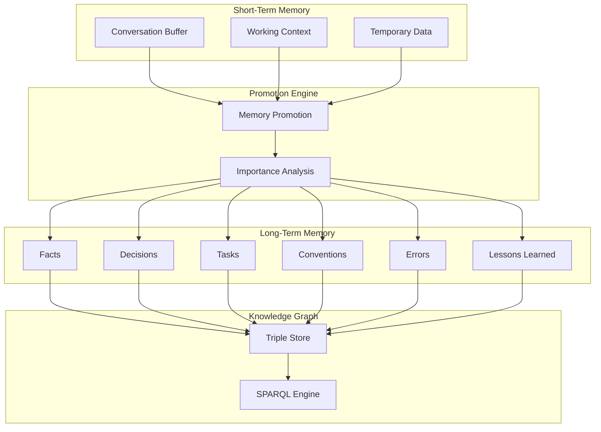
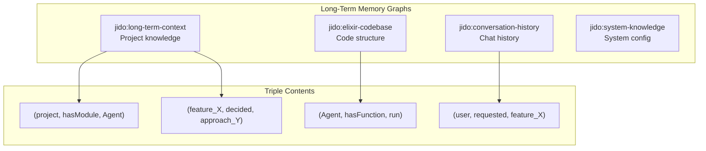
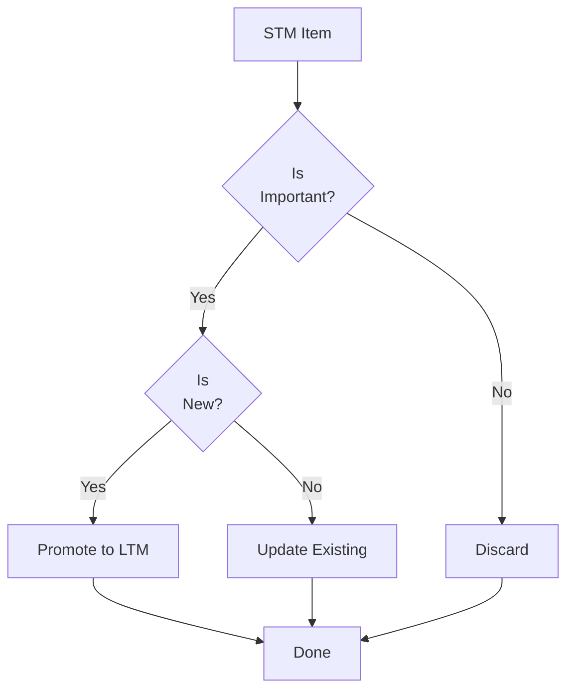

# Memory System Guide

## Table of Contents
- [Introduction](#introduction)
- [Memory Architecture](#memory-architecture)
- [Short-Term Memory](#short-term-memory)
- [Long-Term Memory](#long-term-memory)
- [Memory Promotion](#memory-promotion)
- [Knowledge Graph](#knowledge-graph)
- [Ontology](#ontology)
- [Querying Memory](#querying-memory)
- [Implementation Details](#implementation-details)

## Introduction

The Memory System provides Jidoka with persistent knowledge and context management. This guide covers the two-tier memory architecture, the semantic knowledge graph, and how to work with memory in agents and applications.

## Memory Architecture

### Two-Tier Memory

Jidoka implements a two-tier memory system:



### Memory Characteristics

| Tier | Storage | Access Speed | Persistence | Capacity |
|------|---------|--------------|-------------|----------|
| **Short-Term** | ETS / Process Dict | Nanoseconds | Ephemeral | Limited |
| **Long-Term** | Triple Store | Milliseconds | Persistent | Scaled |

## Short-Term Memory

### Overview

Short-term memory (STM) holds ephemeral information for the current session:
- Conversation history
- Working context
- Temporary analysis results
- Agent state

### STM Implementation

```elixir
defmodule Jidoka.Memory.ShortTerm do
  @moduledoc """
  Short-term memory implementation using ETS.
  """

  use GenServer

  @table_name :jidoka_stm
  @max_entries 1000

  defstruct [:table, :session_id]

  # Client API

  def start_link(opts) do
    GenServer.start_link(__MODULE__, opts, name: __MODULE__)
  end

  def put(key, value) do
    GenServer.call(__MODULE__, {:put, key, value})
  end

  def get(key) do
    GenServer.call(__MODULE__, {:get, key})
  end

  def get_all() do
    GenServer.call(__MODULE__, :get_all)
  end

  def clear() do
    GenServer.call(__MODULE__, :clear)
  end

  # Server Callbacks

  @impl true
  def init(opts) do
    session_id = Keyword.get(opts, :session_id)

    table = :ets.new(@table_name, [
      :set,
      :public,
      read_concurrency: true,
      write_concurrency: true
    ])

    {:ok, %__MODULE__{table: table, session_id: session_id}}
  end

  @impl true
  def handle_call({:put, key, value}, _from, state) do
    :ets.insert(state.table, {key, value, System.system_time(:millisecond)})

    # Evict old entries if over capacity
    evict_old_entries(state.table)

    {:reply, :ok, state}
  end

  @impl true
  def handle_call({:get, key}, _from, state) do
    result = case :ets.lookup(state.table, key) do
      [{^key, value, _timestamp}] -> {:ok, value}
      [] -> {:error, :not_found}
    end

    {:reply, result, state}
  end

  @impl true
  def handle_call(:get_all, _from, state) do
    all = :ets.tab2list(state.table)
    |> Enum.map(fn {key, value, _ts} -> {key, value} end)

    {:reply, all, state}
  end

  @impl true
  def handle_call(:clear, _from, state) do
    :ets.delete_all_objects(state.table)
    {:reply, :ok, state}
  end

  defp evict_old_entries(table) do
    size = :ets.info(table, :size)

    if size > @max_entries do
      # Remove oldest entries
      entries = :ets.tab2list(table)
      |> Enum.sort_by(fn {_k, _v, ts} -> ts end, :asc)

      to_remove = (size - @max_entries) + 100

      entries
      |> Enum.take(to_remove)
      |> Enum.each(fn {key, _v, _ts} -> :ets.delete(table, key) end)
    end
  end
end
```

### Conversation Buffer

```elixir
defmodule Jidoka.Memory.ConversationBuffer do
  @moduledoc """
  Maintains conversation history for context window.
  """

  defstruct [:messages, :max_tokens, :current_tokens]

  def new(max_tokens \\ 100_000) do
    %__MODULE__{
      messages: [],
      max_tokens: max_tokens,
      current_tokens: 0
    }
  end

  def add(buffer, role, content) do
    message = %{role: role, content: content, timestamp: DateTime.utc_now()}
    tokens = estimate_tokens(content)

    new_buffer = %{buffer | messages: buffer.messages ++ [message]}
    |> prune_to_fit()
  end

  def get_context(buffer, window \\ nil) do
    messages = case window do
      nil -> buffer.messages
      n -> Enum.take(buffer.messages, -n)
    end

    Enum.map(messages, fn m ->
      %{role: m.role, content: m.content}
    end)
  end

  defp prune_to_fit(buffer) do
    if buffer.current_tokens > buffer.max_tokens do
      # Remove oldest messages until within limit
      {pruned, tokens} = Enum.reduce_while(
        buffer.messages,
        {[], buffer.current_tokens},
        fn msg, {acc, tok} ->
          msg_tokens = estimate_tokens(msg.content)
          if tok - msg_tokens < buffer.max_tokens do
            {:cont, {[msg | acc], tok - msg_tokens}}
          else
            {:halt, {acc, tok}}
          end
        end
      )

      %{buffer | messages: Enum.reverse(pruned), current_tokens: tokens}
    else
      buffer
    end
  end

  defp estimate_tokens(content) do
    # Rough estimate: ~4 characters per token
    div(String.length(content), 4) + 1
  end
end
```

## Long-Term Memory

### Overview

Long-term memory (LTM) stores persistent knowledge as RDF triples in a semantic triple store. This enables:
- Semantic queries across knowledge domains
- Complex relationship understanding
- Inference and reasoning
- Cross-session knowledge retention

### Named Graphs

LTM uses named graphs to organize knowledge:



### LTM Implementation

```elixir
defmodule Jidoka.Memory.LongTerm do
  @moduledoc """
  Long-term memory using RDF triple store.
  """

  use GenServer

  @graphs %{
    context: "http://jidoka.ai/graphs/long-term-context",
    codebase: "http://jidoka.ai/graphs/elixir-codebase",
    history: "http://jidoka.ai/graphs/conversation-history",
    system: "http://jidoka.ai/graphs/system-knowledge"
  }

  defstruct [:triple_store, :prefix]

  # Client API

  def start_link(opts) do
    GenServer.start_link(__MODULE__, opts, name: __MODULE__)
  end

  def insert(statements, graph \\ :context) do
    GenServer.call(__MODULE__, {:insert, statements, graph})
  end

  def query(sparql) do
    GenServer.call(__MODULE__, {:query, sparql})
  end

  def get_fact(id) do
    sparql = """
    PREFIX jido: <http://jidoka.ai/ontology/>

    SELECT ?subject ?predicate ?object
    WHERE {
      ?subject a jido:Fact .
      ?subject jido:id "#{id}" .
      ?subject ?predicate ?object .
    }
    """

    query(sparql)
  end

  # Server Callbacks

  @impl true
  def init(opts) do
    triple_store = Keyword.get(opts, :triple_store, Jidoka.TripleStore)
    prefix = Keyword.get(opts, :prefix, "http://jidoka.ai/")

    {:ok, %__MODULE__{triple_store: triple_store, prefix: prefix}}
  end

  @impl true
  def handle_call({:insert, statements, graph}, _from, state) do
    graph_uri = Map.get(@graphs, graph)

    result = state.triple_store.insert(
      statements,
      graph: graph_uri
    )

    {:reply, result, state}
  end

  @impl true
  def handle_call({:query, sparql}, _from, state) do
    result = state.triple_store.query(sparql)
    {:reply, result, state}
  end
end
```

## Memory Promotion

### Overview

The promotion engine determines which short-term memories should be preserved in long-term memory.

### Promotion Strategy



### Promotion Engine

```elixir
defmodule Jidoka.Memory.Promotion do
  @moduledoc """
  Promotes important items from short-term to long-term memory.
  """

  defstruct [:rules, :threshold]

  @promotion_rules [
    # Explicit decisions
    %{type: :decision, importance: 1.0, category: :decisions},

    # Errors and failures
    %{type: :error, importance: 0.9, category: :errors},

    # Task completions
    %{type: :task_completed, importance: 0.8, category: :tasks},

    # Discoveries
    %{type: :discovery, importance: 0.7, category: :discoveries},

    # User preferences
    %{type: :preference, importance: 0.6, category: :conventions}
  ]

  def new(threshold \\ 0.5) do
    %__MODULE__{
      rules: @promotion_rules,
      threshold: threshold
    }
  end

  def should_promote?(promotion, item) do
    importance = calculate_importance(promotion, item)
    importance >= promotion.threshold
  end

  def promote(promotion, item) do
    if should_promote?(promotion, item) do
      category = categorize_item(promotion, item)
      to_triples(item, category)
    else
      []
    end
  end

  defp calculate_importance(promotion, item) do
    # Base importance from type
    base = Enum.find_value(promotion.rules, 0.0, fn rule ->
      if rule.type == item.type, do: rule.importance
    end)

    # Adjust based on context
    adjusted = base + context_boost(item)
    min(adjusted, 1.0)
  end

  defp context_boost(item) do
    cond do
      item.verified_by_user -> 0.1
      item.referenced_multiple_times -> 0.1
      item.high_confidence -> 0.05
      true -> 0.0
    end
  end

  defp categorize_item(promotion, item) do
    Enum.find_value(promotion.rules, :facts, fn rule ->
      if rule.type == item.type, do: rule.category
    end)
  end

  defp to_triples(item, category) do
    subject = "http://jidoka.ai/facts/#{UUID.uuid4()}"

    [
      {subject, "http://www.w3.org/1999/02/22-rdf-syntax-ns#type",
       "http://jidoka.ai/ontology##{category}"},
      {subject, "http://jidoka.ai/ontology#content",
       to_string(item.content)},
      {subject, "http://jidoka.ai/ontology#timestamp",
       DateTime.to_iso8601(item.timestamp)}
    ]
  end
end
```

## Knowledge Graph

### Overview

The knowledge graph stores all long-term memory as RDF triples, enabling SPARQL queries for semantic understanding.

### Triple Store Integration

```elixir
defmodule Jidoka.TripleStore do
  @moduledoc """
  Triple store interface using RDF.ex.
  """

  use GenServer

  defstruct [:store, :graphs]

  # Client API

  def start_link(opts) do
    GenServer.start_link(__MODULE__, opts, name: __MODULE__)
  end

  def insert(triples, opts \\ []) do
    GenServer.call(__MODULE__, {:insert, triples, opts})
  end

  def query(sparql) do
    GenServer.call(__MODULE__, {:query, sparql})
  end

  def clear_graph(graph) do
    GenServer.call(__MODULE__, {:clear_graph, graph})
  end

  # Server Callbacks

  @impl true
  def init(opts) do
    backend = Keyword.get(opts, :backend, :memory)

    store = case backend do
      :memory -> RDF.TripleStore.new(name: Jidoka.Store)
      :sparql -> configure_sparql_backend(opts)
    end

    {:ok, %__MODULE__{store: store, graphs: %{}}}
  end

  @impl true
  def handle_call({:insert, triples, opts}, _from, state) do
    graph = Keyword.get(opts, :graph, :default)

    new_store = Enum.reduce(triples, state.store, fn triple, acc ->
      RDF.Triple.Store.add(acc, triple, graph: graph)
    end)

    {:reply, :ok, %{state | store: new_store}}
  end

  @impl true
  def handle_call({:query, sparql}, _from, state) do
    result = SPARQL.execute_query(sparql, state.store)
    {:reply, result, state}
  end

  @impl true
  def handle_call({:clear_graph, graph}, _from, state) do
    new_store = RDF.Triple.Store.delete_graph(state.store, graph)
    {:reply, :ok, %{state | store: new_store}}
  end

  defp configure_sparql_backend(opts) do
    # Configure SPARQL endpoint
    endpoint = Keyword.fetch!(opts, :endpoint)
    RDF.TripleStore.new(
      name: Jidoka.Store,
      endpoint: endpoint
    )
  end
end
```

## Ontology

### Memory Types

Jidoka uses an ontology to classify different types of knowledge:

| Class | Description | Example |
|-------|-------------|---------|
| **Fact** | Verified information | "Project uses Phoenix 1.7" |
| **Assumption** | Unverified beliefs | "User prefers functional style" |
| **Hypothesis** | Testable propositions | "Caching will improve performance" |
| **Discovery** | New findings | "Found unused module dependency" |
| **Risk** | Potential issues | "This function may cause memory leak" |
| **Unknown** | Knowledge gaps | "Purpose of utility function unknown" |
| **Decision** | Made choices | "Chose Postgres over MySQL" |
| **Task** | Action items | "Implement authentication" |
| **Convention** | Agreed patterns | "Use 2-space indentation" |
| **Error** | Recorded failures | "Deployment failed at step 3" |
| **LessonLearned** | Insights | "Always validate environment variables" |

### Ontology Definition

```turtle
@prefix jido: <http://jidoka.ai/ontology#>.
@prefix rdf: <http://www.w3.org/2001/XMLSchema#>.

jido:Memory a rdfs:Class.
jido:Fact a rdfs:Class; rdfs:subClassOf jido:Memory.
jido:Decision a rdfs:Class; rdfs:subClassOf jido:Memory.
jido:Task a rdfs:Class; rdfs:subClassOf jido:Memory.
jido:Convention a rdfs:Class; rdfs:subClassOf jido:Memory.
jido:Error a rdfs:Class; rdfs:subClassOf jido:Memory.
jido:LessonLearned a rdfs:Class; rdfs:subClassOf jido:Memory.

jido:content a rdf:Property; rdfs:domain jido:Memory; rdfs:range xsd:string.
jido:timestamp a rdf:Property; rdfs:domain jido:Memory; rdfs:range xsd:dateTime.
jido:confidence a rdf:Property; rdfs:domain jido:Memory; rdfs:range xsd:float.
jido:source a rdf:Property; rdfs:domain jido:Memory; rdfs:range xsd:string.
jido:verified a rdf:Property; rdfs:domain jido:Memory; rdfs:range xsd:boolean.
```

### Working with Memory Types

```elixir
defmodule Jidoka.Memory.Types do
  @moduledoc """
  Memory type definitions and helpers.
  """

  @memory_types [
    :fact,
    :assumption,
    :hypothesis,
    :discovery,
    :risk,
    :unknown,
    :decision,
    :task,
    :convention,
    :error,
    :lesson_learned
  ]

  def type_uri(:fact), do: "http://jidoka.ai/ontology#Fact"
  def type_uri(:decision), do: "http://jidoka.ai/ontology#Decision"
  def type_uri(:task), do: "http://jidoka.ai/ontology#Task"
  def type_uri(:convention), do: "http://jidoka.ai/ontology#Convention"
  def type_uri(:error), do: "http://jidoka.ai/ontology#Error"
  def type_uri(:lesson_learned), do: "http://jidoka.ai/ontology#LessonLearned"
  def type_uri(_other), do: "http://jidoka.ai/ontology#Memory"

  def create_memory(type, content, attrs \\ %{}) do
    %{
      type: type,
      content: content,
      timestamp: DateTime.utc_now(),
      confidence: Map.get(attrs, :confidence, 0.5),
      source: Map.get(attrs, :source, "system"),
      verified: Map.get(attrs, :verified, false),
      metadata: Map.get(attrs, :metadata, %{})
    }
  end
end
```

## Querying Memory

### SPARQL Queries

Query the knowledge graph using SPARQL:

```elixir
defmodule Jidoka.Memory.Query do
  @moduledoc """
  SPARQL query helpers for memory.
  """

  # Find all facts about a specific topic
  def find_facts_about(topic) do
    sparql = """
    PREFIX jido: <http://jidoka.ai/ontology#>

    SELECT ?subject ?content ?timestamp ?confidence
    WHERE {
      ?subject a jido:Fact .
      ?subject jido:content ?content .
      ?subject jido:timestamp ?timestamp .
      ?subject jido:confidence ?confidence .
      FILTER(CONTAINS(LCASE(STR(?content)), "#{String.downcase(topic)}"))
    }
    ORDER BY DESC(?timestamp)
    """

    Jidoka.Memory.LongTerm.query(sparql)
  end

  # Get all decisions in chronological order
  def list_decisions do
    sparql = """
    PREFIX jido: <http://jidoka.ai/ontology#>

    SELECT ?subject ?content ?timestamp
    WHERE {
      ?subject a jido:Decision .
      ?subject jido:content ?content .
      ?subject jido:timestamp ?timestamp .
    }
    ORDER BY ASC(?timestamp)
    """

    Jidoka.Memory.LongTerm.query(sparql)
  end

  # Find related items by shared context
  def find_related(memory_id) do
    sparql = """
    PREFIX jido: <http://jidoka.ai/ontology#>

    SELECT ?related ?content
    WHERE {
      ?subject jido:id "#{memory_id}" .
      ?subject jido:context ?context .
      ?related jido:context ?context .
      ?related jido:content ?content .
      FILTER(?subject != ?related)
    }
    """

    Jidoka.Memory.LongTerm.query(sparql)
  end

  # Get project conventions
  def get_conventions do
    sparql = """
    PREFIX jido: <http://jidoka.ai/ontology#>

    SELECT ?content ?source
    WHERE {
      ?subject a jido:Convention .
      ?subject jido:content ?content .
      ?subject jido:source ?source .
      ?subject jido:verified true .
    }
    """

    Jidoka.Memory.LongTerm.query(sparql)
  end

  # Search for errors related to a module
  def find_errors_for_module(module_name) do
    sparql = """
    PREFIX jido: <http://jidoka.ai/ontology#>

    SELECT ?subject ?content ?timestamp
    WHERE {
      ?subject a jido:Error .
      ?subject jido:content ?content .
      ?subject jido:timestamp ?timestamp .
      ?subject jido:affectedModule "#{module_name}" .
    }
    ORDER BY DESC(?timestamp)
    """

    Jidoka.Memory.LongTerm.query(sparql)
  end
end
```

## Implementation Details

### Context Manager Integration

```elixir
defmodule Jidoka.Agents.ContextManager do
  @moduledoc """
  Agent that manages both short-term and long-term memory.
  """

  use GenServer

  defstruct [
    :stm_pid,
    :ltm_pid,
    :promotion_engine,
    :session_id
  ]

  @impl true
  def init(opts) do
    session_id = Keyword.get(opts, :session_id)

    # Start short-term memory
    {:ok, stm} = Jidoka.Memory.ShortTerm.start_link(session_id: session_id)

    # Connect to long-term memory (shared)
    ltm = Jidoka.Memory.LongTerm

    promotion = Jidoka.Memory.Promotion.new()

    state = %__MODULE__{
      stm_pid: stm,
      ltm_pid: ltm,
      promotion_engine: promotion,
      session_id: session_id
    }

    # Periodic promotion
    schedule_promotion()

    {:ok, state}
  end

  def store(agent, key, value, promote \\ false) do
    GenServer.call(agent, {:store, key, value, promote})
  end

  def retrieve(agent, key) do
    GenServer.call(agent, {:retrieve, key})
  end

  def get_context(agent, query) do
    GenServer.call(agent, {:get_context, query})
  end

  @impl true
  def handle_call({:store, key, value, promote}, _from, state) do
    # Store in STM
    :ok = Jidoka.Memory.ShortTerm.put(state.stm_pid, key, value)

    # Check for promotion
    if promote do
      promote_to_ltm(state, key, value)
    end

    {:reply, :ok, state}
  end

  @impl true
  def handle_call({:retrieve, key}, _from, state) do
    result = Jidoka.Memory.ShortTerm.get(state.stm_pid, key)

    # If not in STM, check LTM
    result = case result do
      {:error, :not_found} -> query_ltm(state, key)
      found -> found
    end

    {:reply, result, state}
  end

  @impl true
  def handle_call({:get_context, query}, _from, state) do
    # Gather context from both STM and LTM
    stm_context = gather_stm_context(state, query)
    ltm_context = gather_ltm_context(state, query)

    context = %{
      short_term: stm_context,
      long_term: ltm_context
    }

    {:reply, context, state}
  end

  @impl true
  def handle_info(:promote, state) do
    # Run promotion cycle
    promote_all(state)
    schedule_promotion()
    {:noreply, state}
  end

  defp promote_to_ltm(state, key, value) do
    item = %{
      type: determine_type(value),
      content: value,
      timestamp: DateTime.utc_now(),
      source: "session:#{state.session_id}"
    }

    triples = Jidoka.Memory.Promotion.promote(state.promotion_engine, item)

    if Enum.any?(triples) do
      Jidoka.Memory.LongTerm.insert(triples, :context)
    end
  end

  defp query_ltm(state, key) do
    sparql = """
    PREFIX jido: <http://jidoka.ai/ontology#>

    SELECT ?content
    WHERE {
      ?subject jido:key "#{key}" .
      ?subject jido:content ?content .
    }
    LIMIT 1
    """

    case Jidoka.Memory.LongTerm.query(sparql) do
      {:ok, [%{"content" => content}]} -> {:ok, content}
      _ -> {:error, :not_found}
    end
  end

  defp schedule_promotion do
    Process.send_after(self(), :promote, 60_000)  # Every minute
  end

  defp determine_type(value) when is_map(value) do
    Map.get(value, :type, :fact)
  end
  def determine_type(_value), do: :fact
end
```

## See Also

- **[Architecture Guide](architecture.md)** - Overall system architecture
- **[Agent Layer Guide](agent-layer.md)** - Agent implementation
- **[Signals Guide](signals.md)** - Signal-based communication
