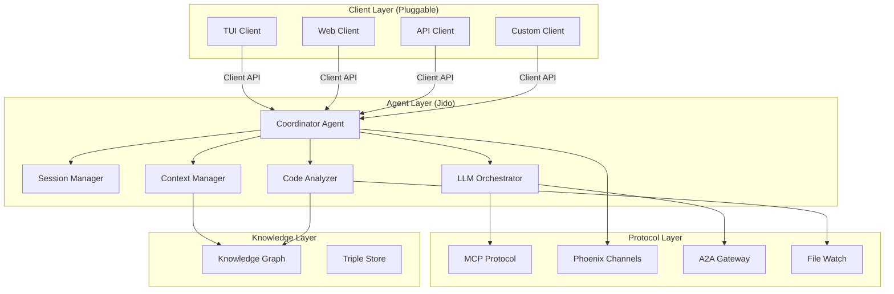
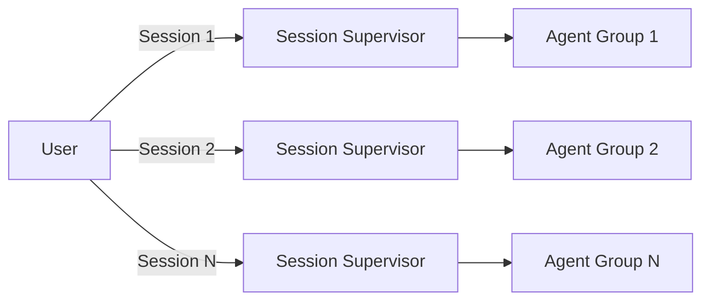
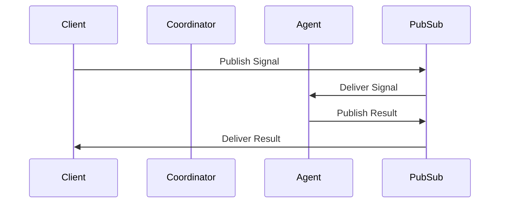

# Jidoka Developer Guide - Overview

## Table of Contents
- [Introduction](#introduction)
- [What is Jidoka?](#what-is-jidoka)
- [Core Concepts](#core-concepts)
- [System Architecture](#system-architecture)
- [Key Features](#key-features)
- [Technology Stack](#technology-stack)
- [Project Structure](#project-structure)
- [Quick Start](#quick-start)
- [Next Steps](#next-steps)

## Introduction

Welcome to the Jidoka Developer Guide. This documentation provides comprehensive information about the Jidoka system architecture, components, and their implementation. Jidoka is a research and planning repository for an agentic coding assistant system, built as a **headless, client-agnostic core** that can power multiple frontend implementations.

## What is Jidoka?

**Jidoka** is a sophisticated agentic coding assistant core built on Elixir and the BEAM VM. It implements a multi-agent system that provides intelligent coding assistance through:

- **Specialized Agents** - Each agent has specific capabilities (code analysis, LLM orchestration, context management)
- **Persistent Memory** - Two-tier memory system with semantic knowledge graph
- **Protocol Integration** - Multiple communication protocols (MCP, Phoenix Channels, A2A)
- **Client-Agnostic Design** - Any frontend can connect via the unified Client API

### Design Philosophy

Jidoka follows these core principles:

1. **Headless by Design** - The core has no built-in UI. All clients (TUI, Web, API) are optional and plug in through the same API.
2. **Process Isolation** - Each agent runs as an independent BEAM process (~25KB), providing fault tolerance.
3. **Signal-Based Communication** - All inter-component communication uses CloudEvents-standard signals.
4. **Semantic Memory** - Knowledge is stored as RDF triples with SPARQL query capabilities.
5. **Extensibility** - Agents, actions, skills, and protocols can all be extended.

## Core Concepts

### Agents

Agents are the fundamental units of work in Jidoka. Each agent:
- Runs as a GenServer process
- Has specific capabilities and responsibilities
- Communicates via signals (pub/sub)
- Can be supervised and restarted independently

### Signals

Signals are CloudEvents-compliant messages that carry data between components:
- Standardized structure with `type`, `source`, `id`, `time`, and `data`
- Published to Phoenix PubSub topics
- Subscribed to by agents that handle specific signal types

### Actions

Actions are discrete units of work that:
- Have defined input/output schemas
- Can be executed by agents
- Are exposed to LLMs as tools
- Return structured results

### Memory System

Jidoka implements a two-tier memory system:
- **Short-term Memory**: In-process conversation buffers and working context
- **Long-term Memory**: Persistent RDF triple-store with named graphs

## System Architecture

Jidoka is organized into three distinct layers:



### Layer Responsibilities

| Layer | Responsibility |
|-------|---------------|
| **Client Layer** | User interaction, display, input collection |
| **Agent Layer** | Core intelligence, task execution, orchestration |
| **Protocol Layer** | External integrations, tool communication |
| **Knowledge Layer** | Persistent memory, semantic understanding |

## Key Features

### 1. Multi-Session Architecture

Each user session runs as an isolated workspace:
- Separate agent processes per session
- Independent context and memory
- Concurrent work on different projects



### 2. Signal-Based Communication

All components communicate through Phoenix PubSub:



### 3. Knowledge Graph Integration

Codebases are indexed as semantic knowledge graphs:
- RDF triples represent code structure
- SPARQL queries for semantic understanding
- Named graphs for different memory types

### 4. Tool Calling System

LLMs can execute actions through a unified tool abstraction:
- Actions exposed with JSON Schema definitions
- Automatic parameter validation
- Structured result returns

## Technology Stack

### Core Technologies

| Component | Technology | Purpose |
|-----------|-----------|---------|
| **Runtime** | BEAM VM | Lightweight processes, fault tolerance |
| **Language** | Elixir 1.15+ | Concurrent, distributed programming |
| **Framework** | Jido | Agent framework with actions and signals |
| **Real-time** | Phoenix Framework | PubSub, channels, presence |
| **Data** | RDF.ex | RDF triple store with SPARQL |

### Key Dependencies

- **Phoenix** - Real-time communication layer
- **CloudEvents** - Standardized event format
- **RDF.ex** - Semantic data storage
- **Broadway** - Data processing pipelines
- **Finch** - HTTP client for external APIs

## Project Structure

```
jidoka/
├── .claude/                    # Agent orchestration definitions
│   ├── agent-definitions/       # Specialized agent configurations
│   ├── commands/                # Development workflow commands
│   ├── AGENTS.md                # Agent system documentation
│   └── AGENT-SYSTEM-GUIDE.md    # Model/tool optimization guide
├── guides/                      # Developer guides (this directory)
├── lib/                         # Implementation code
│   ├── jidoka/                  # Main application namespace
│   │   ├── application.ex       # Application supervision tree
│   │   ├── agents/              # Agent implementations
│   │   ├── protocols/           # Protocol implementations
│   │   ├── signals/             # Signal definitions
│   │   └── actions/             # Action definitions
│   └── jido/                    # Jido framework integration
├── research/                    # Architectural research documents
├── test/                        # Test suite
└── config/                      # Configuration files
```

### Documentation Structure

```
guides/developer/
├── overview.md           # This file - system overview
├── architecture.md       # Detailed architecture breakdown
├── agent-layer.md        # Agent system deep dive
├── protocol-layer.md     # Protocol integration details
├── client-api.md         # Client API specification
├── memory-system.md      # Memory and knowledge graph
├── signals.md            # Signal/event system
└── development-workflow.md  # Development workflow orchestration
```

## Quick Start

### Prerequisites

- Elixir 1.15 or later
- Erlang/OTP 26 or later
- A SPARQL-capable triple store (e.g., Blazegraph, Virtuoso)

### Installation

```bash
# Clone the repository
git clone https://github.com/agentjido/jidoka.git
cd jidoka

# Install dependencies
mix deps.get

# Setup the database (for triple store)
mix triple_store.setup

# Run tests
mix test
```

### Running the System

```bash
# Start the application interactively
iex -S mix

# Or start the application
mix start
```

## Next Steps

Continue your journey through the developer guides:

1. **[Architecture](architecture.md)** - Deep dive into system architecture and design patterns
2. **[Agent Layer](agent-layer.md)** - Understanding agents, actions, and skills
3. **[Protocol Layer](protocol-layer.md)** - External integrations and protocols
4. **[Client API](client-api.md)** - Building clients for Jidoka
5. **[Memory System](memory-system.md)** - Knowledge graph and persistent memory
6. **[Signals](signals.md)** - Signal-based communication system
7. **[Development Workflow](development-workflow.md)** - Agent orchestration for development

## Additional Resources

- **[Research Documents](../../research/)** - Architectural research and design documents
- **[Agent Definitions](../.claude/agent-definitions/)** - Agent system configurations
- **[Command Definitions](../.claude/commands/)** - Development workflow commands
- **[CLAUDE.md](../CLAUDE.md)** - Repository-specific guidance for AI assistants
