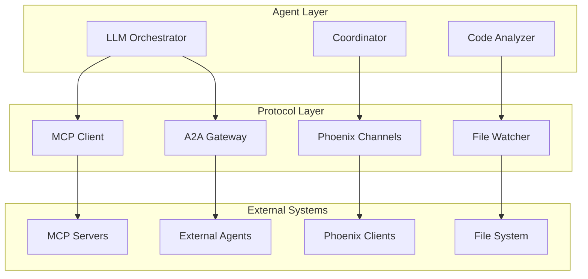
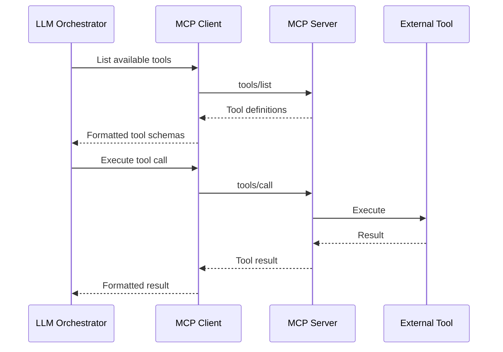
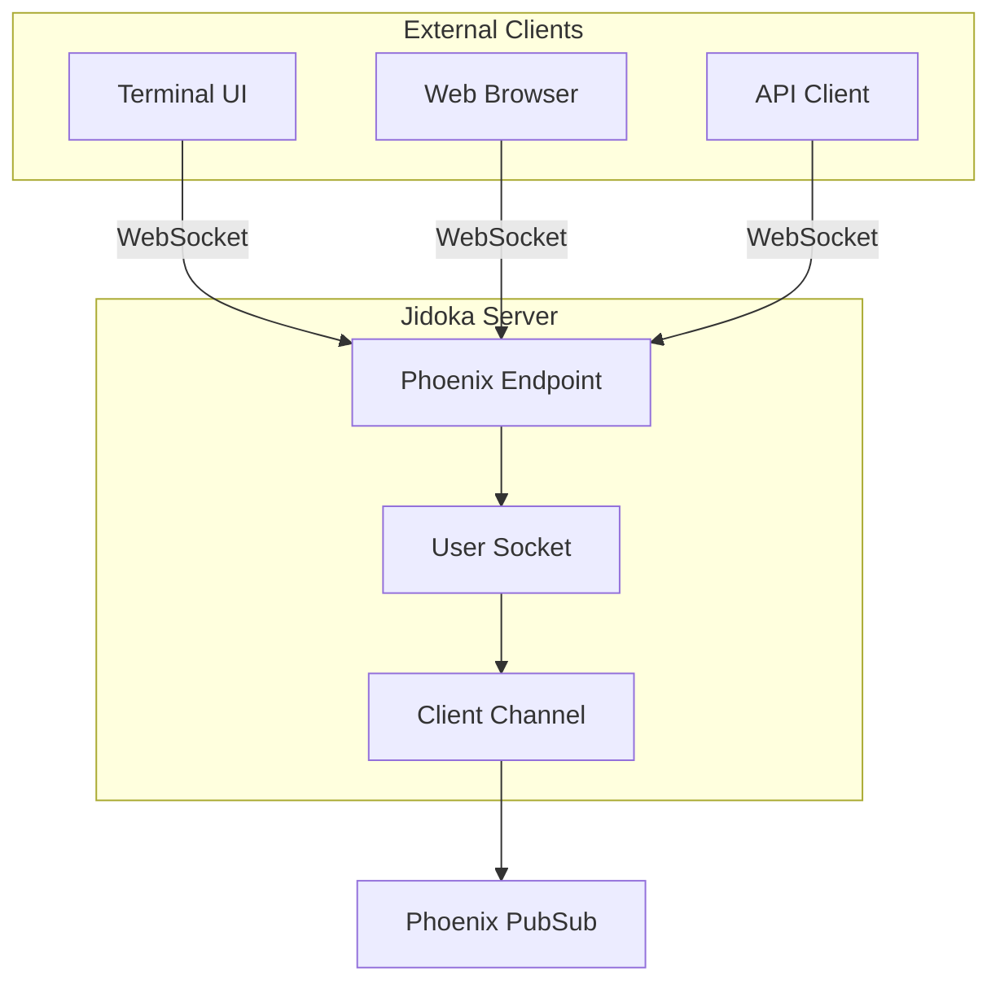
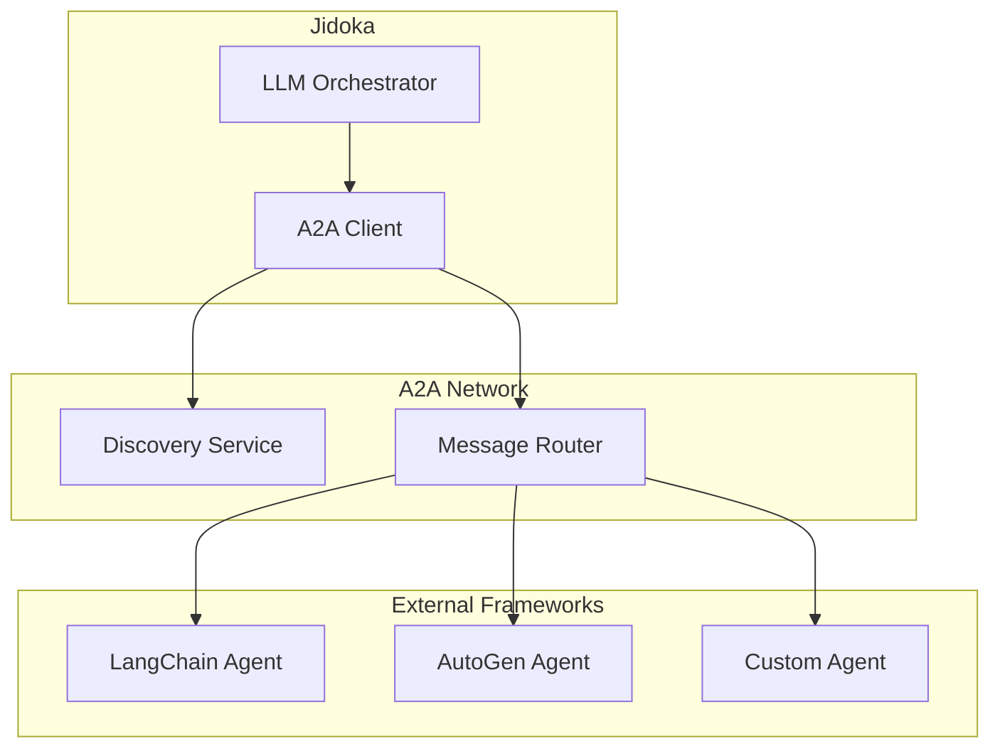
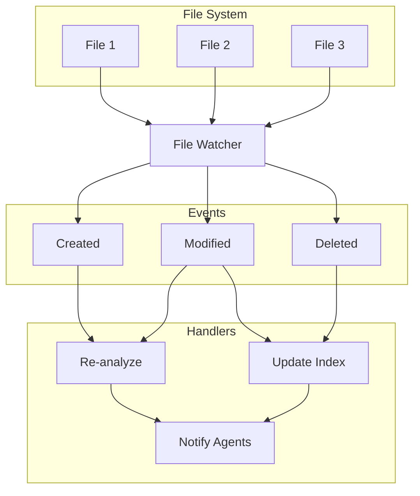

# Protocol Layer Guide

## Table of Contents
- [Introduction](#introduction)
- [Protocol Architecture](#protocol-architecture)
- [MCP Protocol](#mcp-protocol)
- [Phoenix Channels](#phoenix-channels)
- [A2A Gateway](#a2a-gateway)
- [File Watcher](#file-watcher)
- [Implementing Custom Protocols](#implementing-custom-protocols)
- [Protocol Testing](#protocol-testing)

## Introduction

The Protocol Layer handles all external integrations and communication protocols in Jidoka. This guide covers the architecture and implementation of protocols that connect Jidoka to external tools, services, and frameworks.

## Protocol Architecture

### Layer Overview

The Protocol Layer sits between the Agent Layer and external systems:



### Protocol Supervisor

All protocols are supervised by a dedicated supervisor:

```elixir
defmodule Jidoka.Protocol.Supervisor do
  use Supervisor

  def start_link(init_arg) do
    Supervisor.start_link(__MODULE__, init_arg, name: __MODULE__)
  end

  @impl true
  def init(_init_arg) do
    children = [
      {Jidoka.Protocol.MCP.Client, []},
      {Jidoka.Protocol.Phoenix.Server, []},
      {Jidoka.Protocol.A2A.Gateway, []},
      {Jidoka.Protocol.FileWatcher, []}
    ]

    # Use one_for_one to isolate protocol failures
    Supervisor.init(children, strategy: :one_for_one)
  end
end
```

### Common Protocol Behavior

All protocols implement a common interface:

```elixir
defmodule Jidoka.Protocol do
  @moduledoc """
  Common behavior for all Jidoka protocols.
  """

  @callback start_link(keyword()) :: GenServer.on_start()
  @callback send_request(any()) :: {:ok, any()} | {:error, any()}
  @callback handle_response(any()) :: :ok | {:error, any()}
  @callback status() :: :connected | :disconnected | :error
end
```

## MCP Protocol

### What is MCP?

The **Model Context Protocol (MCP)** is a standardized protocol for connecting LLMs to external tools and data sources. Jidoka implements an MCP client that can connect to MCP servers and expose their tools to the LLM Orchestrator.

### MCP Architecture



### MCP Client Implementation

```elixir
defmodule Jidoka.Protocol.MCP.Client do
  @moduledoc """
  MCP Client for connecting to MCP servers.

  Implements JSON-RPC 2.0 communication with MCP servers
  and exposes tools to the LLM Orchestrator.
  """

  use GenServer
  require Logger

  @impl true
  def init(opts) do
    server_url = Keyword.fetch!(opts, :server_url)
    transport = Keyword.get(opts, :transport, :stdio)

    state = %{
      server_url: server_url,
      transport: transport,
      connection: nil,
      tools: [],
      status: :disconnected
    }

    send(self(), :connect)
    {:ok, state}
  end

  @impl true
  def handle_info(:connect, state) do
    case connect(state.server_url) do
      {:ok, connection} ->
        Logger.info("Connected to MCP server: #{state.server_url}")
        new_state = %{state | connection: connection, status: :connected}
        send(self(), :initialize)
        {:noreply, new_state}

      {:error, reason} ->
        Logger.error("Failed to connect to MCP server: #{inspect(reason)}")
        # Schedule retry
        Process.send_after(self(), :connect, 5000)
        {:noreply, state}
    end
  end

  def handle_info(:initialize, %{connection: conn} = state) do
    # Send initialize request
    request = %{
      jsonrpc: "2.0",
      id: 1,
      method: "initialize",
      params: %{
        protocolVersion: "2024-11-05",
        capabilities: %{},
        clientInfo: %{
          name: "jidoka",
          version: Jidoka.version()
        }
      }
    }

    send_request(conn, request)
    {:noreply, state}
  end

  defp connect(server_url) do
    # Implementation depends on transport (stdio, HTTP, WebSocket)
    case String.starts_with?(server_url, ["http://", "https://"]) do
      true -> connect_http(server_url)
      false -> connect_stdio()
    end
  end

  defp send_request(connection, request) do
    # JSON-RPC 2.0 request encoding
    json = Jason.encode!(request)
    send_raw(connection, json <> "\n")
  end

  defp send_raw(connection, data) do
    # Transport-specific sending
    :ok
  end
end
```

### MCP Tool Integration

Tools from MCP servers are automatically integrated with the LLM Orchestrator:

```elixir
defmodule Jidoka.Protocol.MCP.ToolBridge do
  @moduledoc """
  Bridges MCP server tools to Jido Actions for LLM tool calling.
  """

  def register_tools(mcp_tools) do
    Enum.each(mcp_tools, fn mcp_tool ->
      action = convert_mcp_tool_to_action(mcp_tool)
      Jidoka.Actions.register(action)
    end)
  end

  defp convert_mcp_tool_to_action(%{
    "name" => name,
    "description" => description,
    "inputSchema" => input_schema
  }) do
    %{
      name: "mcp_#{name}",
      description: description,
      schema: input_schema,
      execute: fn params ->
        execute_mcp_tool(name, params)
      end
    }
  end

  defp execute_mcp_tool(tool_name, params) do
    GenServer.call(Jidoka.Protocol.MCP.Client, {:execute_tool, tool_name, params})
  end
end
```

### MCP Configuration

```elixir
# config/config.exs
config :jidoka, :mcp_servers,
  filesystem: [
    url: "stdio://filesystem",
    enabled: true
  ],
  database: [
    url: "http://localhost:3000/mcp",
    enabled: true
  ]
```

## Phoenix Channels

### Overview

Phoenix Channels provide real-time bidirectional communication between Jidoka and external clients. This is the primary protocol for client connections.

### Channel Architecture



### Channel Implementation

```elixir
defmodule Jidoka.Protocol.Phoenix.Socket do
  @moduledoc """
  Phoenix Socket for client connections.
  """

  use Phoenix.Socket
  require Logger

  ## Channels
  channel "client:*", Jidoka.Protocol.Phoenix.ClientChannel
  channel "signals", Jidoka.Protocol.Phoenix.SignalsChannel

  # Socket params authentication
  @impl true
  def connect(_params, socket, _connect_info) do
    {:ok, socket}
  end

  # Socket ID's are topics for broadcasts
  @impl true
  def id(_socket), do: nil
end

defmodule Jidoka.Protocol.Phoenix.ClientChannel do
  use Phoenix.Channel
  require Logger

  @impl true
  def join("client:" <> _client_id, _payload, socket) do
    Logger.info("Client joined: #{socket.topic}")
    {:ok, socket}
  end

  @impl true
  def handle_in("request", %{"type" => type, "data" => data}, socket) do
    # Publish request as signal
    Jidoka.Signals.publish(%Jidoka.Signal{
      type: "client.#{type}",
      source: socket.topic,
      data: data
    })

    {:noreply, socket}
  end

  @impl true
  def handle_out("event", payload, socket) do
    push(socket, "event", payload)
    {:noreply, socket}
  end
end
```

### Client-Side Connection

```elixir
# Example client connection
defmodule Jidoka.Client.Connection do
  def connect(client_id) do
    {:ok, socket} = Phoenix.Socket.Client.start_link(
      url: "ws://localhost:4000/socket",
      params: %{client_id: client_id}
    )

    Phoenix.Socket.Client.channel(socket, "client:#{client_id}",
      Jidoka.Client.ClientChannel
    )

    {:ok, socket}
  end

  def send_request(socket, type, data) do
    Phoenix.Socket.Client.push(socket, "request", %{type: type, data: data})
  end
end
```

## A2A Gateway

### Overview

The **Agent-to-Agent (A2A) Gateway** enables communication between Jidoka and other agent frameworks. This allows for cross-framework agent discovery and messaging.

### A2A Architecture



### A2A Implementation

```elixir
defmodule Jidoka.Protocol.A2A.Gateway do
  @moduledoc """
  Agent-to-Agent Gateway for cross-framework communication.

  Implements discovery and messaging with external agent frameworks.
  """

  use GenServer
  require Logger

  @impl true
  def init(opts) do
    discovery_url = Keyword.get(opts, :discovery_url)

    state = %{
      discovery_url: discovery_url,
      registered_agents: %{},
      subscriptions: []
    }

    send(self(), :discover_agents)
    {:ok, state}
  end

  @impl true
  def handle_info(:discover_agents, state) do
    case discover_agents(state.discovery_url) do
      {:ok, agents} ->
        Enum.each(agents, &register_agent/1)
        new_state = %{state | registered_agents: Map.new(agents, fn a -> {a.id, a} end)}
        {:noreply, new_state}

      {:error, reason} ->
        Logger.warning("Agent discovery failed: #{inspect(reason)}")
        # Schedule retry
        Process.send_after(self(), :discover_agents, 30_000)
        {:noreply, state}
    end
  end

  def send_message(agent_id, message) do
    GenServer.call(__MODULE__, {:send_message, agent_id, message})
  end

  @impl true
  def handle_call({:send_message, agent_id, message}, _from, state) do
    case Map.get(state.registered_agents, agent_id) do
      nil ->
        {:reply, {:error, :agent_not_found}, state}

      agent ->
        result = send_to_agent(agent, message)
        {:reply, result, state}
    end
  end

  defp discover_agents(discovery_url) do
    # HTTP request to discovery service
    case Finch.get(:http_client, discovery_url <> "/agents") do
      {:ok, %Finch.Response{status: 200, body: body}} ->
        {:ok, Jason.decode!(body)}

      {:error, reason} ->
        {:error, reason}
    end
  end

  defp register_agent(agent_info) do
    Logger.info("Registered external agent: #{agent_info["id"]}")
    :ok
  end

  defp send_to_agent(agent, message) do
    # Send message via appropriate transport
    case agent["transport"] do
      "http" -> send_via_http(agent["endpoint"], message)
      "websocket" -> send_via_ws(agent["endpoint"], message)
      _ -> {:error, :unsupported_transport}
    end
  end
end
```

### A2A Message Format

```elixir
defmodule Jidoka.Protocol.A2A.Message do
  @moduledoc """
  Standard message format for A2A communication.
  """

  @type t :: %__MODULE__{
    id: String.t(),
    source: String.t(),
    target: String.t(),
    type: String.t(),
    data: map(),
    timestamp: DateTime.t()
  }

  defstruct [
    :id,
    :source,
    :target,
    :type,
    :data,
    :timestamp
  ]

  def new(source, target, type, data) do
    %__MODULE__{
      id: UUID.uuid4(),
      source: source,
      target: target,
      type: type,
      data: data,
      timestamp: DateTime.utc_now()
    }
  end

  def to_json(%__MODULE__{} = message) do
    message
    |> Map.from_struct()
    |> Jason.encode!()
  end
end
```

## File Watcher

### Overview

The File Watcher protocol monitors the filesystem for changes and triggers appropriate actions when files are modified, created, or deleted.

### File Watcher Architecture



### File Watcher Implementation

```elixir
defmodule Jidoka.Protocol.FileWatcher do
  @moduledoc """
  File system watcher for detecting codebase changes.

  Uses FileSystem (inotify) for efficient file watching.
  """

  use GenServer
  require Logger

  @impl true
  def init(opts) do
    watch_dirs = Keyword.get(opts, :dirs, ["lib/", "test/"])

    # Start file system watcher
    {:ok, watcher_pid} = FileSystem.start_link(dirs: watch_dirs)
    FileSystem.subscribe(watcher_pid)

    state = %{
      watcher_pid: watcher_pid,
      watch_dirs: watch_dirs,
      debounce_timer: nil
    }

    {:ok, state}
  end

  @impl true
  def handle_info(
    {:file_event, watcher_pid, {path, events}},
    %{watcher_pid: watcher_pid} = state
  ) do
    # Filter relevant events
    relevant_events = Enum.filter(events, &relevant_event?/1)

    if Enum.any?(relevant_events) do
      Logger.debug("File event: #{path} (#{inspect(events)})")
      handle_file_change(path, events, state)
    else
      {:noreply, state}
    end
  end

  defp relevant_event?(:created), do: true
  defp relevant_event?(:modified), do: true
  defp relevant_event?(:removed), do: true
  defp relevant_event(_), do: false

  defp handle_file_change(path, events, state) do
    # Debounce rapid changes
    case state.debounce_timer do
      nil ->
        timer = Process.send_after(self(), {:process_change, path, events}, 100)
        {:noreply, %{state | debounce_timer: timer}}

      timer ->
        Process.cancel_timer(timer)
        new_timer = Process.send_after(self(), {:process_change, path, events}, 100)
        {:noreply, %{state | debounce_timer: new_timer}}
    end
  end

  @impl true
  def handle_info({:process_change, path, events}, state) do
    # Publish file change signal
    Jidoka.Signals.publish(%Jidoka.Signal{
      type: "file.changed",
      source: "file_watcher",
      data: %{
        "path" => path,
        "events" => Enum.map(events, &to_string/1)
      }
    })

    {:noreply, %{state | debounce_timer: nil}}
  end
end
```

### File Watcher Integration with Code Analyzer

```elixir
defmodule Jidoka.Agents.CodeAnalyzer do
  use GenServer

  @impl true
  def handle_info(%Jidoka.Signal{type: "file.changed", data: %{"path" => path}}, state) do
    # Re-analyze changed file
    if relevant_file?(path, state) do
      Logger.info("Re-analyzing changed file: #{path}")
      analyze_file(path, state)
    end

    {:noreply, state}
  end

  defp relevant_file?(path, state) do
    String.starts_with?(path, state.project_root) &&
    not ignored_file?(path)
  end

  defp ignored_file?(path) do
    Enum.any?(["_build/", "deps/", ".git/"], &String.contains?(path, &1))
  end
end
```

## Implementing Custom Protocols

### Protocol Template

```elixir
defmodule Jidoka.Protocol.Custom do
  @moduledoc """
  Custom protocol implementation template.

  Implement the required callbacks to create a functional protocol.
  """

  use GenServer
  require Logger

  # Client API

  def start_link(opts) do
    GenServer.start_link(__MODULE__, opts, name: __MODULE__)
  end

  def send_request(data) do
    GenServer.call(__MODULE__, {:send, data})
  end

  def status do
    GenServer.call(__MODULE__, :status)
  end

  # Server Callbacks

  @impl true
  def init(opts) do
    state = %{
      config: Keyword.get(opts, :config, %{}),
      connection: nil,
      status: :disconnected
    }

    send(self(), :connect)
    {:ok, state}
  end

  @impl true
  def handle_call(:status, _from, state) do
    {:reply, state.status, state}
  end

  @impl true
  def handle_call({:send, data}, _from, state) do
    case state.status do
      :connected ->
        result = do_send(state.connection, data)
        {:reply, result, state}

      :disconnected ->
        {:reply, {:error, :not_connected}, state}
    end
  end

  @impl true
  def handle_info(:connect, state) do
    case connect(state.config) do
      {:ok, connection} ->
        Logger.info("#{__MODULE__} connected")
        {:noreply, %{state | connection: connection, status: :connected}}

      {:error, reason} ->
        Logger.error("Failed to connect: #{inspect(reason)}")
        # Retry logic
        Process.send_after(self(), :connect, 5000)
        {:noreply, state}
    end
  end

  @impl true
  def handle_info({:incoming, data}, state) do
    # Process incoming data from the protocol
    handle_incoming_data(data)
    {:noreply, state}
  end

  @impl true
  def terminate(_reason, state) do
    if state.connection do
      disconnect(state.connection)
    end
    :ok
  end

  # Private Helpers

  defp connect(config) do
    # Implement connection logic
    {:ok, %{pid: self()}}
  end

  defp disconnect(connection) do
    # Implement disconnection logic
    :ok
  end

  defp do_send(connection, data) do
    # Implement send logic
    {:ok, %{}}
  end

  defp handle_incoming_data(data) do
    # Process incoming data and publish as signals if needed
    Jidoka.Signals.publish(%Jidoka.Signal{
      type: "protocol.custom.data",
      source: "custom_protocol",
      data: data
    })
  end
end
```

### Registering Custom Protocols

Add your protocol to the protocol supervisor:

```elixir
# In lib/jidoka/protocol/supervisor.ex
defmodule Jidoka.Protocol.Supervisor do
  use Supervisor

  def start_link(init_arg) do
    Supervisor.start_link(__MODULE__, init_arg, name: __MODULE__)
  end

  @impl true
  def init(_init_arg) do
    children = [
      # ... existing protocols ...
      {Jidoka.Protocol.Custom, config: custom_config()}
    ]

    Supervisor.init(children, strategy: :one_for_one)
  end

  defp custom_config do
    Application.get_env(:jidoka, :custom_protocol, %{})
  end
end
```

## Protocol Testing

### Unit Tests

```elixir
defmodule Jidoka.Protocol.CustomTest do
  use ExUnit.Case, async: true

  import Mox

  setup do
    start_supervised!(Jidoka.Protocol.Custom)
    :ok
  end

  describe "send_request/1" do
    test "sends data successfully when connected" do
      assert {:ok, result} = Jidoka.Protocol.Custom.send_request(%{data: "test"})
      assert result.status == :sent
    end

    test "returns error when disconnected" do
      # Force disconnect
      :sys.stop(Jidoka.Protocol.Custom)

      assert {:error, :not_connected} = Jidoka.Protocol.Custom.send_request(%{})
    end
  end
end
```

### Integration Tests

```elixir
defmodule Jidoka.ProtocolIntegrationTest do
  use ExUnit.Case

  setup do
    start_supervised!(Jidoka.Application)
    :ok
  end

  describe "protocol communication" do
    test "protocols can communicate with external services" do
      # Test actual external communication
      assert {:ok, _response} = Jidoka.Protocol.MCP.Client.list_tools()
    end
  end
end
```

## See Also

- **[Architecture Guide](architecture.md)** - Overall system architecture
- **[Agent Layer Guide](agent-layer.md)** - Agent implementation
- **[Signals Guide](signals.md)** - Signal-based communication
