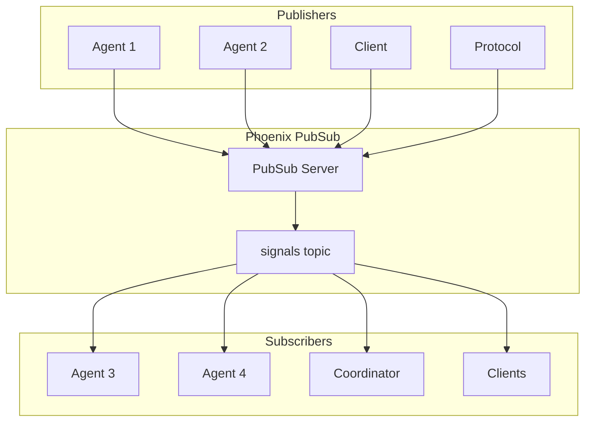
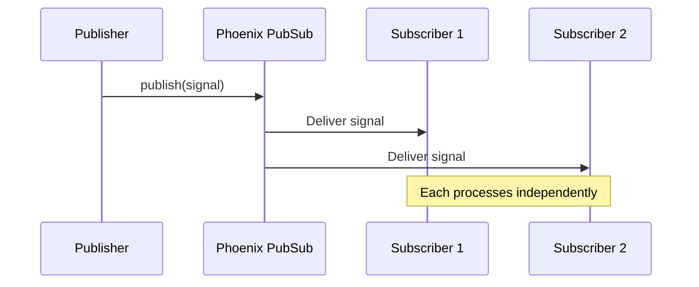
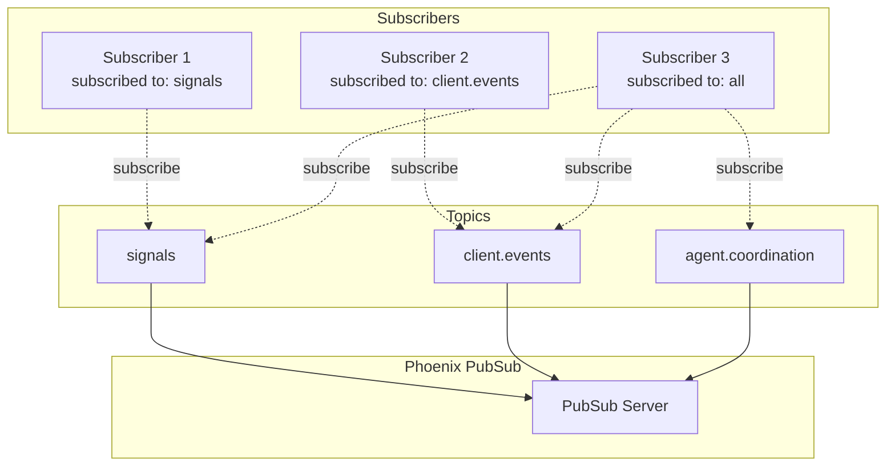
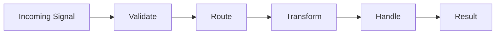

# Signals Guide

## Table of Contents
- [Introduction](#introduction)
- [Signal Architecture](#signal-architecture)
- [CloudEvents Specification](#cloudevents-specification)
- [Signal Types](#signal-types)
- [Publishing Signals](#publishing-signals)
- [Subscribing to Signals](#subscribing-to-signals)
- [Signal Processing](#signal-processing)
- [Signal Security](#signal-security)

## Introduction

Signals are the primary communication mechanism in Jidoka. Based on the CloudEvents specification, signals enable decoupled, asynchronous communication between agents, protocols, and clients via Phoenix PubSub.

## Signal Architecture

### Communication Model



### Signal Flow



## CloudEvents Specification

Jidoka implements the [CloudEvents 1.0 specification](https://github.com/cloudevents/spec) for signal format:

### Required Attributes

| Attribute | Type | Description |
|-----------|------|-------------|
| `id` | string | Unique identifier for the signal |
| `source` | URI | The source of the signal |
| `specversion` | string | CloudEvents spec version (always "1.0") |
| `type` | string | The type of the signal |

### Optional Attributes

| Attribute | Type | Description |
|-----------|------|-------------|
| `datacontenttype` | string | Content type of data (e.g., "application/json") |
| `dataschema` | URI | Schema for the data payload |
| `subject` | string | Subject of the signal |
| `time` | timestamp | When the signal was created |

### Extension Attributes

Jidoka adds these extensions:

| Attribute | Type | Description |
|-----------|------|-------------|
| `session_id` | string | Associated session ID |
| `agent_id` | string | Agent that generated the signal |
| `correlation_id` | string | For request-response correlation |

### Signal Structure

```elixir
defmodule Jidoka.Signal do
  @moduledoc """
  CloudEvents-compliant signal structure.
  """

  @type t :: %__MODULE__{
    id: String.t(),
    source: String.t(),
    type: String.t(),
    specversion: String.t(),
    data: map(),
    datacontenttype: String.t() | nil,
    dataschema: String.t() | nil,
    subject: String.t() | nil,
    time: DateTime.t() | nil,
    # Extensions
    session_id: String.t() | nil,
    agent_id: String.t() | nil,
    correlation_id: String.t() | nil
  }

  defstruct [
    :id,
    :source,
    :type,
    :specversion,
    :data,
    :datacontenttype,
    :dataschema,
    :subject,
    :time,
    :session_id,
    :agent_id,
    :correlation_id
  ]

  # Defaults
  @specversion "1.0"

  def new(attrs) do
    struct!(__MODULE__, %{
      id: Map.get(attrs, :id, UUID.uuid4()),
      specversion: @specversion,
      source: Map.fetch!(attrs, :source),
      type: Map.fetch!(attrs, :type),
      data: Map.get(attrs, :data, %{}),
      datacontenttype: Map.get(attrs, :datacontenttype, "application/json"),
      time: Map.get(attrs, :time, DateTime.utc_now()),
      subject: Map.get(attrs, :subject),
      dataschema: Map.get(attrs, :dataschema),
      session_id: Map.get(attrs, :session_id),
      agent_id: Map.get(attrs, :agent_id),
      correlation_id: Map.get(attrs, :correlation_id)
    })
  end

  def to_json(%__MODULE__{} = signal) do
    signal
    |> Map.from_struct()
    |> put_time_iso8601()
    |> Jason.encode!()
  end

  def from_json(json) do
    json
    |> Jason.decode!()
    |> parse_time_iso8601()
    |> then(&struct!(__MODULE__, &1))
  end

  defp put_time_iso8601(%{time: %DateTime{} = time} = map) do
    %{map | time: DateTime.to_iso8601(time)}
  end
  defp put_time_iso8601(map), do: map

  defp parse_time_iso8601(%{time: time_string} = map) when is_binary(time_string) do
    {:ok, dt, _} = DateTime.from_iso8601(time_string)
    %{map | time: dt}
  end
  defp parse_time_iso8601(map), do: map
end
```

## Signal Types

### Naming Convention

Signal types use reverse-dot notation with category hierarchy:

```
category.subcategory.action
```

Examples:
- `agent.status.changed`
- `code.analyzed`
- `llm.response.stream`
- `file.changed`
- `session.started`

### Core Signal Types

#### Agent Signals

| Type | Description | Data |
|------|-------------|------|
| `agent.started` | Agent has started | `%{"agent" => "name", "pid" => pid}` |
| `agent.stopped` | Agent has stopped | `%{"agent" => "name", "reason" => reason}` |
| `agent.status.changed` | Agent status changed | `%{"agent" => "name", "status" => status}` |
| `agent.error` | Agent encountered error | `%{"agent" => "name", "error" => error}` |

#### Code Signals

| Type | Description | Data |
|------|-------------|------|
| `code.analyzed` | Code analysis complete | `%{"path" => path, "results" => results}` |
| `code.indexed` | Code indexing complete | `%{"modules" => count, "functions" => count}` |
| `code.issue.detected` | Code issue found | `%{"severity" => severity, "message" => msg}` |

#### LLM Signals

| Type | Description | Data |
|------|-------------|------|
| `llm.request.sent` | LLM request sent | `%{"model" => model, "prompt" => prompt}` |
| `llm.response.stream` | Streaming response chunk | `%{"content" => chunk, "index" => n}` |
| `llm.response.complete` | Full response received | `%{"content" => response, "tokens" => n}` |
| `llm.tool.call` | Tool execution requested | `%{"tool" => name, "params" => params}` |
| `llm.tool.result` | Tool execution result | `%{"tool" => name, "result" => result}` |

#### Session Signals

| Type | Description | Data |
|------|-------------|------|
| `session.started` | New session started | `%{"session_id" => id, "user_id" => id}` |
| `session.ended` | Session ended | `%{"session_id" => id, "reason" => reason}` |
| `session.context.updated` | Session context updated | `%{"session_id" => id, "changes" => changes}` |

#### File Signals

| Type | Description | Data |
|------|-------------|------|
| `file.created` | File created | `%{"path" => path}` |
| `file.changed` | File modified | `%{"path" => path, "events" => events}` |
| `file.deleted` | File deleted | `%{"path" => path}` |

#### Client Signals

| Type | Description | Data |
|------|-------------|------|
| `client.connected` | Client connected | `%{"client_id" => id, "type" => type}` |
| `client.disconnected` | Client disconnected | `%{"client_id" => id, "reason" => reason}` |
| `client.request` | Client request | `%{"type" => type, "params" => params}` |

### Signal Type Registry

```elixir
defmodule Jidoka.Signals.Registry do
  @moduledoc """
  Registry of known signal types and their schemas.
  """

  @signal_types %{
    "agent.started" => %{
      description: "Agent has started",
      data_schema: %{
        "agent" => %{type: :string, required: true},
        "pid" => %{type: :string, required: true}
      }
    },
    "llm.response.stream" => %{
      description: "Streaming LLM response chunk",
      data_schema: %{
        "content" => %{type: :string, required: true},
        "index" => %{type: :integer, required: true},
        "session_id" => %{type: :string, required: false}
      }
    },
    # ... more signal types
  }

  def list_types, do: Map.keys(@signal_types)

  def get_schema(type) do
    get_in(@signal_types, [type, :data_schema])
  end

  def validate(%Jidoka.Signal{type: type, data: data}) do
    case get_schema(type) do
      nil -> {:error, :unknown_type}
      schema -> validate_data(schema, data)
    end
  end

  defp validate_data(schema, data) do
    required_valid = Enum.all?(schema, fn {key, def} ->
      not Map.get(def, :required, false) or Map.has_key?(data, key)
    end)

    if required_valid do
      :ok
    else
      {:error, :missing_required_fields}
    end
  end
end
```

## Publishing Signals

### Basic Publishing

```elixir
defmodule Jidoka.Signals do
  @moduledoc """
  Signal publishing interface.
  """

  alias Jidoka.Signal

  @pubsub Jidoka.PubSub
  @topic "signals"

  def publish(%Signal{} = signal) do
    # Validate before publishing
    case Jidoka.Signals.Registry.validate(signal) do
      :ok ->
        Phoenix.PubSub.broadcast(@pubsub, @topic, signal)
        :ok

      {:error, reason} ->
        {:error, reason}
    end
  end

  # Convenience constructors

  def agent_status_changed(agent_name, status) do
    %Signal{
      source: "agent:#{agent_name}",
      type: "agent.status.changed",
      data: %{
        "agent" => agent_name,
        "status" => status
      }
    }
    |> publish()
  end

  def llm_stream_chunk(content, session_id, index) do
    %Signal{
      source: "agent:llm_orchestrator",
      type: "llm.response.stream",
      data: %{
        "content" => content,
        "session_id" => session_id,
        "index" => index
      }
    }
    |> publish()
  end

  def code_analyzed(path, results) do
    %Signal{
      source: "agent:code_analyzer",
      type: "code.analyzed",
      data: %{
        "path" => path,
        "results" => results
      }
    }
    |> publish()
  end
end
```

### Publishing from Agents

```elixir
defmodule Jidoka.Agents.CodeAnalyzer do
  use GenServer
  require Jidoka.Signals

  @impl true
  def handle_info(:analyze_project, state) do
    # Perform analysis
    results = analyze(state.project_path)

    # Publish result signal
    Jidoka.Signals.code_analyzed(state.project_path, results)

    {:noreply, %{state | status: :idle}}
  end

  @impl true
  def handle_info({:file_changed, path}, state) do
    # Publish status update
    Jidoka.Signals.publish(%Jidoka.Signal{
      source: "agent:code_analyzer",
      type: "agent.status.changed",
      data: %{
        "agent" => "code_analyzer",
        "status" => "analyzing",
        "message" => "Analyzing #{path}"
      }
    })

    {:noreply, state}
  end
end
```

### Direct vs Broadcast

```elixir
# Broadcast to all subscribers
Phoenix.PubSub.broadcast(@pubsub, @topic, signal)

# Send to specific subscriber (by pid)
Phoenix.PubSub.direct_broadcast(@pubsub, @topic, subscriber_pid, signal)

# Send to subscribers in a specific shard (for scaling)
Phoenix.PubSub.broadcast(@pubsub, {@topic, shard}, signal)
```

## Subscribing to Signals

### Basic Subscription

```elixir
defmodule Jidoka.Agents.Example do
  use GenServer

  @impl true
  def init(_opts) do
    # Subscribe to signals topic
    Phoenix.PubSub.subscribe(Jidoka.PubSub, "signals")

    {:ok, %{}}
  end

  @impl true
  def handle_info(%Jidoka.Signal{} = signal, state) do
    # Route to appropriate handler
    handle_signal(signal)
    {:noreply, state}
  end

  # Pattern match on specific signal types
  defp handle_signal(%Jidoka.Signal{type: "code.analyzed", data: data}) do
    # Handle code analysis results
    process_analysis_results(data)
  end

  defp handle_signal(%Jidoka.Signal{type: "llm.response.stream", data: data}) do
    # Handle streaming response
    forward_to_client(data)
  end

  defp handle_signal(_signal) do
    # Ignore unhandled signals
    :ok
  end
end
```

### Selective Subscription

```elixir
defmodule Jidoka.Agents.SelectiveSubscriber do
  use GenServer

  def init(_opts) do
    Phoenix.PubSub.subscribe(Jidoka.PubSub, "signals")
    {:ok, %{subscriptions: []}}
  end

  def subscribe_to_types(agent, types) when is_list(types) do
    GenServer.call(agent, {:subscribe, types})
  end

  @impl true
  def handle_call({:subscribe, types}, _from, state) do
    {:reply, :ok, %{state | subscriptions: types}}
  end

  @impl true
  def handle_info(%Jidoka.Signal{type: type} = signal, state) do
    if type in state.subscriptions do
      handle_subscribed_signal(signal)
    end

    {:noreply, state}
  end
end
```

### Subscription with Filters

```elixir
defmodule Jidoka.Signals.Filter do
  @moduledoc """
  Signal filtering helpers.
  """

  def where_type(signal, types) when is_list(types) do
    signal.type in types
  end

  def where_type(signal, type) do
    signal.type == type
  end

  def where_source(signal, source) do
    signal.source == source
  end

  def where_session(signal, session_id) do
    signal.session_id == session_id
  end

  def where_data_matches(signal, key_pattern, value_pattern) do
    get_in(signal.data, key_pattern) == value_pattern
  end

  def match(signal, filters) when is_list(filters) do
    Enum.all?(filters, fn filter -> filter.(signal) end)
  end
end

# Usage
defmodule Jidoka.Agents.Filtered do
  use GenServer

  @impl true
  def init(_opts) do
    Phoenix.PubSub.subscribe(Jidoka.PubSub, "signals")
    {:ok, %{}}
  end

  @impl true
  def handle_info(%Jidoka.Signal{} = signal, state) do
    Jidoka.Signals.Filter.match(signal, [
      &Jidoka.Signals.Filter.where_type(&1, ["llm.response.stream", "llm.response.complete"]),
      &Jidoka.Signals.Filter.where_session(&1, "current_session")
    ])
    |> case do
      true -> handle_matching_signal(signal)
      false -> :ok
    end

    {:noreply, state}
  end
end
```

### Topic Subscription



## Signal Processing

### Processing Pipeline



### Signal Handler Pattern

```elixir
defmodule Jidoka.Signals.Handler do
  @moduledoc """
  Generic signal handler behavior.
  """

  @callback can_handle?(Jidoka.Signal.t()) :: boolean()
  @callback handle(Jidoka.Signal.t(), state()) :: {:ok, state()} | {:error, any()}

  defmacro __using__(_opts) do
    quote do
      @behaviour Jidoka.Signals.Handler

      def handle_signal(signal, state) do
        if can_handle?(signal) do
          handle(signal, state)
        else
          {:ok, state}
        end
      end
    end
  end
end

# Example handler
defmodule Jidoka.Signals.Handlers.CodeAnalysis do
  use Jidoka.Signals.Handler

  @impl true
  def can_handle?(%Jidoka.Signal{type: "code.analyzed"}), do: true
  def can_handle?(_), do: false

  @impl true
  def handle(%Jidoka.Signal{data: %{"results" => results}}, state) do
    # Process analysis results
    {:ok, %{state | last_analysis: results}}
  end
end
```

### Signal Pipeline

```elixir
defmodule Jidoka.Signals.Pipeline do
  @moduledoc """
  Pipeline for processing signals through multiple handlers.
  """

  defstruct [:handlers, :error_handler]

  def new(handlers, opts \\ []) do
    error_handler = Keyword.get(opts, :on_error, :default)

    %__MODULE__{
      handlers: handlers,
      error_handler: error_handler
    }
  end

  def process(pipeline, signal) do
    process_handlers(pipeline, signal, pipeline.handlers)
  end

  defp process_handlers(_pipeline, signal, []) do
    {:ok, signal}
  end

  defp process_handlers(pipeline, signal, [handler | rest]) do
    case handler.handle_signal(signal, %{}) do
      {:ok, new_state} ->
        # Continue pipeline
        process_handlers(pipeline, signal, rest)

      {:error, reason} ->
        handle_error(pipeline, reason, signal)
    end
  end

  defp handle_error(pipeline, reason, signal) do
    case pipeline.error_handler do
      :default ->
        # Log and continue
        require Logger
        Logger.warning("Signal pipeline error: #{inspect(reason)}")
        {:error, reason}

      :stop ->
        {:error, reason}

      {module, fun} ->
        apply(module, fun, [reason, signal])
    end
  end
end

# Usage
defmodule Jidoka.Signals.MainPipeline do
  def pipeline do
    handlers = [
      Jidoka.Signals.Handlers.Validation,
      Jidoka.Signals.Handlers.Logging,
      Jidoka.Signals.Handlers.Metrics,
      Jidoka.Signals.Handlers.Routing
    ]

    Jidoka.Signals.Pipeline.new(handlers, on_error: :stop)
  end
end
```

## Signal Security

### Authentication

```elixir
defmodule Jidoka.Signals.Auth do
  @moduledoc """
  Signal authentication and authorization.
  """

  def sign(signal, secret) do
    # Add HMAC signature
    data = Jidoka.Signal.to_json(signal)
    signature = :crypto.mac(:hmac, :sha256, secret, data)

    %{signal | data: Map.put(signal.data, "_sig", Base.encode16(signature))}
  end

  def verify(%Jidoka.Signal{data: %{"_sig" => signature}} = signal, secret) do
    data = %{signal | data: Map.delete(signal.data, "_sig")}
    |> Jidoka.Signal.to_json()

    expected = :crypto.mac(:hmac, :sha256, secret, data)
    |> Base.encode16()

    constant_time_compare(signature, expected)
  end
  def verify(_, _), do: false

  defp constant_time_compare(a, b) do
    if byte_size(a) == byte_size(b) do
      :crypto.bytes_to_integer(:crypto.exor(a, b)) == 0
    else
      false
    end
  end
end
```

### Authorization

```elixir
defmodule Jidoka.Signals.Authorizer do
  @moduledoc """
  Signal authorization checks.
  """

  @permissions %{
    # What agents can publish what signal types
    "agent:coordinator" => ["*"],
    "agent:code_analyzer" => ["code.*", "agent.status.changed"],
    "agent:llm_orchestrator" => ["llm.*", "agent.status.changed"],
    "client:*" => ["client.request"]
  }

  def can_publish?(source, type) do
    Enum.any?(@permissions, fn {pattern, allowed_types} ->
      matches_source?(source, pattern) and
        Enum.any?(allowed_types, &matches_type?(type, &1))
    end)
  end

  defp matches_source?(source, pattern) do
    pattern = String.replace(pattern, "*", "*")
    case :glob.compile(pattern) do
      {:ok, regex} -> :regex.run(regex, source) != :nomatch
      {:error, _} -> false
    end
  end

  defp matches_type?(type, pattern) when pattern == "*", do: true
  defp matches_type?(type, pattern) do
    pattern = String.replace(pattern, "*", ".*") |> Regex.compile!
    Regex.match?(pattern, type)
  end
end
```

## See Also

- **[Architecture Guide](architecture.md)** - Overall system architecture
- **[Agent Layer Guide](agent-layer.md)** - Agent signal handling
- **[Client API Guide](client-api.md)** - Client event API
