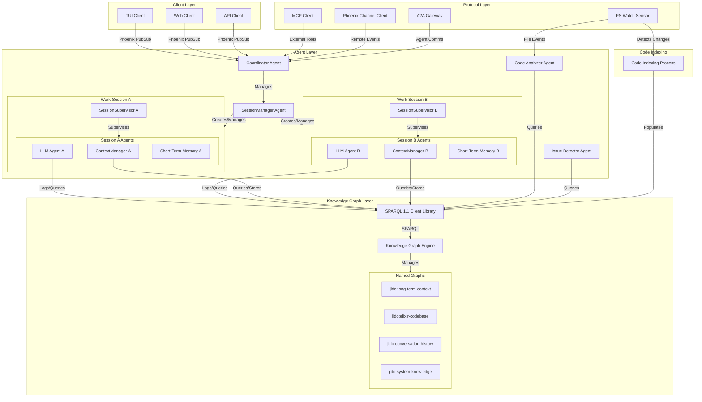

# Jido Coder Lib - Foundation Implementation Plan

## Overview

This implementation plan describes the construction of **jidoka**, a headless, client-agnostic agentic coding assistant core built on Elixir and the BEAM VM. The architecture follows a layered design with specialized agents, semantic memory systems, and pluggable protocol integrations.

## Architecture Diagram



## Project Structure

```
jidoka/
├── lib/
│   ├── jidoka/
│   │   ├── application.ex                 # Application entry point
│   │   ├── pubsub.ex                      # PubSub configuration
│   │   ├── agents/                        # Agent implementations
│   │   │   ├── coordinator.ex
│   │   │   ├── session_manager.ex
│   │   │   ├── context_manager.ex
│   │   │   ├── llm_orchestrator.ex
│   │   │   ├── code_analyzer.ex
│   │   │   └── issue_detector.ex
│   │   ├── session/                       # Session management
│   │   │   ├── supervisor.ex
│   │   │   └── state.ex
│   │   ├── memory/                        # Memory systems
│   │   │   ├── short_term/
│   │   │   │   ├── conversation_buffer.ex
│   │   │   │   ├── working_context.ex
│   │   │   │   └── pending_memories.ex
│   │   │   └── long_term/
│   │   │       ├── triple_store_adapter.ex
│   │   │       └── session_adapter.ex
│   │   ├── knowledge/                     # Knowledge graph layer
│   │   │   ├── sparql_client.ex
│   │   │   ├── named_graphs.ex
│   │   │   └── ontologies/
│   │   ├── tools/                         # Jido Actions as tools
│   │   │   ├── read_file.ex
│   │   │   ├── search_code.ex
│   │   │   └── analyze_function.ex
│   │   ├── protocol/                      # Protocol integrations
│   │   │   ├── mcp/
│   │   │   ├── phoenix/
│   │   │   └── a2a/
│   │   └── signals/                       # Signal definitions
│   └── jidoka.ex
├── test/
│   ├── jidoka/
│   │   ├── agents/
│   │   ├── session/
│   │   ├── memory/
│   │   ├── knowledge/
│   │   └── integration/
│   └── test_helper.ex
├── config/
│   ├── config.exs
│   └── dev.exs
├── mix.exs
└── README.md
```

## Phase Summaries

| Phase | Title | Description | Dependencies |
|-------|-------|-------------|--------------|
| 1 | Core Foundation | Application structure, supervision tree, PubSub, Registry | None |
| 2 | Agent Layer Base | Base agent abstractions, signal routing, coordinator | Phase 1 |
| 3 | Multi-Session Architecture | SessionManager, SessionSupervisor, isolated work-sessions | Phase 2 |
| 4 | Two-Tier Memory System | STM, LTM, promotion engine | Phase 3 |
| 5 | Knowledge Graph Layer | SPARQL client, quad store, named graphs | Phase 4 |
| 6 | Codebase Semantic Model | Elixir ontology, code indexing | Phase 5 |
| 7 | Conversation History | Conversation ontology, logging, retrieval | Phase 5 |
| 8 | Client API & Protocols | Client API, MCP, Phoenix Channels, A2A | Phase 7 |

## Implementation Principles

1. **Test-First**: Every component includes comprehensive tests before implementation
2. **Incremental**: Each phase builds on previous phases with clear dependencies
3. **Isolation**: Sessions are fully isolated with scoped state
4. **Semantic**: All knowledge is represented with proper ontologies
5. **Fault-Tolerant**: Leverages BEAM supervision for graceful degradation
6. **Client-Agnostic**: Core has no knowledge of client implementations

## Success Criteria

1. **Headless Operation**: Core runs without any UI client
2. **Multi-Session**: Multiple isolated sessions running concurrently
3. **Persistent Memory**: Two-tier memory with promotion and retrieval
4. **Semantic Code Understanding**: Codebase represented as queryable knowledge graph
5. **Conversation History**: Full interaction logging with structured ontology
6. **Protocol Support**: MCP, Phoenix Channels, and A2A integrations
7. **Client API**: Well-defined PubSub event API for any client type
8. **Test Coverage**: 80%+ test coverage across all modules
9. **Documentation**: Comprehensive module and function documentation
10. **Fault Tolerance**: Graceful handling of agent failures

## Phase Files

- [Phase 1: Core Foundation](./phase-01.md)
- [Phase 2: Agent Layer Base](./phase-02.md)
- [Phase 3: Multi-Session Architecture](./phase-03.md)
- [Phase 4: Two-Tier Memory System](./phase-04.md)
- [Phase 5: Knowledge Graph Layer](./phase-05.md)
- [Phase 6: Codebase Semantic Model](./phase-06.md)
- [Phase 7: Conversation History](./phase-07.md)
- [Phase 8: Client API & Protocols](./phase-08.md)
