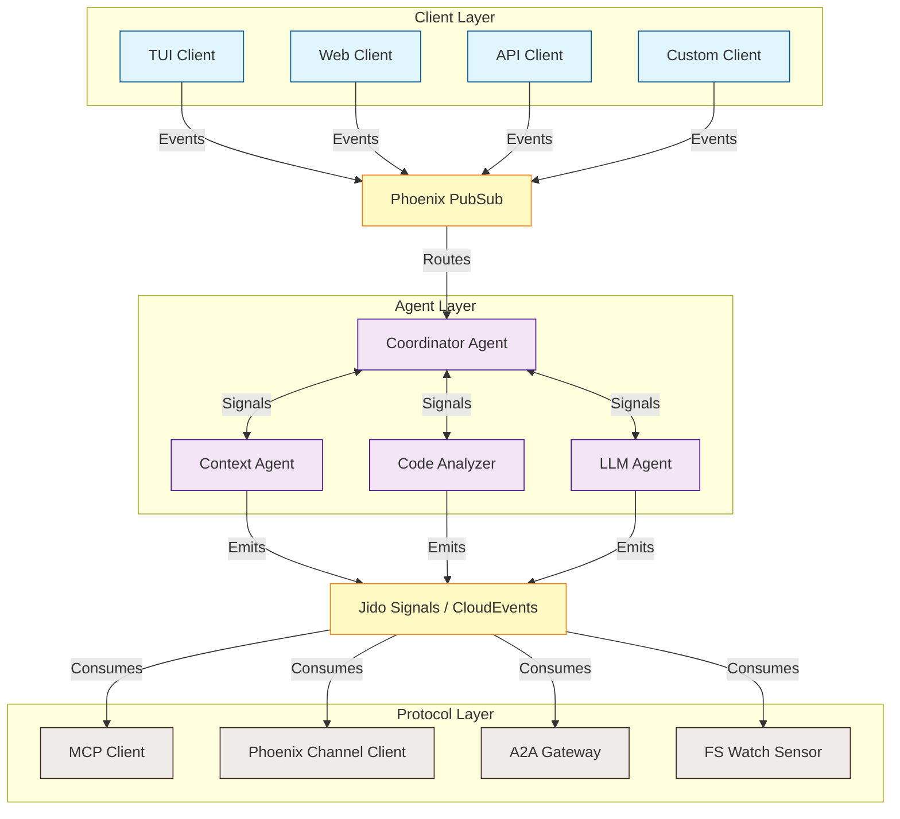

# Agentic Coding Assistant Core Architecture in Elixir

A comprehensive multi-agent system combining Jido's autonomous agent framework delivers a fault-tolerant, headless coding assistant. This architecture leverages BEAM's unique concurrency model—where each agent runs as an isolated ~25KB process—to enable specialized agents working in parallel: context refinement, code analysis, issue detection, and LLM orchestration, all coordinated through CloudEvents-based signals and Phoenix PubSub.

## Core architecture overview

The system divides into two primary layers: an **Agent Orchestration Layer** built on Jido's GenServer-based agents, and a **Protocol Integration Layer** connecting to external tools and services via MCP, Phoenix Channels, and inter-agent protocols. Client applications (TUI, web, API, etc.) consume the core through a well-defined event API via Phoenix PubSub.



## Supervision tree design

The supervision tree balances fault isolation with coordinated recovery. Critical infrastructure (PubSub, Registry) uses `:one_for_one` while tightly coupled agent groups use `:rest_for_one` to maintain consistency when dependencies fail.

```elixir
defmodule CodingAssistant.Application do
  use Application

  def start(_type, _args) do
    children = [
      # Core Infrastructure (one_for_one - independent)
      {Phoenix.PubSub, name: CodingAssistant.PubSub},
      {Registry, keys: :unique, name: CodingAssistant.AgentRegistry},
      {Registry, keys: :duplicate, name: CodingAssistant.TopicRegistry},

      # Shared State (ETS owner)
      CodingAssistant.ContextStore,

      # Agent Supervisor (rest_for_one - ordered dependencies)
      {CodingAssistant.AgentSupervisor, strategy: :rest_for_one},

      # Protocol Connections
      CodingAssistant.ProtocolSupervisor
    ]

    Supervisor.start_link(children,
      strategy: :one_for_one,
      name: CodingAssistant.Supervisor
    )
  end
end
```

The AgentSupervisor manages the specialized agents with proper startup ordering:

```elixir
defmodule CodingAssistant.AgentSupervisor do
  use Supervisor

  def start_link(opts) do
    Supervisor.start_link(__MODULE__, opts, name: __MODULE__)
  end

  def init(_opts) do
    children = [
      # Coordinator starts first - orchestrates others
      {CodingAssistant.Agents.Coordinator, []},
      # Context agent manages shared project context
      {CodingAssistant.Agents.ContextManager, []},
      # Specialized analysis agents
      CodingAssistant.Agents.CodeAnalyzer,
      CodingAssistant.Agents.IssueDetector,
      # LLM agent depends on context
      {CodingAssistant.Agents.LLMOrchestrator, []}
    ]

    Supervisor.init(children, strategy: :rest_for_one)
  end
end
```

## Multi-agent system with Jido

### Agent definitions using Jido Skills

Each specialized agent encapsulates domain-specific capabilities through Jido Skills. Skills combine signal routing, state management, and child process supervision into reusable units.

```elixir
defmodule CodingAssistant.Skills.CodeAnalysis do
  use Jido.Skill,
    name: "code_analysis",
    description: "Analyzes codebase structure, dependencies, and patterns",
    category: "analysis",
    tags: ["code", "ast", "patterns"],
    vsn: "1.0.0",
    schema_key: :analysis,
    signals: [
      input: ["code.file.changed", "code.analyze.*", "context.updated"],
      output: ["analysis.complete", "analysis.issue.found"]
    ],
    config: [
      project_path: [type: :string, required: true],
      analysis_depth: [type: :integer, default: 3]
    ]

  def initial_state do
    %{
      file_index: %{},
      dependency_graph: nil,
      last_analysis: nil,
      pending_files: []
    }
  end

  # Signal routing with priority-based dispatch
  def router do
    [
      %{
        path: "code.file.changed",
        instruction: %{action: CodingAssistant.Actions.IndexFile},
        priority: 100
      },
      %{
        path: "code.analyze.full",
        instruction: %{action: CodingAssistant.Actions.FullAnalysis},
        priority: 50
      },
      %{
        path: "code.analyze.**",
        match: fn signal -> signal.data[:urgent] == true end,
        instruction: %{action: CodingAssistant.Actions.PriorityAnalysis},
        priority: 90
      }
    ]
  end

  # Supervised child processes for background work
  def child_spec(config) do
    [
      {CodingAssistant.FileWatcher, [path: config.project_path]},
      {CodingAssistant.ASTCache, [name: :ast_cache]}
    ]
  end
end
```

### Coordinator agent for orchestration

The Coordinator agent manages inter-agent communication and broadcasts events to subscribed clients:

```elixir
defmodule CodingAssistant.Agents.Coordinator do
  use Jido.Agent,
    name: "coordinator",
    description: "Orchestrates specialized agents and broadcasts events",
    actions: [
      CodingAssistant.Actions.RouteTask,
      CodingAssistant.Actions.AggregateFindings,
      CodingAssistant.Actions.BroadcastEvent
    ],
    schema: [
      active_tasks: [type: {:map, :string, :map}, default: %{}],
      pending_broadcasts: [type: {:list, :map}, default: []],
      event_aggregation: [type: :atom, default: :immediate]
    ]

  def start_link(opts) do
    Jido.Agent.Server.start_link(__MODULE__, opts, name: __MODULE__)
  end
end

defmodule CodingAssistant.Agents.Coordinator.Server do
  use Jido.Agent.Server
  alias Phoenix.PubSub

  @impl true
  def init(opts) do
    # Subscribe to all agent output signals
    PubSub.subscribe(CodingAssistant.PubSub, "analysis.*")
    PubSub.subscribe(CodingAssistant.PubSub, "context.*")
    PubSub.subscribe(CodingAssistant.PubSub, "llm.*")

    {:ok, %{
      id: Jido.ID.generate(),
      active_tasks: %{},
      agent_status: %{},
      event_queue: :queue.new()
    }}
  end

  @impl true
  def handle_info({:signal, %{type: "analysis.issue.found"} = signal}, state) do
    # Broadcast finding to all subscribed clients
    PubSub.broadcast(CodingAssistant.PubSub, "client.events",
      {:issue_found, signal.data})

    new_queue = :queue.in({:issue, signal.data}, state.event_queue)
    {:noreply, %{state | event_queue: new_queue}}
  end

  @impl true
  def handle_info({:signal, %{type: "llm.response.ready"} = signal}, state) do
    # Broadcast LLM response to all subscribed clients
    PubSub.broadcast(CodingAssistant.PubSub, "client.events",
      {:llm_response, signal.data})
    {:noreply, state}
  end
end
```

### Inter-agent communication via Jido Signals

Signals follow the CloudEvents specification, providing standardized, traceable message passing:

```elixir
defmodule CodingAssistant.Signals do
  alias Jido.Signal

  def file_changed(path, change_type) do
    Signal.new(%{
      type: "code.file.changed",
      source: "/filesystem",
      data: %{path: path, change: change_type, timestamp: DateTime.utc_now()},
      jido_dispatch: [
        {:pubsub, [topic: "code.events", pubsub: CodingAssistant.PubSub]}
      ]
    })
  end

  def analysis_complete(results, agent_id) do
    Signal.new(%{
      type: "analysis.complete",
      source: "/agents/#{agent_id}",
      data: results,
      jido_dispatch: [
        {:pubsub, [topic: "analysis.results", pubsub: CodingAssistant.PubSub]},
        {:pid, [target: Coordinator, async: true]}
      ]
    })
  end

  def broadcast_event(event_type, payload) do
    Signal.new(%{
      type: "client.#{event_type}",
      source: "/coordinator",
      data: payload,
      jido_dispatch: [
        {:pubsub, [topic: "client.events", pubsub: CodingAssistant.PubSub]}
      ]
    })
  end
end
```

## Client API

Clients consume the core through Phoenix PubSub events. The core publishes events to the `client.events` topic, and clients can send commands via direct function calls to the Coordinator.

### Subscribable Events

Clients subscribe to `CodingAssistant.PubSub` topic `"client.events"` to receive:

```elixir
# LLM response chunks (for streaming)
{:llm_stream_chunk, %{content: String.t(), message_id: String.t()}}

# Final LLM response
{:llm_response, %{content: String.t(), message_id: String.t(), metadata: map()}}

# Agent status updates
{:agent_status, %{agent_id: String.t(), status: :idle | :processing | :error}}

# Analysis results
{:analysis_complete, %{results: map(), agent_id: String.t()}}

# Issues found
{:issue_found, %{severity: :low | :medium | :high | :critical, message: String.t()}}

# Tool execution
{:tool_call, %{tool_name: String.t(), params: map(), call_id: String.t()}}
{:tool_result, %{call_id: String.t(), result: term()}}
{:tool_error, %{call_id: String.t(), error: term()}}

# Context updates
{:context_updated, %{project_path: String.t(), file_count: integer()}}
```

### Client Commands

Clients invoke commands directly on the Coordinator:

```elixir
# Send a message to the LLM agent
CodingAssistant.Agents.Coordinator.send_message("project_path", "Hello, help me refactor this")

# Request code analysis
CodingAssistant.Agents.Coordinator.analyze_code("project_path", :full)

# Get current context
CodingAssistant.Context.Manager.get_context("project_path")

# List available tools
CodingAssistant.Tools.Registry.list_tools()
```

## Context management architecture

### Fine-grained context for LLM calls

The context management system maintains multiple context layers with different update frequencies and relevance scoring:

```elixir
defmodule CodingAssistant.Context.Manager do
  use GenServer

  @max_context_tokens 8000
  @sliding_window_size 10

  defstruct [
    :project_path,
    :file_index,
    conversation_history,
    active_files,
    long_term_memory,
    relevance_cache
  ]

  def build_llm_context(query, opts \\ []) do
    GenServer.call(__MODULE__, {:build_context, query, opts})
  end

  @impl true
  def handle_call({:build_context, query, opts}, _from, state) do
    context = %{
      # Layer 1: Project-level context (always included)
      project: build_project_context(state),

      # Layer 2: Active file context (currently open/edited)
      active: build_active_context(state.active_files, opts[:max_files] || 5),

      # Layer 3: Relevant code retrieved by similarity
      relevant: retrieve_relevant_code(query, state),

      # Layer 4: Recent conversation (sliding window)
      conversation: Enum.take(state.conversation_history, -@sliding_window_size),

      # Layer 5: Summarized older conversation
      summary: summarize_old_conversation(state.conversation_history)
    }

    # Optimize to fit token budget
    optimized = optimize_context(context, @max_context_tokens)
    {:reply, {:ok, optimized}, state}
  end

  defp build_project_context(state) do
    %{
      structure: get_file_tree(state.project_path, max_depth: 3),
      dependencies: extract_dependencies(state.project_path),
      conventions: read_project_conventions(state.project_path),
      readme: read_readme(state.project_path)
    }
  end

  defp optimize_context(context, max_tokens) do
    priorities = [:project, :active, :conversation, :relevant, :summary]

    Enum.reduce_while(priorities, {[], 0}, fn layer, {acc, tokens} ->
      layer_content = Map.get(context, layer)
      layer_tokens = estimate_tokens(layer_content)

      if tokens + layer_tokens <= max_tokens do
        {:cont, {[{layer, layer_content} | acc], tokens + layer_tokens}}
      else
        # Truncate this layer to fit remaining budget
        truncated = truncate_to_tokens(layer_content, max_tokens - tokens)
        {:halt, {[{layer, truncated} | acc], max_tokens}}
      end
    end)
    |> elem(0)
    |> Enum.reverse()
    |> Map.new()
  end
end
```

### ETS-backed context store for high-performance access

```elixir
defmodule CodingAssistant.ContextStore do
  use GenServer

  def start_link(_opts) do
    GenServer.start_link(__MODULE__, [], name: __MODULE__)
  end

  @impl true
  def init(_opts) do
    # Create ETS tables with optimized settings
    :ets.new(:file_content, [:set, :public, :named_table, read_concurrency: true])
    :ets.new(:file_metadata, [:set, :public, :named_table, read_concurrency: true])
    :ets.new(:analysis_cache, [:set, :public, :named_table,
      read_concurrency: true, write_concurrency: true])

    {:ok, %{}}
  end

  def cache_file(path, content, metadata) do
    :ets.insert(:file_content, {path, content})
    :ets.insert(:file_metadata, {path, Map.put(metadata, :cached_at, System.monotonic_time())})
  end

  def get_file(path) do
    case :ets.lookup(:file_content, path) do
      [{^path, content}] -> {:ok, content}
      [] -> :not_found
    end
  end

  def invalidate_file(path) do
    :ets.delete(:file_content, path)
    :ets.delete(:file_metadata, path)
  end
end
```

## LLM integration with Jido.AI

### LLM orchestrator agent

```elixir
defmodule CodingAssistant.Agents.LLMOrchestrator do
  use Jido.Agent,
    name: "llm_orchestrator",
    description: "Manages LLM interactions with tool calling",
    actions: [
      CodingAssistant.Actions.Chat,
      CodingAssistant.Actions.CodeGeneration,
      CodingAssistant.Actions.CodeExplanation
    ],
    schema: [
      model: [type: :atom, default: :claude_sonnet],
      temperature: [type: :float, default: 0.7],
      max_tokens: [type: :integer, default: 4096]
    ]

  def start_link(opts) do
    Jido.AI.Agent.start_link(
      agent: __MODULE__,
      ai: [
        model: {:anthropic, model: "claude-sonnet-4-20250514", api_key: get_api_key()},
        prompt: system_prompt(),
        tools: coding_tools()
      ],
      name: __MODULE__
    )
  end

  defp system_prompt do
    """
    You are an expert Elixir coding assistant. You help developers understand,
    write, and debug Elixir code. You have access to tools for searching the
    codebase, reading files, and analyzing code structure.

    Current project context:
    <%= @project_context %>

    Active file: <%= @active_file %>
    """
  end

  defp coding_tools do
    [
      CodingAssistant.Tools.ReadFile,
      CodingAssistant.Tools.SearchCode,
      CodingAssistant.Tools.AnalyzeFunction,
      CodingAssistant.Tools.ListFiles,
      CodingAssistant.Tools.GetDefinition
    ]
  end
end
```

### Tool definitions as Jido Actions

```elixir
defmodule CodingAssistant.Tools.SearchCode do
  use Jido.Action,
    name: "search_code",
    description: "Search the codebase for code matching a query",
    schema: [
      query: [type: :string, required: true, doc: "Search query string"],
      file_pattern: [type: :string, default: "**/*.ex", doc: "Glob pattern for files"],
      max_results: [type: :integer, default: 10]
    ]

  def run(%{query: query, file_pattern: pattern, max_results: max}, context) do
    project_path = context[:project_path]

    results = project_path
    |> Path.join(pattern)
    |> Path.wildcard()
    |> Enum.flat_map(&search_file(&1, query))
    |> Enum.take(max)

    {:ok, %{
      query: query,
      results: results,
      total_matches: length(results)
    }}
  end

  defp search_file(path, query) do
    case File.read(path) do
      {:ok, content} ->
        content
        |> String.split("\n")
        |> Enum.with_index(1)
        |> Enum.filter(fn {line, _} -> String.contains?(line, query) end)
        |> Enum.map(fn {line, num} ->
          %{file: path, line_number: num, content: String.trim(line)}
        end)
      _ -> []
    end
  end
end

defmodule CodingAssistant.Tools.ReadFile do
  use Jido.Action,
    name: "read_file",
    description: "Read the contents of a file",
    schema: [
      path: [type: :string, required: true, doc: "File path relative to project"],
      start_line: [type: :integer, doc: "Starting line (1-indexed)"],
      end_line: [type: :integer, doc: "Ending line (inclusive)"]
    ]

  def run(params, context) do
    full_path = Path.join(context[:project_path], params.path)

    case File.read(full_path) do
      {:ok, content} ->
        lines = String.split(content, "\n")

        selected = case {params[:start_line], params[:end_line]} do
          {nil, nil} -> lines
          {start, nil} -> Enum.drop(lines, start - 1)
          {nil, stop} -> Enum.take(lines, stop)
          {start, stop} -> lines |> Enum.slice((start-1)..(stop-1))
        end

        {:ok, %{
          path: params.path,
          content: Enum.join(selected, "\n"),
          total_lines: length(lines)
        }}

      {:error, reason} ->
        {:error, "Failed to read file: #{reason}"}
    end
  end
end
```

### Streaming response handling

```elixir
defmodule CodingAssistant.LLM.StreamHandler do
  @moduledoc "Handles streaming LLM responses to clients"

  def stream_to_clients(llm_agent_pid, message, pubsub) do
    Task.async(fn ->
      # Configure streaming callback
      handler = %{
        on_llm_new_delta: fn _model, deltas ->
          for delta <- deltas do
            content = extract_content(delta)
            Phoenix.PubSub.broadcast(
              pubsub,
              "client.events",
              {:llm_stream_chunk, %{content: content}}
            )
          end
        end,
        on_message_processed: fn _chain, message ->
          Phoenix.PubSub.broadcast(
            pubsub,
            "client.events",
            {:llm_response, message}
          )
        end
      }

      Jido.AI.Agent.chat_response(llm_agent_pid, message, callbacks: [handler])
    end)
  end
end
```

## Protocol integration layer

### MCP client integration using Anubis

```elixir
defmodule CodingAssistant.MCP.Client do
  use Anubis.Client,
    name: "CodingAssistant",
    version: "1.0.0",
    protocol_version: "2025-03-26"

  def connect_to_server(server_url) do
    {:ok, _} = start_link(url: server_url)
  end

  def list_available_tools do
    call_method("tools/list", %{})
  end

  def execute_tool(tool_name, args) do
    call_method("tools/call", %{name: tool_name, arguments: args})
  end
end

defmodule CodingAssistant.MCP.Supervisor do
  use Supervisor

  def start_link(opts) do
    Supervisor.start_link(__MODULE__, opts, name: __MODULE__)
  end

  def init(_opts) do
    mcp_servers = Application.get_env(:coding_assistant, :mcp_servers, [])

    children = for {name, url} <- mcp_servers do
      Supervisor.child_spec(
        {CodingAssistant.MCP.Client, [name: name, url: url]},
        id: {CodingAssistant.MCP.Client, name}
      )
    end

    Supervisor.init(children, strategy: :one_for_one)
  end
end
```

### Phoenix Channels client for remote servers

```elixir
defmodule CodingAssistant.Phoenix.Connection do
  use GenServer
  alias PhoenixClient.{Socket, Channel}

  def start_link(opts) do
    GenServer.start_link(__MODULE__, opts, name: __MODULE__)
  end

  @impl true
  def init(opts) do
    socket_opts = [
      url: opts[:url] || "ws://localhost:4000/socket/websocket",
      reconnect_interval: 5_000
    ]

    {:ok, socket} = Socket.start_link(socket_opts)

    # Join the agent coordination channel
    {:ok, _response, channel} = Channel.join(socket, "agents:coordination")

    {:ok, %{socket: socket, channel: channel}}
  end

  def push_event(event, payload) do
    GenServer.cast(__MODULE__, {:push, event, payload})
  end

  @impl true
  def handle_cast({:push, event, payload}, %{channel: channel} = state) do
    Channel.push_async(channel, event, payload)
    {:noreply, state}
  end

  @impl true
  def handle_info(%PhoenixClient.Message{event: event, payload: payload}, state) do
    # Route incoming messages to appropriate agents
    Phoenix.PubSub.broadcast(
      CodingAssistant.PubSub,
      "remote.events",
      {:remote_event, event, payload}
    )
    {:noreply, state}
  end
end
```

### A2A gateway for cross-framework agents

```elixir
defmodule CodingAssistant.A2A.Gateway do
  use GenServer

  @agent_card_path "/.well-known/agent.json"

  defstruct [:http_client, :known_agents, :pending_tasks]

  def discover_agent(base_url) do
    GenServer.call(__MODULE__, {:discover, base_url})
  end

  def send_message(agent_url, message) do
    GenServer.call(__MODULE__, {:send_message, agent_url, message}, 30_000)
  end

  @impl true
  def handle_call({:discover, base_url}, _from, state) do
    url = base_url <> @agent_card_path

    case Req.get(url) do
      {:ok, %{status: 200, body: agent_card}} ->
        new_agents = Map.put(state.known_agents, base_url, agent_card)
        {:reply, {:ok, agent_card}, %{state | known_agents: new_agents}}
      {:error, reason} ->
        {:reply, {:error, reason}, state}
    end
  end

  @impl true
  def handle_call({:send_message, agent_url, message}, _from, state) do
    # A2A JSON-RPC request
    request = %{
      jsonrpc: "2.0",
      id: generate_request_id(),
      method: "message/send",
      params: %{
        message: %{
          role: "user",
          parts: [%{content: message, content_type: "text/plain"}]
        }
      }
    }

    case Req.post(agent_url <> "/a2a", json: request) do
      {:ok, %{status: 200, body: response}} ->
        {:reply, {:ok, response}, state}
      {:error, reason} ->
        {:reply, {:error, reason}, state}
    end
  end
end
```

## Configuration and environment

```elixir
# config/config.exs
import Config

config :coding_assistant,
  project_path: System.get_env("PROJECT_PATH", "."),

  # LLM Configuration
  llm: [
    provider: :anthropic,
    model: "claude-sonnet-4-20250514",
    max_tokens: 4096,
    temperature: 0.7
  ],

  # MCP Servers
  mcp_servers: [
    filesystem: "stdio://mcp-server-filesystem",
    git: "http://localhost:8080/mcp"
  ],

  # Phoenix Server Connection (optional)
  phoenix_server: [
    enabled: true,
    url: "ws://localhost:4000/socket/websocket"
  ],

  # Agent Configuration
  agents: [
    context_refresh_interval: :timer.seconds(30),
    analysis_debounce: :timer.seconds(2)
  ]

config :instructor,
  adapter: Instructor.Adapters.Anthropic,
  anthropic: [api_key: System.get_env("ANTHROPIC_API_KEY")]

config :phoenix, :json_library, Jason
```

## Key architectural decisions

**Process isolation enables graceful degradation**—if the code analyzer crashes, the LLM agent continues functioning while the supervisor restarts the failed component. Each agent maintains its own state, communicating only through signals, preventing cascading failures.

**Phoenix PubSub as the message backbone** provides both local and distributed messaging. Agents publish findings to topics; clients subscribe to relevant topics. This decouples agents from any specific client implementation entirely.

**Jido Actions as LLM tools** create a unified abstraction—the same validated, schema-driven actions that agents execute locally convert directly to tool definitions the LLM can invoke. This eliminates duplicate tool definitions and ensures consistency.

**Client-agnostic design** means the core has no knowledge of how users interact with it. Whether through a TUI, web interface, API, or custom client, all communication happens through the same PubSub event API. This allows multiple client types to connect simultaneously.

This architecture exploits BEAM's strengths—lightweight processes, fault tolerance, message passing—while providing the structured patterns (CloudEvents, MCP, A2A) that make complex agentic systems maintainable and extensible.
