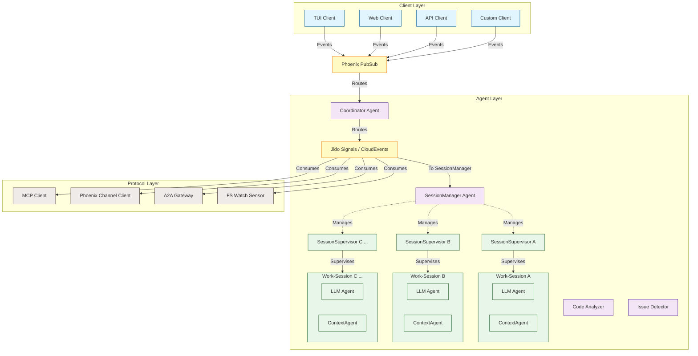

# Enhancing the Jido Coder Lib with Multi-Session Architecture

The current architecture of `jidoka` presents a robust, multi-agent system leveraging the BEAM's concurrency model and Jido's autonomous agent framework to deliver a fault-tolerant, headless coding assistant. It effectively divides responsibilities across specialized agents—Coordinator, ContextManager, CodeAnalyzer, IssueDetector, and LLMOrchestrator—coordinated through CloudEvents-based signals and Phoenix PubSub. However, the current design implicitly supports a single, global workspace and a single LLM interaction context. To evolve this into a more versatile and powerful tool, we must introduce the concept of multiple, isolated work-sessions. This enhancement will allow users, or even different parts of a larger application, to maintain separate contexts, conversation histories, and LLM configurations, potentially with different providers and models, all within the same running application instance. This document outlines the necessary architectural modifications to integrate this multi-session capability, building upon the existing solid foundation.

The primary motivation for introducing isolated work-sessions is to cater to scenarios where concurrent, independent coding tasks or interactions are required. For instance, a developer might want to have one session dedicated to refactoring a specific module, another for exploring a new feature branch, and a third for debugging an issue, each with its own relevant context and conversational flow with an LLM. Furthermore, different sessions might benefit from different LLM characteristics; one session might use a powerful, slower model for complex code generation, while another uses a faster, more concise model for quick Q&A or documentation lookup. This multi-session approach enhances user productivity, provides better mental model separation for different tasks, and allows for more granular control over AI assistance. Achieving this requires careful consideration of session lifecycle management, context isolation, dynamic agent instantiation, and routing of client interactions to the appropriate session.

## Architectural Overview: Introducing the Work-Session Layer

To incorporate multiple isolated work-sessions, we propose introducing a new "Session Layer" within the existing Agent Orchestration Layer. This layer will be responsible for the creation, management, and termination of individual work-sessions. Each work-session will encapsulate its own set of agents, specifically a dedicated LLM agent and a Context agent, ensuring that conversational history and contextual data are strictly isolated. The existing global agents like the CodeAnalyzer and IssueDetector might remain global for efficiency, broadcasting their findings, or they could be instantiated per session depending on the desired granularity of analysis and resource considerations. The global Coordinator agent's role will evolve; it will now act as a central dispatcher, routing incoming client requests and inter-agent signals to the appropriate work-session instance. This design preserves the existing benefits of the BEAM's lightweight processes and Jido's agent model, as each work-session and its constituent agents will operate as independent, supervised processes.

The revised architecture would look like this:



In this revised structure, the `SessionManager` agent becomes a critical new component. It will be responsible for handling requests to create new work-sessions, assigning them unique identifiers, and starting their respective `SessionSupervisor` instances. Each `SessionSupervisor` will then manage the lifecycle of the agents within its specific work-session, primarily a dedicated `LLMOrchestrator` and a `ContextManager`. This dynamic supervision ensures that if one work-session crashes, it does not affect others, maintaining the system's overall robustness. The global `Coordinator` will need to be augmented to understand session identifiers in incoming signals and route them accordingly, or client requests will directly target session-specific agents via a registry.

## Core Components for Multi-Session Support

The successful implementation of isolated work-sessions hinges on several key components: a `SessionManager` for lifecycle control, a dynamic `SessionSupervisor` for each session, session-scoped `LLMOrchestrator` and `ContextManager` agents, an enhanced `Coordinator` for routing, and modifications to the client API for session-aware interactions. These components will work in concert to provide the desired isolation and configurability.

The `SessionManager` agent will be the entry point for session management. It will handle commands to create, list, and terminate work-sessions. When creating a session, it will generate a unique session ID (e.g., a UUID) and spawn a new `SessionSupervisor` process under its own supervision, registering it with the session ID. This allows for a clear hierarchy and fault isolation: if the `SessionManager` restarts, it can potentially re-enumerate or reinitialize known sessions, and if a single `SessionSupervisor` crashes, it only affects its own work-session. The `SessionManager` itself can be a simple GenServer or a Jido Agent if it needs to respond to signals directly.

```elixir
# Proposed: lib/codingassistant/agents/session_manager.ex
defmodule CodingAssistant.Agents.SessionManager do
  use GenServer
  require Logger

  @name __MODULE__

  def start_link(opts) do
    GenServer.start_link(@name, opts, name: @name)
  end

  def create_session(opts \\ []) do
    GenServer.call(@name, {:create_session, opts})
  end

  def terminate_session(session_id) do
    GenServer.call(@name, {:terminate_session, session_id})
  end

  def list_sessions() do
    GenServer.call(@name, :list_sessions)
  end

  def get_session_pid(session_id) do
    GenServer.call(@name, {:get_session_pid, session_id})
  end

  @impl true
  def init(_opts) do
    # ETS table for quick lookup of session pids by ID, managed by this GenServer.
    # Alternatively, use Registry.
    :ets.new(:session_registry, [:set, :protected, :named_table, read_concurrency: true])
    {:ok, %{sessions: %{}, next_id: 1}} # sessions: map of id to {pid, supervisor_pid}
  end

  @impl true
  def handle_call({:create_session, opts}, _from, state) do
    session_id = generate_session_id(opts) # Or use UUID
    llm_config = Keyword.get(opts, :llm_config, default_llm_config())
    session_opts = [session_id: session_id, llm_config: llm_config]

    case CodingAssistant.SessionSupervisor.start_link(session_opts) do
      {:ok, supervisor_pid} ->
        # The SessionSupervisor itself will register its main agents or provide a way to find them.
        # For simplicity, assume the supervisor PID is enough to manage the session.
        # We might want to register the LLM agent or a session "facade" agent.
        :ets.insert(:session_registry, {session_id, supervisor_pid})
        new_sessions = Map.put(state.sessions, session_id, {supervisor_pid, llm_config})
        Logger.info("Created work-session #{session_id}")
        {:reply, {:ok, session_id}, %{state | sessions: new_sessions}}

      {:error, reason} ->
        {:reply, {:error, reason}, state}
    end
  end

  @impl true
  def handle_call({:terminate_session, session_id}, _from, state) do
    case Map.get(state.sessions, session_id) do
      {supervisor_pid, _} ->
        # Terminate the entire session supervision tree
        :ok = Supervisor.stop(supervisor_pid)
        :ets.delete(:session_registry, session_id)
        new_sessions = Map.delete(state.sessions, session_id)
        Logger.info("Terminated work-session #{session_id}")
        {:reply, :ok, %{state | sessions: new_sessions}}
      nil ->
        {:reply, {:error, :not_found}, state}
    end
  end

  @impl true
  def handle_call(:list_sessions, _from, state) do
    session_info = Enum.map(state.sessions, fn {id, {pid, config}} ->
      %{id: id, pid: pid, llm_config: config}
    end)
    {:reply, session_info, state}
  end

  @impl true
  def handle_call({:get_session_pid, session_id}, _from, state) do
    case Map.get(state.sessions, session_id) do
      {supervisor_pid, _} -> {:reply, {:ok, supervisor_pid}, state}
      nil -> {:reply, {:error, :not_found}, state}
    end
  end

  defp generate_session_id(opts), do: UUID.uuid4() # Requires :uuid library
  defp default_llm_config, do: [provider: :anthropic, model: "claude-sonnet-4-20250514"]
end
```

Each work-session will be managed by its own `SessionSupervisor`. This supervisor will start the agents specific to that session. The most crucial agents will be a `ContextManager` and an `LLMOrchestrator`, both configured with the `session_id`. This `session_id` will be used to namespace their data, for example, in ETS table names or PubSub topics, ensuring isolation. The `LLMOrchestrator` within a session will receive its LLM configuration (provider, model, API key, temperature, etc.) from the options passed during session creation.

```elixir
# Proposed: lib/codingassistant/session_supervisor.ex
defmodule CodingAssistant.SessionSupervisor do
  use Supervisor
  require Logger

  def start_link(opts) do
    session_id = Keyword.fetch!(opts, :session_id)
    llm_config = Keyword.fetch!(opts, :llm_config)
    name = {:via, Registry, {CodingAssistant.SessionRegistry, session_id}}
    Supervisor.start_link(__MODULE__, [session_id, llm_config], name: name)
  end

  @impl true
  def init([session_id, llm_config]) do
    # Ensure unique names for ETS tables or PubSub topics if agents use them directly
    # For example, ContextStore could be parameterized.
    # PubSub topics could be "session_#{session_id}.events"

    children = [
      # Context Agent for this session
      {CodingAssistant.Agents.ContextManager,
       [name: context_agent_name(session_id), session_id: session_id]},

      # LLM Orchestrator for this session
      {CodingAssistant.Agents.LLMOrchestrator,
       [
         name: llm_agent_name(session_id),
         session_id: session_id,
         llm_config: llm_config
         # Potentially other session-specific tools or configurations
       ]}
      # Could also include session-specific instances of CodeAnalyzer, IssueDetector
      # if their analysis needs to be session-context aware.
    ]

    # Using :one_for_one for session internal agents.
    # If ContextManager fails, LLMOrchestrator might still be usable for general chat,
    # but context-aware operations will fail. A :rest_for_one could be considered
    # if LLMOrchestrator strictly depends on ContextManager.
    Supervisor.init(children, strategy: :one_for_one)
  end

  defp context_agent_name(session_id), do: {:via, Registry, {CodingAssistant.AgentRegistry, "context_#{session_id}"}}
  defp llm_agent_name(session_id), do: {:via, Registry, {CodingAssistant.AgentRegistry, "llm_#{session_id}"}}

  # Helper to find the LLM agent PID for a given session_id
  def get_llm_agent_pid(session_id) do
    case Registry.lookup(CodingAssistant.AgentRegistry, "llm_#{session_id}") do
      [{pid, _}] -> {:ok, pid}
      [] -> {:error, :not_found}
    end
  end
end
```
The existing `CodingAssistant.AgentRegistry` (a `Registry` with unique keys) can be leveraged to register these session-specific agents. For instance, the LLM agent for session "abc-123" could be registered under the key `{"llm_agent", "abc-123"}`. This allows other parts of the system, like the global `Coordinator` or client API handlers, to easily locate and communicate with the agents of a specific session.

The `ContextManager` will need significant refactoring. Instead of managing a single global project context, each instance will manage context for its assigned session. This means its internal state (file_index, conversation_history, etc.) is isolated. If it uses ETS tables, it might need to create session-specific tables or include the `session_id` as part of the key in a shared table. The `build_llm_context/3` function will operate solely on the data accumulated within its session.

```elixir
# Modified: lib/codingassistant/agents/context_manager.ex (Conceptual)
defmodule CodingAssistant.Agents.ContextManager do
  use GenServer # Or Jido.Agent if it needs to respond to signals directly

  # ... start_link will now take session_id ...
  def start_link(opts) do
    session_id = Keyword.fetch!(opts, :session_id)
    name = Keyword.get(opts, :name, {:via, Registry, {CodingAssistant.AgentRegistry, "context_#{session_id}"}})
    GenServer.start_link(__MODULE__, [session_id], name: name)
  end

  @impl true
  def init([session_id]) do
    # State is now scoped to the session.
    # ETS table names could incorporate session_id if using dedicated tables.
    # e.g., :ets.new(:"file_content_#{session_id}", [:set, :protected, :named_table, read_concurrency: true])
    # Or, a shared ETS table (like the existing CodingAssistant.ContextStore) needs to be modified
    # to include session_id in its keys or operations.
    Logger.info("ContextManager starting for session #{session_id}")
    {:ok, %CodingAssistant.Context.Manager.State{
        project_path: nil, # Will be set per session, perhaps via a signal
        session_id: session_id,
        file_index: %{},
        conversation_history: [],
        active_files: [],
        long_term_memory: %{},
        relevance_cache: %{}
      }}
  end

  # ... existing callbacks like handle_call for :build_context will now operate on this session-specific state.

  # PubSub subscriptions might also be session-specific if some events are only relevant to a session.
  # def handle_info({:signal, signal}, state) do
  #   if Map.get(signal.data, :session_id) == state.session_id do
  #     # Process signal
  #   else
  #     {:noreply, state}
  #   end
  # end
end
```

Similarly, the `LLMOrchestrator` will be instantiated per session. Its `start_link/1` function will accept `llm_config` which specifies the provider and model to use. This configuration will be passed directly to `Jido.AI.Agent.start_link/2`.

```elixir
# Modified: lib/codingassistant/agents/llm_orchestrator.ex (Conceptual)
defmodule CodingAssistant.Agents.LLMOrchestrator do
  use Jido.Agent # Assuming Jido.Agent is the base

  # ... name, description, actions, schema might remain similar or be adapted ...

  # start_link will now take session_id and llm_config
  def start_link(opts) do
    session_id = Keyword.fetch!(opts, :session_id)
    llm_config = Keyword.fetch!(opts, :llm_config)
    name = Keyword.get(opts, :name, {:via, Registry, {CodingAssistant.AgentRegistry, "llm_#{session_id}"}})

    # Map llm_config to Jido.AI format
    # Example: llm_config = [provider: :anthropic, model: "claude-sonnet-4-20250514", temperature: 0.7]
    # Jido.AI expects: model: {:provider, model_name, opts}, api_key, prompt, tools
    {provider, model_name} = {Keyword.fetch!(llm_config, :provider), Keyword.fetch!(llm_config, :model)}
    jido_ai_model_opts = [api_key: get_api_key_for_provider(provider)] # + other model specific opts like temperature

    Jido.AI.Agent.start_link(
      agent: __MODULE__,
      ai: [
        model: {provider, model_name, jido_ai_model_opts},
        prompt: system_prompt(session_id), # System prompt might also be session-configurable
        tools: coding_tools() # Tools might also be session-configurable
      ],
      name: name,
      # Pass session_id to the agent's state if needed by actions/callbacks
      agent_state: %{session_id: session_id}
    )
  end

  # defp system_prompt(session_id) do
  #   # Could fetch session-specific context or instructions here
  #   base_prompt = "You are an expert Elixir coding assistant for session #{session_id}."
  #   # ...
  # end

  # Actions used by this LLM agent (e.g., CodingAssistant.Tools.ReadFile)
  # will need to be aware of the session_id to access the correct context
  # if they perform context-aware operations.
  # This might be passed via the `context` argument in `run/2`.
end
```
The `get_api_key_for_provider/1` function would need to be implemented to securely fetch API keys based on the chosen provider, likely from the application's configuration or a secret management system. The `system_prompt/1` and `coding_tools/0` functions could also be enhanced to allow session-specific customization. For instance, different sessions might have access to different sets of tools or slightly different personas defined in their system prompts.

The global `Coordinator` agent's role will shift. It will no longer directly manage a single LLM or context agent. Instead, it will act as a router. Incoming client requests that are targeted at a specific session will need to include a `session_id`. The `Coordinator` will use this `session_id` to look up the appropriate session-specific agent (e.g., the LLM agent of that session) from the `CodingAssistant.AgentRegistry` and forward the request or signal. For global operations that don't pertain to a specific session (e.g., requesting a list of all active sessions, or if global analysis agents are still present), the `Coordinator` will handle these as before.

```elixir
# Modified: lib/codingassistant/agents/coordinator.ex (Conceptual changes)
defmodule CodingAssistant.Agents.Coordinator do
  use Jido.Agent
  # ... existing definitions ...

  # Example of a modified action or direct call handler
  def send_message_to_session(session_id, message) do
    # This would likely be an action or a GenServer call to the Coordinator
    GenServer.call(__MODULE__, {:send_message_to_session, session_id, message})
  end

  # @impl true (if using GenServer directly for some parts)
  # def handle_call({:send_message_to_session, session_id, message}, _from, state) do
  #   case CodingAssistant.SessionSupervisor.get_llm_agent_pid(session_id) do
  #     {:ok, llm_agent_pid} ->
  #       # Use Jido.AI.Agent.chat_response or equivalent to send message to the specific LLM agent
  #       # This might involve sending a signal to that agent or calling its functions directly.
  #       # For example, if LLMOrchestrator has a `handle_chat` signal:
  #       signal = CodingAssistant.Signals.chat_request(message, session_id: session_id)
  #       Jido.Agent.dispatch(llm_agent_pid, signal)
  #       {:reply, :ok, state}
  #     {:error, :not_found} ->
  #       {:reply, {:error, "Session #{session_id} not found"}, state}
  #   end
  # end

  # Inter-agent signals might also need to carry session_id if they are session-specific.
  # @impl true
  # def handle_info({:signal, %{type: "code.file.changed"} = signal}, state) do
  #   # If this change is relevant to all sessions, broadcast to all context managers.
  #   # If it's specific to a session (e.g., signal.data[:session_id]), route accordingly.
  #   # This depends on how file watching and scoping is implemented.
  #   Phoenix.PubSub.broadcast(CodingAssistant.PubSub, "context_manager.*", {:signal, signal})
  #   {:noreply, state}
  # end
end
```
The `CodingAssistant.Signals` module might need to be updated to include a `session_id` field in its data structure for signals that are intended for a specific session. This allows agents receiving signals to filter and process only those relevant to their session.

## Client API and Interaction Flow

With the introduction of multiple work-sessions, the Client API must evolve to allow clients to specify which session they are interacting with. This primarily involves adding a `session_id` parameter to most API calls. The client will first need to create a session, obtaining a unique identifier, and then use this identifier for subsequent operations within that session.

### Session Management API

New functions will be added to allow clients to manage the lifecycle of their work-sessions. These would likely interact directly with the `SessionManager` agent.

```elixir
# Proposed: lib/codingassistant/client.ex (or similar API module)
defmodule CodingAssistant.Client do
  alias Phoenix.PubSub

  # ... existing client functions ...

  @doc """
  Creates a new isolated work-session.
  Options can include :llm_config to specify provider, model, etc.
  """
  def create_session(opts \\ []) do
    CodingAssistant.Agents.SessionManager.create_session(opts)
  end

  @doc """
  Terminates an existing work-session and releases its resources.
  """
  def terminate_session(session_id) do
    CodingAssistant.Agents.SessionManager.terminate_session(session_id)
  end

  @doc """
  Lists all currently active work-sessions.
  """
  def list_sessions() do
    CodingAssistant.Agents.SessionManager.list_sessions()
  end
end
```

### Session-Aware Interaction API

Existing client commands like `send_message/3` or `analyze_code/3` will be modified to accept a `session_id`.

```elixir
# Modified: lib/codingassistant/client.ex (or similar API module)
defmodule CodingAssistant.Client do
  # ... session management functions ...

  @doc """
  Sends a message to the LLM agent within a specific work-session.
  """
  def send_message(session_id, message, opts \\ []) do
    # This would route to the Coordinator, which then routes to the session's LLM agent.
    # Or, if clients can directly PubSub to session-specific topics:
    # PubSub.broadcast(CodingAssistant.PubSub, "session_#{session_id}.input", {:chat_request, message})
    # And the session's LLM agent subscribes to this topic.
    # More likely, it calls the Coordinator which then dispatches:
    CodingAssistant.Agents.Coordinator.send_message_to_session(session_id, message, opts)
  end

  @doc """
  Requests code analysis within the context of a specific work-session.
  """
  def analyze_code(session_id, project_path, analysis_type, opts \\ []) do
    # Similar routing logic as send_message
    CodingAssistant.Agents.Coordinator.analyze_code_in_session(session_id, project_path, analysis_type, opts)
  end

  @doc """
  Gets the current context for a specific work-session.
  """
  def get_context(session_id) do
    # Direct call to the session's ContextManager, via registry
    case Registry.lookup(CodingAssistant.AgentRegistry, "context_#{session_id}") do
      [{pid, _}] -> CodingAssistant.Agents.ContextManager.get_context(pid)
      [] -> {:error, :session_not_found}
    end
  end

  # ... other functions like list_tools/0 might remain global if tools are globally defined ...
end
```

### Event Subscription for Sessions

Clients will subscribe to PubSub topics to receive events. These topics can be global or session-specific.

```elixir
# In the client application (e.g., TUI, Web UI)

# Subscribe to global events (e.g., session created/terminated, global agent status)
Phoenix.PubSub.subscribe(CodingAssistant.PubSub, "client.global_events")

# Subscribe to events for a specific session
def subscribe_to_session_events(session_id) do
  Phoenix.PubSub.subscribe(CodingAssistant.PubSub, "client.session.#{session_id}")
end

# Example of handling events:
def handle_info({:llm_stream_chunk, %{content: content, message_id: message_id, session_id: session_id}}, state) do
  # Update UI for the specific session
  {:noreply, update_session_ui(state, session_id, content)}
end

def handle_info({:session_created, %{session_id: session_id}}, state) do
  # Update list of active sessions in UI
  {:noreply, add_session_to_list(state, session_id)}
end
```
The `LLMOrchestrator` and `ContextManager` within each session would publish their events to their respective `client.session.{session_id}` topic. The global `Coordinator` or `SessionManager` would publish lifecycle events to `client.global_events`.

## Context Isolation and Management

Ensuring strict context isolation is paramount for the multi-session architecture. Each `ContextManager` instance, being a separate GenServer (or Jido Agent) with its own state, inherently provides isolation for its in-memory data like `conversation_history`, `active_files`, and `file_index`. However, careful attention is needed for shared resources like ETS tables and PubSub topics to prevent cross-session data leakage.

The existing `CodingAssistant.ContextStore` GenServer, which owns ETS tables like `:file_content` and `:file_metadata`, needs modification. A simple approach is for each `ContextManager` to request the `ContextStore` to include its `session_id` in all operations. The `ContextStore` would then need to manage data with composite keys, for example, `{session_id, file_path}`.

```elixir
# Modified: lib/codingassistant/context_store.ex (Conceptual)
defmodule CodingAssistant.ContextStore do
  use GenServer

  # ... start_link ...

  @impl true
  def init(_opts) do
    # Tables remain global, but keys will include session_id
    :ets.new(:file_content, [:set, :public, :named_table, read_concurrency: true])
    :ets.new(:file_metadata, [:set, :public, :named_table, read_concurrency: true])
    :ets.new(:analysis_cache, [:set, :public, :named_table, read_concurrency: true, write_concurrency: true])
    {:ok, %{}}
  end

  def cache_file(session_id, path, content, metadata) do
    :ets.insert(:file_content, {{session_id, path}, content})
    :ets.insert(:file_metadata, {{session_id, path}, Map.put(metadata, :cached_at, System.monotonic_time())})
  end

  def get_file(session_id, path) do
    case :ets.lookup(:file_content, {session_id, path}) do
      [{{^session_id, ^path}, content}] -> {:ok, content}
      [] -> :not_found
    end
  end

  def invalidate_file(session_id, path) do
    :ets.delete(:file_content, {session_id, path})
    :ets.delete(:file_metadata, {session_id, path})
  end

  # ... analysis_cache functions also need to be updated to use session_id ...
end
```
The `ContextManager` for each session would then call these modified functions, passing its own `session_id`. An alternative, if ETS table creation overhead is acceptable and the number of sessions is not expected to be extremely high (thousands), could be for each `ContextManager` to dynamically create its own private ETS tables. This would simplify key management but increase the number of ETS tables in the system.

PubSub topics must also be scoped. When a session-specific agent (like `LLMOrchestrator` or `ContextManager`) publishes events that are only relevant to its session, it should use a session-specific topic (e.g., `"client.session.#{session_id}"`). Clients interested in that session's events will subscribe to this topic. Global events, such as session creation/deletion or updates from truly global agents (if any remain), would be published to a global topic (e.g., `"client.global_events"`).

Conversation history, previously managed as a single list, will now be naturally isolated within each `ContextManager`'s state. The `build_llm_context/3` function in `ContextManager` will operate on this private conversation history, ensuring that only the relevant conversational context for that session is provided to its LLM agent.

## LLM Integration and Provider Flexibility

The multi-session architecture directly supports the use of different LLM providers and models for each work-session. This flexibility is achieved by passing an `llm_config` map during session creation, which is then used to configure the `LLMOrchestrator` for that specific session. The `JidoAi` library, which in turn uses `ReqLLM`, is designed to handle various providers, so the main task is to correctly relay this configuration.

The `llm_config` could be a keyword list or a map containing details such as:
* `:provider` (e.g., `:anthropic`, `:openai`, `:google_gemini`)
* `:model` (e.g., `"claude-3-sonnet-20240229"`, `"gpt-4-turbo"`)
* `:api_key` (or a reference to where to find it, e.g., `{:system_env, "ANTHROPIC_API_KEY"}`)
* `:temperature` (float)
* `:max_tokens` (integer)
* Any other provider-specific or model-specific parameters supported by `ReqLLM`/`JidoAi`.

The `LLMOrchestrator.start_link/1` function, as shown in the conceptual code earlier, will extract these parameters and format them appropriately for the `Jido.AI.Agent.start_link/2` call. This typically involves constructing a tuple for the `:model` option, like `{provider, model_name, provider_opts}`, where `provider_opts` would include the API key and other settings.

```elixir
# Example of how Jido.AI.Agent might expect options (actual syntax depends on Jido.AI 2.0)
# Jido.AI.Agent.start_link(
#   agent: MyLLMAgent,
#   ai: [
#     model: {:anthropic, "claude-3-sonnet-20240229", [api_key: "sk-...", temperature: 0.7]},
#     # ... other ai options like prompt, tools
#   ],
#   # ... other agent options
# )
```
The `CodingAssistant.Agents.SessionManager.create_session/1` function would accept this `llm_config`. It's crucial to securely handle API keys. They should not be passed directly in client requests if avoidable. Instead, the `SessionManager` or `LLMOrchestrator` could resolve API keys from a secure configuration store or environment variables based on the provider specified in `llm_config`. For example, `llm_config` might only specify `provider: :anthropic`, and the system knows to fetch the API key for `:anthropic` from its secure configuration.

The tools available to an LLM agent within a session could also be made session-configurable. The `start_link` function of `LLMOrchestrator` could accept a list of tool modules, allowing different sessions to have different capabilities. This adds another layer of flexibility.

## Supervision and Fault Tolerance

The BEAM's "let it crash" philosophy and its robust supervision trees are central to building fault-tolerant systems, and the multi-session architecture will continue to leverage these strengths. The proposed supervision hierarchy ensures that failures are contained and recovery is managed gracefully.

The top-level `CodingAssistant.Application` supervisor will start the `SessionManager` agent. The `SessionManager` will, in turn, supervise each `SessionSupervisor` instance. This means if a particular `SessionSupervisor` (and thus an entire work-session) crashes, it will be restarted by the `SessionManager` according to the `SessionManager`'s child specification strategy (e.g., `:one_for_one`). If a session is not restartable (or if restarts fail repeatedly), the `SessionManager` can choose to stop trying and notify clients or an administrator.

```elixir
# In CodingAssistant.Application (Conceptual)
defmodule CodingAssistant.Application do
  use Application

  def start(_type, _args) do
    children = [
      # ... Core Infrastructure: PubSub, Registry, ContextStore (if ContextStore remains global) ...
      {Phoenix.PubSub, name: CodingAssistant.PubSub},
      {Registry, keys: :unique, name: CodingAssistant.AgentRegistry},
      {Registry, keys: :unique, name: CodingAssistant.SessionRegistry}, # For SessionSupervisors
      CodingAssistant.ContextStore, # Assuming it's modified for multi-session or manages shared ETS

      # ... AgentSupervisor for global agents like Coordinator, CodeAnalyzer, IssueDetector ...
      # If these agents remain global and are not part of sessions.
      # The Coordinator would be here.
      {CodingAssistant.AgentSupervisor, strategy: :rest_for_one}, # For global agents

      # SessionManager
      {CodingAssistant.Agents.SessionManager, []},

      # ... ProtocolSupervisor ...
      CodingAssistant.ProtocolSupervisor
    ]
    # ... Supervisor.start_link/2 ...
  end
end

# The SessionManager itself would be a supervisor:
defmodule CodingAssistant.Agents.SessionManager do
  use Supervisor # Changed from GenServer if it directly supervises SessionSupervisors

  # ... init for SessionManager ...
  @impl true
  def init(_opts) do
    # This supervisor will dynamically add children (SessionSupervisors)
    Supervisor.init([], strategy: :one_for_one) # Children are added dynamically
  end

  # In handle_call {:create_session, ...}:
  # child_spec = Supervisor.child_spec({CodingAssistant.SessionSupervisor, session_opts}, id: session_id, restart: :temporary)
  # {:ok, pid} = Supervisor.start_child(__MODULE__, child_spec)
  # This makes session management more direct.
  # The previous GenServer-based SessionManager is also fine if it calls
  # CodingAssistant.SessionSupervisor.start_link and then monitors it.
end
```
Within each `SessionSupervisor`, the agents for that session (e.g., `ContextManager`, `LLMOrchestrator`) will be supervised. If one of these internal agents crashes, the `SessionSupervisor` will handle the restart based on its strategy (e.g., `:one_for_one` or `:rest_for_one` if there are dependencies between them). If an agent within a session repeatedly crashes and reaches its maximum restart intensity, the entire `SessionSupervisor` will terminate, effectively taking down that work-session. The `SessionManager` (or its own supervisor) will then be notified of this termination.

This layered supervision ensures that:
1.  A crash in one work-session does not affect other sessions or the core application infrastructure.
2.  A crash within a session's internal agent (e.g., its LLM agent) is contained within that session and attempts are made to recover it.
3.  Unrecoverable sessions are cleanly terminated, freeing up resources.

Registry will play a key role in fault tolerance and discovery. By registering session supervisors and their internal agents via `{:via, Registry, ...}`, the system can dynamically find and communicate with them even after restarts (as long as they re-register with the same name). If a session supervisor crashes and its `SessionManager` restarts it, the new supervisor instance should re-register its agents, making them discoverable again.

## Considerations and Future Directions

Implementing a multi-session architecture introduces several considerations regarding resource management, performance, and potential future enhancements.

**Resource Management:** Each work-session consumes memory and CPU. While BEAM processes are lightweight, a very large number of concurrent sessions, each with extensive context and active LLM conversations, could lead to significant resource usage. It's important to consider:
*   **Session Limits:** Implementing configurable limits on the number of concurrent sessions.
*   **Session Timeouts:** Automatically terminating idle sessions after a period of inactivity to free up resources.
*   **Context Size Limits:** Enforcing or more aggressively pruning context (conversation history, file caches) within sessions to prevent unbounded memory growth. The existing `optimize_context/2` function is a good foundation, but its triggers and aggressiveness might need tuning per session or globally.
*   **LLM Connection Management:** If LLM providers have connection limits or costs, the system might need to manage or pool connections, especially if many sessions use the same provider/model. `ReqLLM` might handle some of this, but application-level pooling or throttling could be beneficial.

**Performance:**
*   **Registry Lookups:** Frequent lookups in the `CodingAssistant.AgentRegistry` for session-specific agents are generally fast, but for extremely high-throughput scenarios, the impact should be monitored.
*   **ETS Contention:** If the `CodingAssistant.ContextStore` uses a single set of ETS tables for all sessions (with composite keys), high write concurrency from many sessions could become a bottleneck. The `write_concurrency: true` option for ETS tables helps, but if this becomes an issue, strategies like sharding ETS tables or having session-owned ETS tables (with a management overhead trade-off) could be explored.
*   **PubSub Throughput:** Phoenix PubSub is designed for high throughput, but a very large number of session-specific topics with many subscribers should be tested under load.

**File System Scoping and Context:**
The current architecture mentions a `project_path`. With multiple sessions, questions arise:
*   Can different sessions operate on different `project_path`s? The `ContextManager` and file-related tools would need to be fully parameterized by the session's configuration.
*   If multiple sessions work on the same project, how are file system changes (e.g., from `FS Watch`) handled? Should all sessions be notified of changes, or only the one that made them (if identifiable)? This might require more sophisticated event filtering or context-aware file watchers.

**Enhanced Session Features:**
*   **Session Persistence:** The ability to save and load work-sessions, including their conversation history and context, would be a powerful feature. This would involve serializing the state of `ContextManager` and potentially parts of the `LLMOrchestrator`'s relevant state.
*   **Session Cloning/Forking:** Allowing users to create a new session that is a copy of an existing one, enabling exploration of different conversational paths from a common context.
*   **Collaborative Sessions:** While the initial design is for isolated user sessions, future work could explore mechanisms for secure, controlled sharing of sessions between multiple users or agents.
*   **Dynamic Tool Loading:** Allowing tools to be added or removed from a session after its creation, providing even more flexibility.

**Inter-Session Communication:**
While isolation is key, there might be scenarios where limited, controlled communication between sessions is desirable (e.g., one session requesting a summary of findings from another). This would require a carefully designed signaling mechanism that doesn't compromise the core isolation principle.

By addressing these considerations and building upon the proposed architectural changes, `jidoka` can evolve into a highly flexible and powerful agentic coding assistance platform, capable of supporting complex, concurrent development workflows. The introduction of isolated work-sessions aligns well with the capabilities of the BEAM and the Jido framework, paving the way for sophisticated AI-driven development experiences.
