# Integrating Two-Tier Memory into Multi-Session Architecture

Building upon the proposed multi-session architecture for `jido_coder_lib`, we now integrate the sophisticated two-tier memory system as outlined in the research document. This integration aims to provide each isolated work-session with a robust memory mechanism, comprising an ephemeral short-term memory for immediate context and a persistent, semantically rich long-term memory grounded in the Jido ontology. This combination will significantly enhance the agent's ability to maintain context, learn from interactions, and make informed decisions over the lifetime of a project or even across multiple related projects. The Jido ontology, with its comprehensive set of classes for representing various knowledge artifacts, provides the perfect semantic backbone for the long-term memory, ensuring that stored information is not just raw data but structured knowledge with provenance, confidence levels, and defined relationships.

The core idea is to embed the two-tier memory system within each `Work-Session`. This means that every `LLMOrchestrator` and its associated `ContextManager` within a session will have access to their own dedicated instance of the short-term memory and will interact with a session-isolated segment of the long-term, ontology-based memory. This design ensures that memories are strictly scoped to their respective sessions, preserving the isolation principle while empowering each session with powerful learning and recall capabilities. The promotion engine, responsible for transferring relevant information from short-term to long-term memory, will also operate on a per-session basis, considering the session's specific context and interaction patterns.

## Architectural Overview: Memory-Enhanced Work-Sessions

The revised architecture now incorporates the two-tier memory system directly into each work-session. The global agents like the `Coordinator` and `SessionManager` remain largely unaware of the internal memory complexities of individual sessions, focusing on their roles in session lifecycle management and high-level routing. The memory components are primarily concerns of the agents within a `SessionSupervisor`.

```mermaid
graph TD
    subgraph ClientLayer [Client Layer]
        TUI[TUI Client]
        Web[Web Client]
        API[API Client]
        Custom[Custom Client]
    end

    PubSub[Phoenix PubSub]

    subgraph AgentLayer [Agent Layer]
        Coordinator[Coordinator Agent]
        Signals[Jido Signals / CloudEvents]

        SessionManager[SessionManager Agent]
        CodeAnalyzer[Code Analyzer]
        IssueDetector[Issue Detector]

        Coordinator -->|Routes| Signals
        Signals -->|To SessionManager| SessionManager

        SessionManager -.->|Manages| SessionSupervisorA[SessionSupervisor A]
        SessionManager -.->|Manages| SessionSupervisorB[SessionSupervisor B]
        SessionManager -.->|Manages| SessionSupervisorC[SessionSupervisor C ...]

        subgraph WorkSessionA ["Work-Session A"]
            LLMAgentA[LLM Agent]
            ContextAgentA[ContextAgent]

            subgraph MemorySystemA ["Two-Tier Memory System"]
                STMA[Short-Term Memory]
                LTMA[Long-Term Memory]
            end
        end

        subgraph WorkSessionB ["Work-Session B"]
            LLMAgentB[LLM Agent]
            ContextAgentB[ContextAgent]

            subgraph MemorySystemB ["Two-Tier Memory System"]
                STMB[Short-Term Memory]
                LTMB[Long-Term Memory]
            end
        end

        subgraph WorkSessionC ["Work-Session C ..."]
            LLMAgentC[LLM Agent]
            ContextAgentC[ContextAgent]

            subgraph MemorySystemC ["Two-Tier Memory System"]
                STMC[Short-Term Memory]
                LTMC[Long-Term Memory]
            end
        end

        SessionSupervisorA -->|Supervises| WorkSessionA
        SessionSupervisorB -->|Supervises| WorkSessionB
        SessionSupervisorC -->|Supervises| WorkSessionC

        LLMAgentA ---|Uses| MemorySystemA
        LLMAgentB ---|Uses| MemorySystemB
        LLMAgentC ---|Uses| MemorySystemC
    end

    subgraph ProtocolLayer [Protocol Layer]
        MCP[MCP Client]
        PhoenixChannel[Phoenix Channel Client]
        A2AGateway[A2A Gateway]
        FSWatch[FS Watch Sensor]
    end

    TUI -->|Events| PubSub
    Web -->|Events| PubSub
    API -->|Events| PubSub
    Custom -->|Events| PubSub

    PubSub -->|Routes| Coordinator

    Signals -->|Consumes| MCP
    Signals -->|Consumes| PhoenixChannel
    Signals -->|Consumes| A2AGateway
    Signals -->|Consumes| FSWatch

    %% Styling
    classDef clientStyle fill:#e1f5fe,stroke:#01579b
    classDef agentStyle fill:#f3e5f5,stroke:#4a148c
    classDef sessionStyle fill:#e8f5e9,stroke:#1b5e20
    classDef memoryStyle fill:#fff3e0,stroke:#e65100
    classDef protocolStyle fill:#efebe9,stroke:#3e2723
    classDef infraStyle fill:#fff9c4,stroke:#f57f17

    class TUI,Web,API,Custom clientStyle
    class Coordinator,SessionManager,CodeAnalyzer,IssueDetector agentStyle
    class WorkSessionA,WorkSessionB,WorkSessionC,SessionSupervisorA,SessionSupervisorB,SessionSupervisorC,LLMAgentA,LLMAgentB,LLMAgentC,ContextAgentA,ContextAgentB,ContextAgentC sessionStyle
    class MemorySystemA,MemorySystemB,MemorySystemC,STMA,LTMA,STMB,LTMB,STMC,LTMC memoryStyle
    class MCP,PhoenixChannel,A2AGateway,FSWatch protocolStyle
    class PubSub,Signals infraStyle
```



Within each `Work-Session`, the `LLMOrchestrator` will be the primary user of the short-term memory, feeding it with conversational turns and working context. It will also be responsible for initiating memory promotion, either implicitly based on heuristics or explicitly via tool calls. The `ContextManager` might also contribute to the short-term memory, particularly the "Working Context" part, by adding information gleaned from file analysis or project structure understanding. The long-term memory, backed by a triple store and utilizing the Jido ontology, will persist knowledge that is deemed important beyond the immediate conversational flow. This knowledge will be queryable by the `LLMOrchestrator` to inform its responses and actions within the session.

## Core Memory Components per Session

The two-tier memory system, as detailed in the research document, consists of a short-term memory component (ephemeral, process-state based) and a long-term memory component (persistent, triple-store based, and ontology-driven). Each of these will be instantiated and managed per work-session.

### Short-Term Memory (STM)

The Short-Term Memory (STM) is designed to be a fast, ephemeral store for information relevant to the current interaction flow within a session. It resides in the Elixir process state, likely within the `LLMOrchestrator` or a dedicated STM GenServer associated with the session. The research document outlines a `JidoCode.Memory.ShortTerm` struct that would encapsulate this. This struct would include:

*   **`conversation`**: A `JidoCode.Memory.ShortTerm.ConversationBuffer` to hold recent messages, implementing a sliding window with token-aware eviction. Evicted messages become candidates for promotion to long-term memory.
*   **`context`**: A `JidoCode.Memory.ShortTerm.WorkingContext` acting as a semantic scratchpad for extracted understanding (e.g., active file, project root, user intent, discovered patterns). Items here have access tracking and a `suggested_type` for potential promotion.
*   **`pending`**: A `JidoCode.Memory.ShortTerm.PendingMemories` queue for items awaiting a promotion decision. These items are structured as proto-MemoryItems, aligned with the Jido ontology.
*   **`access_log`**: Tracks usage patterns for importance scoring.
*   **`token_budget`**: Manages the token limits for different parts of the STM.

This STM module would be initialized when a work-session starts and would be part of the state of the session's `LLMOrchestrator` or a closely coupled memory management process within the `SessionSupervisor`.

```elixir
# Conceptual: Within the LLMOrchestrator for a session
defmodule CodingAssistant.Agents.LLMOrchestrator do
  use Jido.Agent
  # ... other definitions ...

  @impl true
  def init(opts) do
    session_id = Keyword.fetch!(opts, :session_id)
    # ... other initializations for LLM config ...

    # Initialize Short-Term Memory for this session
    initial_stm = JidoCode.Memory.ShortTerm.new(session_id)

    {:ok, %{
      # ... other agent state ...
      session_id: session_id,
      stm: initial_stm,
      # Potentially a PID or reference to the LongTermMemory adapter for this session
      ltm_adapter: CodingAssistant.Memory.LongTerm.SessionAdapter.new(session_id)
    }}
  end

  # Example of adding a message to STM
  def handle_signal(%{type: "user_message", data: %{content: content}} = signal, state) do
    message = %{
      id: generate_message_id(),
      role: :user,
      content: content,
      timestamp: DateTime.utc_now(),
      token_count: estimate_tokens(content) # Requires a token estimation function
    }
    {updated_stm, _evicted_messages} = JidoCode.Memory.ShortTerm.ConversationBuffer.add(state.stm.conversation, message)
    # Potentially process evicted_messages for promotion

    # ... rest of the logic, e.g., call LLM ...
    {:noreply, %{state | stm: %{state.stm | conversation: updated_stm}}}
  end

  # ... other callbacks ...
end
```

### Long-Term Memory (LTM) with Jido Ontology

The Long-Term Memory (LTM) is persistent, semantically structured, and directly utilizes the existing Jido ontology modules. Each work-session will have its own isolated LTM store, which could be a separate triple store instance or a namespaced partition within a larger triple store. The `JidoCode.Memory.LongTerm.TripleStoreAdapter` (or a session-specific wrapper like `CodingAssistant.Memory.LongTerm.SessionAdapter`) will be responsible for persisting and querying memory items.

The power of this LTM lies in its use of the Jido ontology. When information from the STM is deemed important for long-term retention, it's promoted. This involves:
1.  **Determining the `jido:MemoryItem` subclass**: Based on the `suggested_type` from the STM or explicit agent decision (e.g., `jido:Fact`, `jido:Assumption`, `jido:Decision`, `jido:LessonLearned`).
2.  **Structuring the data**: Creating a map representing the memory item, including its content, confidence, source type, session ID, agent ID, project ID, evidence, rationale, and timestamp.
3.  **Persisting as RDF triples**: The adapter converts this map into RDF triples using the class and property definitions from the Jido ontology (e.g., `rdf:type`, `jido:summary`, `jido:hasConfidence`, `jido:assertedIn`, `jido:appliesToProject`).

The research document provides a good starting point for the `TripleStoreAdapter`. This adapter would need to be instantiated per session, ensuring that all `assertedIn` properties correctly link to the `jido:WorkSession` instance for that specific session.

```elixir
# Conceptual: Session-specific LTM Adapter
defmodule CodingAssistant.Memory.LongTerm.SessionAdapter do
  @moduledoc """
  Adapter for managing a session's isolated Long-Term Memory using Jido Ontology.
  """
  # This would use or wrap the JidoCode.Memory.LongTerm.TripleStoreAdapter
  # ensuring all operations are scoped to the given session_id.

  def new(session_id) do
    # Initialize connection to the triple store for this session.
    # This could involve creating a dedicated graph/namespace in the triple store
    # or ensuring all triples include the session context.
    %{session_id: session_id, triple_store_backend: get_triple_store_backend()}
  end

  def persist_memory(adapter, memory_map) do
    # memory_map would contain fields like :id, :content, :memory_type (atom), :confidence etc.
    # This function would call the core JidoCode.Memory.LongTerm.TripleStoreAdapter.persist/2
    # passing the memory_map and adapter.session_id.
    JidoCode.Memory.LongTerm.TripleStoreAdapter.persist(memory_map, adapter.session_id)
  end

  def query_memories(adapter, query) do
    # Query the triple store for memories related to this session.
    # Query language (e.g., SPARQL) would need to be scoped to the session's data.
    # Example: Find all jido:Fact items for this session.
    sparql_query = """
    PREFIX jido: <https://jido.ai/ontology#>
    SELECT ?summary ?timestamp
    WHERE {
      ?memory rdf:type jido:Fact .
      ?memory jido:summary ?summary .
      ?memory jido:hasTimestamp ?timestamp .
      ?memory jido:assertedIn jido:session_#{adapter.session_id} .
    }
    ORDER BY DESC(?timestamp)
    LIMIT 10
    """
    # Execute query against adapter.triple_store_backend
    # execute_query(adapter.triple_store_backend, sparql_query)
  end

  # ... other LTM operations like update, delete ...

  defp get_triple_store_backend() do
    # Configuration for the actual triple store (e.g., :mnesia, :ecto_with_rdf, :external_sparql_endpoint)
    Application.get_env(:coding_assistant, :triple_store_backend)
  end
end
```
The `jido:WorkSession` instance itself, representing the current work-session in the LTM, would be created when the session starts. This allows all memories created within that session to be linked back to it, providing provenance and enabling session-scoped queries.

## Memory Promotion and Retrieval within Sessions

The flow of information from STM to LTM, and the retrieval of LTM to inform the agent, are critical processes.

### Promotion Engine

The promotion engine, as described in the research, operates within each session. It considers items from the STM's `PendingMemories` queue (which can be populated by evicted conversation messages or explicitly marked items from the `WorkingContext`). Promotion decisions can be based on:
*   **Implicit signals**: Importance scores derived from access frequency, recency, or heuristics within the session.
*   **Agent self-determination**: The LLM agent explicitly requesting to "remember" something via a dedicated tool call. This is a powerful mechanism as it leverages the LLM's understanding.
*   **Type inference**: The `suggested_type` from the `WorkingContext` items.

When an item is chosen for promotion, the `LLMOrchestrator` (or a dedicated promotion process) would:
1.  Finalize the memory item's details, ensuring it aligns with a `jido:MemoryItem` subclass.
2.  Call the session's `LtmAdapter.persist_memory/2` function.
3.  Remove the item from the STM's pending queue.

```elixir
# Conceptual: Promotion logic within LLMOrchestrator or a dedicated PromotionEngine module
defmodule CodingAssistant.Memory.PromotionEngine do
  def evaluate_and_promote(stm, ltm_adapter, opts \\ []) do
    implicit_threshold = Keyword.get(opts, :implicit_threshold, 0.7)

    ready_items = JidoCode.Memory.ShortTerm.PendingMemories.ready_for_promotion(stm.pending, implicit_threshold)

    Enum.each(ready_items, fn item ->
      # Map pending_item to the format expected by TripleStoreAdapter.persist/2
      memory_map = %{
        id: item.id,
        content: item.content,
        memory_type: item.memory_type, # e.g., :fact, :assumption
        confidence: item.confidence,
        source_type: map_source_type(item.source_type), # e.g., :user, :agent
        session_id: stm.session_id, # Ensure session_id is available
        # agent_id, project_id, evidence_refs, rationale, created_at would also be mapped
      }
      CodingAssistant.Memory.LongTerm.SessionAdapter.persist_memory(ltm_adapter, memory_map)
    end)

    # Clear promoted items from STM's pending list
    promoted_ids = Enum.map(ready_items, & &1.id)
    updated_pending = JidoCode.Memory.ShortTerm.PendingMemories.clear_promoted(stm.pending, promoted_ids)
    %{stm | pending: updated_pending}
  end

  # This could be called periodically or after significant interactions.
  # Agent self-determination (e.g., a "remember" tool call) would directly add to
  # pending_memories with high importance or trigger immediate promotion.
end
```

### Memory Retrieval and Contextualization

Retrieving relevant memories from the LTM is crucial for providing the LLM with informed context. This process would typically occur before the LLM generates a response or when explicitly asked to recall something.
1.  **Query Formulation**: Based on the current user query or the ongoing task, the `LLMOrchestrator` (or a retrieval module) formulates a query. This could involve keyword matching, semantic similarity (if the triple store supports it), or more complex SPARQL queries based on the Jido ontology.
2.  **LTM Query**: The formulated query is executed against the session's LTM via the `LtmAdapter.query_memories/2` function.
3.  **Result Integration**: The retrieved memories (e.g., relevant facts, decisions, or past discoveries) are formatted and injected into the LLM's prompt, likely as part of the context built by the `ContextManager` or directly appended to the conversation history in the STM.

```elixir
# Conceptual: Retrieval logic within LLMOrchestrator
defmodule CodingAssistant.Agents.LLMOrchestrator do
  # ... other code ...

  defp enrich_context_with_ltm(current_context, user_query, ltm_adapter) do
    # Simple keyword-based query for demonstration
    # A more sophisticated system would use semantic search or structured SPARQL.
    query_keywords = extract_keywords(user_query) # Requires a keyword extraction function

    # Example: Find facts or discoveries related to these keywords for the current session
    relevant_memories = CodingAssistant.Memory.LongTerm.SessionAdapter.query_memories(ltm_adapter, %{keywords: query_keywords, types: [:fact, :discovery]})

    # Format retrieved memories for LLM consumption
    memory_strings = Enum.map(relevant_memories, fn memory ->
      "[Past Memory - #{memory.type |> Atom.to_string |> String.capitalize()}]: #{memory.summary} (Confidence: #{memory.confidence})"
    end)

    # Prepend or append to the current context
    "Relevant past information:\n" <> Enum.join(memory_strings, "\n") <> "\n\n" <> current_context
  end

  # In the signal handler for user messages:
  # def handle_signal(%{type: "user_message", data: %{content: content}} = signal, state) do
  #   # ... add to STM ...
  #
  #   enriched_context = enrich_context_with_ltm(existing_project_context, content, state.ltm_adapter)
  #
  #   # ... call LLM with enriched_context ...
  #   {:noreply, updated_state}
  # end
end
```
The `ContextManager`'s `build_llm_context/3` function, previously responsible for project structure and recent conversation, would now also incorporate this retrieved LTM information, creating a much richer and more informed context for the LLM. The layers of context could be extended to include "Long-Term Memories".

## Session Lifecycle and Memory Persistence

The lifecycle of a work-session directly impacts its associated memory components.

*   **Session Creation**: When a new session is created via the `SessionManager`, and its `SessionSupervisor` starts:
    *   The `LLMOrchestrator` (and its associated STM) is initialized.
    *   The session-specific `LtmAdapter` is initialized.
    *   A corresponding `jido:WorkSession` individual is created in the LTM, representing this new session. This individual will have properties like `jido:startedAt`, `jido:hasStatus` (e.g., `jido:Active`), and potentially `jido:hasParticipatingAgent` linking to the LLM agent.
    *   If the new session is intended to continue a previous one (a feature mentioned in the `jido-session.ttl` ontology with `jido:continuesSession`), the LTM adapter might need to pre-load some specific, highly relevant memories from the ancestor session into the new session's STM or make them easily accessible.

*   **Session Runtime**:
    *   The STM continuously evolves with the conversation.
    *   The promotion engine periodically or event-drivenly moves important items from STM to LTM, linking them to the session's `jido:WorkSession` individual.
    *   The LTM is queried to retrieve relevant information for context building.

*   **Session Termination**:
    *   When a session is terminated (e.g., via `SessionManager.terminate_session/1` or due to inactivity):
        *   The `SessionSupervisor` and its child processes (including `LLMOrchestrator` and its STM) are shut down. The ephemeral STM is lost.
        *   The `jido:WorkSession` individual in the LTM should be updated to reflect its termination (e.g., `jido:hasStatus` set to `jido:Closed` or `jido:Abandoned`, and `jido:endedAt` timestamp set).
        *   The LTM data for that session persists in the triple store, archived but available for future reference or if the session is later "continued".

This persistence of LTM even after session closure is crucial for long-term learning and project continuity. The ontology, with its `jido:continuesSession` and `jido:hasPreviousSession` properties, provides the semantic framework to link sessions and their memories over time, allowing for a form of persistent project memory that transcends individual interaction sessions.

## Enhanced Context Management with Memory

The `ContextManager` within each session plays a vital role in integrating both the immediate (STM) and persistent (LTM) information to build a comprehensive context for the LLM. Its `build_llm_context/3` function will evolve.

Previously, it might have looked like this (conceptually):
```elixir
# Old ContextManager (conceptual)
defp build_llm_context(state, query, opts) do
  context = %{
    project: build_project_context(state),
    active: build_active_context(state.active_files, opts[:max_files] || 5),
    conversation: Enum.take(state.conversation_history, -@sliding_window_size)
  }
  optimize_context(context, @max_context_tokens)
end
```

With the two-tier memory system, it will now incorporate LTM:
```elixir
# Enhanced ContextManager (conceptual, within a session)
defmodule CodingAssistant.Agents.ContextManager do
  # ... start_link, init, etc. ...

  @impl true
  def handle_call({:build_context, query, opts}, _from, state) do
    # Layer 1: Project-level context (always included)
    project_context = build_project_context(state)

    # Layer 2: Active file context (currently open/edited)
    active_context = build_active_context(state.active_files, opts[:max_files] || 5)

    # Layer 3: Relevant code retrieved by similarity (from project files)
    relevant_code_context = retrieve_relevant_code(query, state)

    # Layer 4: Recent conversation (from Short-Term Memory)
    # This might now come from the LLMOrchestrator's STM if ConversationBuffer is managed there,
    # or ContextManager might have its own view/subscription to recent conversation events.
    # For simplicity, assume state.conversation_history is populated from STM events.
    conversation_context = Enum.take(state.conversation_history, -@sliding_window_size)

    # Layer 5: Retrieved Long-Term Memories
    # This is the new, crucial addition. The ContextManager (or LLMOrchestrator) queries LTM.
    long_term_memory_context = retrieve_relevant_long_term_memories(query, state.session_id, state.ltm_adapter)

    # Combine all layers
    full_context = %{
      project: project_context,
      active: active_context,
      relevant_code: relevant_code_context,
      conversation: conversation_context,
      long_term_memory: long_term_memory_context
      # Potentially a summary of older conversation if token budget is tight
    }

    # Optimize to fit token budget, potentially prioritizing layers
    optimized_context = optimize_context_with_memory(full_context, @max_context_tokens)
    {:reply, {:ok, optimized_context}, state}
  end

  defp retrieve_relevant_long_term_memories(query, session_id, ltm_adapter) do
    # This function would use the ltm_adapter to query for memories
    # relevant to the 'query' within the 'session_id' scope.
    # The query could be simple keyword matching or more complex semantic/RDF queries.
    # Example: Fetch recent facts, decisions, or lessons learned.
    CodingAssistant.Memory.LongTerm.SessionAdapter.query_memories(ltm_adapter, %{query: query, limit: 5})
  end

  defp optimize_context_with_memory(context, max_tokens) do
    # This optimization strategy needs to be smart.
    # Prioritization might be: Project > Active Files > LTM > Recent Conversation > Relevant Code > Summary
    # Or LTM items could be given high priority if they are highly scored or recent.
    # ... implementation ...
  end
end
```
This enhanced context provides the LLM with a much richer understanding, blending immediate project specifics with historically learned and semantically structured knowledge. The `JidoCode.Memory.ShortTerm.WorkingContext` items, which themselves have `suggested_type` and `confidence`, can also feed into this process, perhaps by guiding what kind of LTM memories to look for or by being directly promoted if their importance is high.

## Conclusion: A Synergistic Enhancement

The integration of the two-tier memory system, powered by the Jido ontology, into the multi-session architecture of `jido_coder_lib` represents a significant leap forward in creating a truly intelligent and context-aware coding assistant. Each work-session becomes not just an isolated conversation but a learning entity, capable of building upon past interactions within its scope and contributing to a persistent, semantically rich knowledge base. This architecture leverages the strengths of Elixir and the BEAM for concurrency and fault tolerance, the flexibility of Jido for agent orchestration, and the semantic power of OWL ontologies for robust knowledge representation and management. The result is a system poised to provide deeply informed, consistent, and evolving assistance to developers across complex and extended tasks.
