# Foundational Integration of a Knowledge-Graph Engine

The proposed architecture for `jido_coder_lib`, incorporating multi-session workspaces and a two-tier memory system, provides a robust framework for an intelligent coding assistant. To further elevate its capabilities and establish a truly semantic foundation for both code understanding and long-term learning, the integration of a dedicated knowledge-graph engine is not just beneficial but essential. This engine, supporting quads for named graphs and interfaced via a fully qualified SPARQL client, will serve as the persistent, queryable heart of the system's semantic knowledge. It will house not only the long-term contextual memories of agents, as previously discussed, but also a comprehensive, ontology-driven description of the source code itself. This addition firmly places the knowledge-graph as a core architectural component, rather than a peripheral tool, fundamentally shaping how the system perceives, processes, and retains information.

The inclusion of a knowledge-graph engine transforms the system from one that reacts to immediate inputs and transient states to one that possesses a deep, structured, and evolving understanding of its operational domain (the codebase) and its own experiential history. The Elixir ontology, found at `https://github.com/pcharbon70/elixir-ontologies/tree/develop/priv/ontologies`, provides the precise semantic vocabulary needed to represent code constructs, their relationships, and project structure in a machine-readable format. By populating a named graph within the knowledge-graph engine using this ontology, the AI agents gain access to a rich semantic model of the code, enabling far more sophisticated analysis, retrieval, and reasoning than traditional text-based or AST-only approaches could achieve. This, combined with the Jido ontology for long-term memories, creates a powerful synergy where code understanding and experiential learning inform and enhance each other.

## The Knowledge-Graph Layer: A Semantic Core

Integrating a knowledge-graph engine necessitates defining it as a distinct, foundational layer within the `jido_coder_lib` architecture. This layer will be responsible for the storage, management, and querying of semantic information through named graphs, accessible via a SPARQL client. It sits beneath the Agent Layer, providing the semantic data upon which many agent operations will depend.

```mermaid
graph TD
    subgraph ClientLayer [Client Layer]
        TUI[TUI Client]
        Web[Web Client]
        API[API Client]
        Custom[Custom Client]
    end

    PubSub[Phoenix PubSub]

    subgraph AgentLayer [Agent Layer]
        Coordinator[Coordinator Agent]
        SessionManager[SessionManager Agent]
        CodeAnalyzer[CodeAnalyzer Agent]
        IssueDetector[IssueDetector Agent]

        Coordinator -->|Routes| SessionManager

        SessionManager -.->|Manages| SessionSupervisorA[SessionSupervisor A]
        SessionManager -.->|Manages| SessionSupervisorB[SessionSupervisor B]
        SessionManager -.->|Manages| SessionSupervisorC[SessionSupervisor C ...]

        subgraph WorkSessionA ["Work-Session A"]
            LLMAgentA[LLM Agent]
            ContextAgentA[ContextAgent]

            subgraph MemorySystemA ["Two-Tier Memory System"]
                STMA[Short-Term Memory]
                LTMA[Long-Term Memory]
            end
        end

        subgraph WorkSessionB ["Work-Session B"]
            LLMAgentB[LLM Agent]
            ContextAgentB[ContextAgent]

            subgraph MemorySystemB ["Two-Tier Memory System"]
                STMB[Short-Term Memory]
                LTMB[Long-Term Memory]
            end
        end

        subgraph WorkSessionC ["Work-Session C ..."]
            LLMAgentC[LLM Agent]
            ContextAgentC[ContextAgent]

            subgraph MemorySystemC ["Two-Tier Memory System"]
                STMC[Short-Term Memory]
                LTMC[Long-Term Memory]
            end
        end

        SessionSupervisorA -->|Supervises| WorkSessionA
        SessionSupervisorB -->|Supervises| WorkSessionB
        SessionSupervisorC -->|Supervises| WorkSessionC

        LLMAgentA ---|Uses| MemorySystemA
        LLMAgentB ---|Uses| MemorySystemB
        LLMAgentC ---|Uses| MemorySystemC
    end

    subgraph KnowledgeGraphLayer [Knowledge Graph Layer]
        KGEngine[Knowledge-Graph Engine]
        SPARQLClient[SPARQL 1.1 Client Library]

        subgraph NamedGraphs ["Named Graphs"]
            LTC_Graph["jido:long-term-context"]
            EC_Graph["jido:elixir-codebase"]
            SK_Graph["jido:system-knowledge"]
        end

        KGEngine -->|SPARQL| SPARQLClient
        SPARQLClient -->|Manages| NamedGraphs
    end

    subgraph ProtocolLayer [Protocol Layer]
        MCP[MCP Client]
        PhoenixChannel[Phoenix Channel Client]
        A2AGateway[A2A Gateway]
        FSWatch[FS Watch Sensor]

        CodeIndexing[Code Indexing]
    end

    TUI -->|Events| PubSub
    Web -->|Events| PubSub
    API -->|Events| PubSub
    Custom -->|Events| PubSub

    PubSub -->|Routes| Coordinator

    LTMA -.->|Logs/Queries| SPARQLClient
    LTMB -.->|Logs/Queries| SPARQLClient
    LTMC -.->|Logs/Queries| SPARQLClient
    CodeAnalyzer -->|Queries| SPARQLClient
    IssueDetector -->|Queries| SPARQLClient

    MCP -->|Detects Changes| CodeIndexing
    PhoenixChannel -->|Detects Changes| CodeIndexing
    A2AGateway -->|Detects Changes| CodeIndexing
    FSWatch -->|Detects Changes| CodeIndexing
    CodeIndexing -.->|Populates| SPARQLClient

    %% Styling
    classDef clientStyle fill:#e1f5fe,stroke:#01579b
    classDef agentStyle fill:#f3e5f5,stroke:#4a148c
    classDef sessionStyle fill:#e8f5e9,stroke:#1b5e20
    classDef kgStyle fill:#fff3e0,stroke:#e65100
    classDef protocolStyle fill:#efebe9,stroke:#3e2723
    classDef ontologyStyle fill:#fce4ec,stroke:#880e4f,stroke-dasharray: 5 5
    classDef infraStyle fill:#fff9c4,stroke:#f57f17

    class TUI,Web,API,Custom clientStyle
    class Coordinator,SessionManager,CodeAnalyzer,IssueDetector agentStyle
    class WorkSessionA,WorkSessionB,WorkSessionC,SessionSupervisorA,SessionSupervisorB,SessionSupervisorC,LLMAgentA,LLMAgentB,LLMAgentC,ContextAgentA,ContextAgentB,ContextAgentC sessionStyle
    class SPARQLClient,KGEngine kgStyle
    class LTC_Graph,EC_Graph,SK_Graph ontologyStyle
    class MCP,PhoenixChannel,A2AGateway,FSWatch,CodeIndexing protocolStyle
    class PubSub infraStyle
```

This "Knowledge Graph Layer" is characterized by:

*   **Knowledge-Graph Engine (Quad Store)**: The core database capable of storing RDF quads (subject, predicate, object, graph). This allows for clear separation and management of different types of semantic information through named graphs. The choice of a specific quad-store implementation (e.g., an Elixir library like `RDF.ex` with a suitable storage backend, or an external service like Virtuoso or Stardog) would be a deployment detail, but the architectural requirement is its capability.
*   **SPARQL 1.1 Client Library**: A fully qualified SPARQL client library for Elixir is crucial. This library will provide the means for all other components in the system to execute SPARQL queries and SPARQL Update requests against the knowledge-graph engine. This is the primary API to the semantic layer.
*   **Named Graphs**: The engine will manage multiple named graphs, each serving a distinct purpose:
    *   `jido:long-term-context`: This graph will store all instances of `jido:MemoryItem` and related Jido ontology triples, forming the persistent long-term memory for agents, as detailed in the two-tier memory system design. Each session's memories will be part of this graph, linked to a `jido:WorkSession` instance.
    *   `jido:elixir-codebase`: This graph will contain a complete semantic description of the project's source code, structured according to the Elixir ontology.
    *   `jido:system-knowledge` (Optional): This graph could store information about the Jido system itself, such as agent capabilities, available skills, or global configurations, also represented using relevant ontologies.

The introduction of this layer signifies a shift towards a semantically rich architecture where data is not just stored but imbued with meaning and relationships, enabling powerful inference and querying capabilities.

## The `jido:elixir-codebase` Graph: A Semantic Code Model

The `jido:elixir-codebase` named graph is pivotal for providing the AI assistant with a deep, machine-understandable representation of the code it works with. This graph will be populated using the Elixir ontology, which defines a comprehensive set of classes and properties for Elixir language constructs and project structure.

The Elixir ontology, as seen in files like `elixir-core.ttl` and `elixir-structure.ttl` from the `elixir-ontologies` repository, provides the necessary vocabulary. For instance, `elixir-core.ttl` defines classes such as `ex:Module`, `ex:Function`, `ex:Macro`, `ex:Type`, `ex:Struct`, `ex:Behaviour`, `ex:Protocol`, and `ex:Exception`. It also defines crucial object properties like `ex:definesFunction`, `ex:callsFunction`, `ex:importsModule`, `ex:implementsProtocol`, `ex:hasStructField`, and data properties like `ex:moduleName`, `ex:functionName`, `ex:arity`, and `ex:filePath`. The `elixir-structure.ttl` complements this by defining classes for higher-level project organization such as `ex:Application`, `ex:MixProject`, `ex:Dependency`, and `ex:SourceDirectory`.

By parsing the Elixir source files within a project and transforming this information into RDF triples using these ontology definitions, the system builds a rich semantic network of the codebase. For example, an Elixir module `MyApp.Math` defining a public function `add/2` would be represented as triples:
*   `<myapp_math_module_uri> rdf:type ex:Module .`
*   `<myapp_math_module_uri> ex:moduleName "MyApp.Math" .`
*   `<myapp_math_module_uri> ex:filePath "lib/my_app/math.ex" .`
*   `<myapp_math_module_uri> ex:definesFunction <add_function_uri> .`
*   `<add_function_uri> rdf:type ex:Function .`
*   `<add_function_uri> ex:functionName "add" .`
*   `<add_function_uri> ex:hasArity 2 .`
*   `<add_function_uri> ex:isFunctionPublic true .`
*   `<add_function_uri> ex:isDefinedInModule <myapp_math_module_uri> .`

This structured representation allows agents to perform complex semantic queries that go far beyond simple text search. An agent could ask:
*   "Find all public functions in modules that are part of the `MyApp` application."
*   "List all modules that implement the `Enumerable` protocol."
*   "Show me the call graph for function `MyApp.UserController.index/0`."
*   "What are the dependencies of the `MyApp.Repo` module?"

The process of populating and maintaining this graph is crucial. This would typically involve:
1.  **Initial Indexing**: When a project is first loaded or a new session starts with a project path, a dedicated process (potentially a `CodeIndexer` agent or a task managed by the `ContextManager` or `SessionManager`) would recursively scan the project's source directories.
2.  **Parsing and Triple Generation**: For each Elixir file, it would use an Elixir parser (e.g., `Sourceror` or a custom parser) to extract ASTs and then map these AST nodes to the Elixir ontology concepts, generating the corresponding RDF triples.
3.  **Graph Updates**: These triples would then be inserted into the `jido:elixir-codebase` named graph using SPARQL UPDATE operations via the SPARQL client.
4.  **Incremental Updates**: The `FS Watch` sensor in the Protocol Layer would monitor file system changes. When a relevant Elixir file is created, modified, or deleted, the indexing process would be triggered incrementally for that file to update the graph, ensuring the semantic model stays synchronized with the codebase. This might involve deleting old triples related to the file and inserting new ones.

This semantic codebase graph becomes an invaluable resource for various agents:
*   **`LLMOrchestrator`**: When generating code or explanations, it can query this graph to understand existing code patterns, find relevant functions or modules, or ensure consistency with the project's structure.
*   **`CodeAnalyzer` Agent**: Can perform deep semantic analysis, such as finding unused code, detecting potential architectural violations, or understanding complex dependency chains, all by querying the graph.
*   **Coding Tools (e.g., `ReadFile`, `AnalyzeFunction`)**: These tools can be enhanced to provide semantically rich information by querying the graph instead of just returning raw text or basic AST data. For example, a "get definition" tool could use the graph to find the precise module and location of a function or type.

## Synergy with Long-Term Context and Agent Operations

The knowledge-graph engine, by hosting both the `jido:elixir-codebase` and the `jido:long-term-context` graphs, creates a powerful synergy. Agents can now correlate their learned experiences and decisions (stored in the long-term context) with the actual semantic structure of the code.

Consider these scenarios:
1.  **Context-Aware Code Analysis**: The `CodeAnalyzer` might identify a recurring pattern of errors in a specific module (information from the `jido:elixir-codebase` graph). It could then query the `jido:long-term-context` graph for past `jido:Decision`s or `jido:LessonLearned` items related to that module or similar error patterns. This combination of current code state and historical learning provides a much richer diagnostic.
2.  **Informed Decision Making**: When an `LLMOrchestrator` is helping a developer make an architectural choice, it can query the `jido:elixir-codebase` graph to understand the current project's structure, dependencies, and implemented conventions. Simultaneously, it can retrieve past `jido:Decision` items and their `jido:TradeOff`s from the `jido:long-term-context` graph (either for the current session or potentially from previous sessions if a mechanism for cross-session knowledge sharing is implemented). This allows the LLM to provide advice that is both contextually relevant to the current codebase and informed by past reasoning.
3.  **Enhanced Memory Formation**: As an agent interacts with the code, information retrieved from the `jido:elixir-codebase` graph can be used to enrich the context when forming new `jido:MemoryItem`s for the long-term memory. For example, if the LLM learns a new fact about a function, that memory can be explicitly linked to the semantic representation of that function in the codebase graph.

The SPARQL client library is the enabler for all these interactions. Agents will use it to:
*   **SELECT queries**: To retrieve information from either the codebase graph or the long-term context graph.
*   **CONSTRUCT queries**: To extract specific sub-graphs or transform data.
*   **ASK queries**: To check for the existence of certain patterns or relationships.
*   **SPARQL Update (INSERT DATA, DELETE DATA, DELETE WHERE, INSERT WHERE)**: To populate and modify the graphs, primarily by the code indexing process for the `jido:elixir-codebase` graph and by the LTM promotion engine for the `jido:long-term-context` graph.

The `JidoCode.Memory.LongTerm.TripleStoreAdapter` (or the `CodingAssistant.Memory.LongTerm.SessionAdapter` conceptualized previously) would be refactored to use this SPARQL client library for all its operations, ensuring it interacts with the `jido:long-term-context` named graph. Similarly, any agent or tool needing to understand the codebase will use the SPARQL client to query the `jido:elixir-codebase` graph.

## Architectural Implications and Responsibilities

Integrating the knowledge-graph engine as a core architectural component has several implications:

*   **New Dependency**: The library will have a dependency on a specific SPARQL client library and potentially on the underlying quad-store (unless an in-Elixir pure implementation is chosen and bundled).
*   **Initialization and Configuration**: The application will need to configure and start the knowledge-graph engine process(es) or establish connections to an external engine during its startup sequence, likely within the `CodingAssistant.Application` supervisor.
*   **Data Management and Migration**: Strategies for managing the data within the knowledge-graph (e.g., clearing graphs for different projects, migrating data if ontologies evolve) will need to be considered.
*   **Performance**: The performance of SPARQL queries, especially complex ones on large codebases or extensive memory histories, will be a critical factor. Choosing an efficient quad-store and optimizing queries will be important. Indexing strategies within the quad-store itself will also play a role.
*   **Agent Responsibility**: Agents will need to be equipped with the knowledge of how to formulate relevant SPARQL queries. This might involve helper modules or functions that generate common query patterns for specific ontologies.

**Key Responsibilities of Architectural Elements related to the Knowledge Graph:**

*   **Knowledge-Graph Engine**:
    *   Persistently store RDF quads in named graphs.
    *   Provide efficient querying and updating capabilities via SPARQL 1.1.
    *   Ensure data integrity and consistency (as much as possible given the nature of RDF/SPARQL).
*   **SPARQL Client Library**:
    *   Offer a robust Elixir API for constructing and executing SPARQL queries and updates.
    *   Handle connection management and communication with the knowledge-graph engine.
    *   Provide mechanisms for parameterizing queries and processing results.
*   **Code Indexing Process/Agent**:
    *   Monitor the file system for changes to Elixir source files.
    *   Parse Elixir files to extract semantic information.
    *   Translate this information into RDF triples based on the Elixir ontology.
    *   Use SPARQL Update to maintain the `jido:elixir-codebase` graph.
*   **Agents (LLMOrchestrator, CodeAnalyzer, ContextManager, etc.)**:
    *   Utilize the SPARQL client to query the `jido:elixir-codebase` graph for code understanding.
    *   Utilize the SPARQL client (via the LTM adapter) to interact with the `jido:long-term-context` graph for storing and retrieving memories.
    *   Integrate semantic information from the knowledge-graph into their decision-making and response generation processes.

## Conclusion: A Foundational Semantic Layer

The integration of a knowledge-graph engine, complete with named graphs for long-term context and a semantically rich codebase model, elevates the `jido_coder_lib` from a capable automation tool to a genuinely intelligent partner in software development. This semantic layer, accessed via a standardized SPARQL interface, becomes the single source of truth for both the system's accumulated knowledge and its understanding of the
