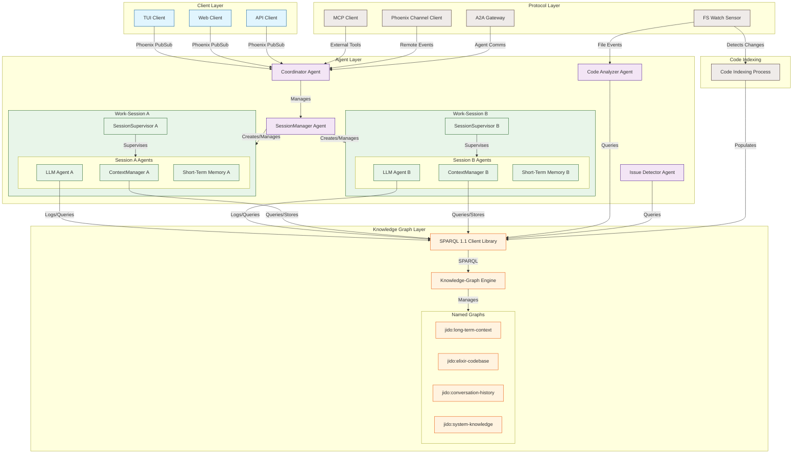

```mermaid
graph TD
    subgraph ClientLayer [Client Layer]
        TUI[TUI Client]
        Web[Web Client]
        API[API Client]
    end

    subgraph AgentLayer [Agent Layer]
        Coordinator[Coordinator Agent]
        SessionManager[SessionManager Agent]
        CodeAnalyzer[Code Analyzer Agent]
        IssueDetector[Issue Detector Agent]

        subgraph WorkSessionA ["Work-Session A"]
            SessionSupervisorA[SessionSupervisor A]
            subgraph AgentsA ["Session A Agents"]
                LLMAgentA[LLM Agent A]
                ContextManagerA[ContextManager A]
                STMA[Short-Term Memory A]
            end
        end

        subgraph WorkSessionB ["Work-Session B"]
            SessionSupervisorB[SessionSupervisor B]
            subgraph AgentsB ["Session B Agents"]
                LLMAgentB[LLM Agent B]
                ContextManagerB[ContextManager B]
                STMB[Short-Term Memory B]
            end
        end
    end

    subgraph KnowledgeGraphLayer [Knowledge Graph Layer]
        SPARQLClient[SPARQL 1.1 Client Library]
        KGEngine[Knowledge-Graph Engine]

        subgraph NamedGraphs ["Named Graphs"]
            LTC_Graph["jido:long-term-context"]
            EC_Graph["jido:elixir-codebase"]
            CH_Graph["jido:conversation-history"]
            SK_Graph["jido:system-knowledge"]
        end
    end

    subgraph ProtocolLayer [Protocol Layer]
        MCP[MCP Client]
        PhoenixChannel[Phoenix Channel Client]
        A2AGateway[A2A Gateway]
        FSWatch[FS Watch Sensor]
    end

    subgraph CodeIndexing [Code Indexing]
        CodeIndexingProcess[Code Indexing Process]
    end

    %% Client to Agent Layer
    TUI -->|Phoenix PubSub| Coordinator
    Web -->|Phoenix PubSub| Coordinator
    API -->|Phoenix PubSub| Coordinator

    %% Agent Layer Internal
    Coordinator -->|Manages| SessionManager
    SessionManager -->|Creates/Manages| WorkSessionA
    SessionManager -->|Creates/Manages| WorkSessionB
    SessionSupervisorA -->|Supervises| AgentsA
    SessionSupervisorB -->|Supervises| AgentsB

    %% Agent to Knowledge Graph Layer
    LLMAgentA -->|Logs/Queries| SPARQLClient
    LLMAgentB -->|Logs/Queries| SPARQLClient
    ContextManagerA -->|Queries/Stores| SPARQLClient
    ContextManagerB -->|Queries/Stores| SPARQLClient
    CodeAnalyzer -->|Queries| SPARQLClient
    IssueDetector -->|Queries| SPARQLClient

    SPARQLClient -->|SPARQL| KGEngine
    KGEngine -->|Manages| NamedGraphs

    %% Code Indexing to Knowledge Graph Layer
    FSWatch -->|Detects Changes| CodeIndexingProcess
    CodeIndexingProcess -->|Populates| SPARQLClient

    %% Protocol Layer to Agents
    MCP -->|External Tools| Coordinator
    PhoenixChannel -->|Remote Events| Coordinator
    A2AGateway -->|Agent Comms| Coordinator
    FSWatch -->|File Events| CodeAnalyzer

    %% Styling
    classDef clientStyle fill:#e1f5fe,stroke:#01579b
    classDef agentStyle fill:#f3e5f5,stroke:#4a148c
    classDef sessionStyle fill:#e8f5e9,stroke:#1b5e20
    classDef kgStyle fill:#fff3e0,stroke:#e65100
    classDef protocolStyle fill:#efebe9,stroke:#3e2723
    classDef ontologyStyle fill:#fce4ec,stroke:#880e4f,stroke-dasharray: 5 5

    class TUI,Web,API clientStyle
    class Coordinator,SessionManager,CodeAnalyzer,IssueDetector agentStyle
    class WorkSessionA,WorkSessionB,SessionSupervisorA,SessionSupervisorB,LLMAgentA,LLMAgentB,ContextManagerA,ContextManagerB,STMA,STMB sessionStyle
    class SPARQLClient,KGEngine,LTC_Graph,EC_Graph,CH_Graph,SK_Graph kgStyle
    class MCP,PhoenixChannel,A2AGateway,FSWatch,CodeIndexingProcess protocolStyle
```
