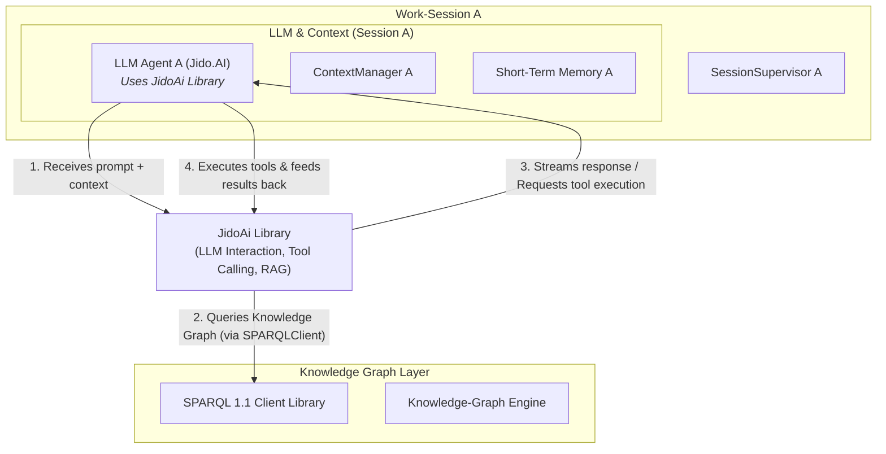

That's an excellent question. The `JidoAi` library, which provides AI algorithms and enhanced accuracy for Jido agents, is not a separate layer in our architecture but rather a **core library that powers the AI capabilities within our `LLMOrchestrator` agents**. It's the engine room for the "AI" part of our AI agents.

Think of it this way:
*   Our architecture defines the *skeleton* and *nervous system* of the application (agents, sessions, knowledge graphs, protocols).
*   The `JidoAi` library provides the *brain* for the `LLMOrchestrator` agents.

Here's how it integrates:

### 1. Primary User: The `LLMOrchestrator`

The `LLMOrchestrator` within each `Work-Session` is the main consumer of the `JidoAi` library. This agent is responsible for:

*   Receiving user prompts.
*   Building a rich, semantically-informed context (by interacting with the `ContextManager` and, through it, the Knowledge Graph Layer).
*   Interacting with the Large Language Model.
*   Executing tools based on the LLM's decisions.
*   Streaming responses back to the client.

The `JidoAi` library provides the sophisticated interface to perform these LLM-related tasks.

### 2. Key Responsibilities of `JidoAi` within `LLMOrchestrator`

When the `LLMOrchestrator` needs to process a user's request, it will delegate several key tasks to the `JidoAi` library:

*   **LLM Abstraction and Configuration**: `JidoAi` will handle the low-level communication with various LLM providers (like OpenAI, Anthropic, etc., likely via `ReqLLM`). The `LLMOrchestrator` will simply provide `JidoAi` with the desired LLM configuration (e.g., provider, model name, API key, temperature) for that specific session. `JidoAi` then manages the connection and request formatting.

*   **Tool Calling/Function Execution**: This is a critical capability. When the LLM decides it needs to use a tool (e.g., "read a file," "search the codebase"), `JidoAi` will be responsible for:
    1.  Parsing the LLM's structured output (e.g., a JSON blob specifying the tool name and arguments).
    2.  Invoking a callback in the `LLMOrchestrator` to execute the actual tool function (e.g., `CodingAssistant.Tools.ReadFile.run/2`).
    3.  Taking the result from the tool execution and feeding it back to the LLM in the correct format to continue its reasoning process.

*   **Advanced AI Algorithms**: The "AI algorithm for different purposes" mentioned in your initial prompt would be encapsulated within `JidoAi`. This could include:
    *   **Retrieval-Augmented Generation (RAG)**: `JidoAi` might have functions that the `LLMOrchestrator` can call to intelligently fetch relevant data from our Knowledge Graph Layer (the `jido:long-term-context` or `jido:elixir-codebase` graphs) before formulating the final prompt for the LLM.
    *   **Streaming and Output Handling**: `JidoAi` would manage the streaming of LLM responses, allowing the `LLMOrchestrator` to push real-time updates to the client via Phoenix PubSub.

### 3. Visualizing the Integration in the Architecture

While `JidoAi` doesn't become a new box in our Mermaid diagram, it's the underlying power source for the "LLM Agent" boxes.



### 4. Code-Level Interaction (Conceptual)

The `LLMOrchestrator` would initialize and use `JidoAi` like this:

```elixir
# In coding_assistant/agents/llm_orchestrator.ex
defmodule CodingAssistant.Agents.LLMOrchestrator do
  # use GenServer or Jido.Agent
  alias Jido.AI, as: JidoAI # Using the JidoAi library

  def start_link(opts) do
    session_id = Keyword.fetch!(opts, :session_id)
    llm_config = Keyword.fetch!(opts, :llm_config) # e.g., [provider: :anthropic, model: "..."]

    # Initialize the JidoAi client for this session's specific LLM configuration
    jido_ai_client = JidoAI.Client.new(llm_config)

    # ... start the GenServer, passing the client ...
    GenServer.start_link(__MODULE__, %{session_id: session_id, jido_ai_client: jido_ai_client, ...})
  end

  def handle_call({:process_prompt, prompt, initial_context}, _from, state) do
    # Define available tools that the LLM can call
    available_tools = CodingAssistant.Tools.list_tools_for_session(state.session_id)

    # Define a callback for JidoAi to interact with our agent
    ai_callbacks = %{
      on_tool_call: fn tool_name, arguments ->
        # This function is called by JidoAi when the LLM wants to use a tool
        result = execute_tool(tool_name, arguments, state) # Agent executes the tool
        JidoAI.Client.submit_tool_result(state.jido_ai_client, result) # Send back to LLM via JidoAi
      end,
      on_content_delta: fn delta ->
        # Stream content to client
        Phoenix.PubSub.broadcast(CodingAssistant.PubSub, "client.session.#{state.session_id}", {:llm_stream_chunk, delta})
      end
    }

    # Delegate the main AI interaction to JidoAi
    # JidoAi handles the complex back-and-forth with the LLM,
    # including RAG if configured, tool calling, and streaming.
    final_response = JidoAI.Client.chat(state.jido_ai_client, prompt,
      context: initial_context,
      tools: available_tools,
      callbacks: ai_callbacks
    )

    {:reply, final_response, state}
  end

  # ... helper functions like execute_tool/3 ...
end
```

In summary, `JidoAi` is the crucial library that empowers our `LLMOrchestrator` agents to be truly intelligent. It abstracts away the complexities of direct LLM interaction and provides the advanced algorithms needed for effective tool use and context-aware reasoning, making it a fundamental part of the `LLMOrchestrator`'s implementation.
