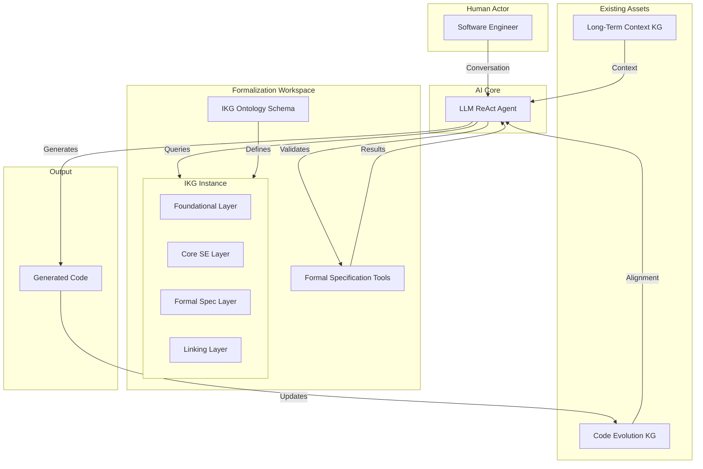

# Architecting Certainty: A Blueprint for an Ontology-Driven Intent Formalization and Code Generation System

The ambitious goal of creating an unsupervised coding assistant that faithfully translates a software engineer's intent into correct, maintainable code hinges on the ability to capture, formalize, and leverage that intent with unprecedented precision. Our previous research has highlighted the potential of a multi-layered Intent-Knowledge-Graph (IKG), built upon a sophisticated ontology that marries broad software engineering concepts with the rigorous semantics of formal specification languages. This IKG would serve as the "living blueprint" for an LLM operating within a ReAct (Reason and Act) framework, guiding its "Reasoning" phases and validating its "Actions" (code generation). To move from this conceptual vision towards a tangible system, a concrete architectural blueprint is essential. This architecture must delineate the key components, their responsibilities, and the intricate dance of data and control that enables an iterative, human-AI collaborative process of intent formalization and its subsequent translation into high-fidelity software artifacts. The following Mermaid diagram and its accompanying explanation detail such an architecture, aiming to operationalize the theoretical framework we've explored.

## The Architect's Vision: A Mermaid Blueprint for Intent-Driven Development

The proposed architecture visualizes a system where human expertise, artificial intelligence, formal methods, and knowledge representation converge to create a robust environment for intent-driven software development. It is designed around a central AI agent (an LLM with ReAct capabilities) that interacts with a dynamically evolving Intent-Knowledge-Graph (IKG), which is itself structured by a comprehensive, multi-layered IKG Ontology. This IKG serves as the single source of truth for the system's intended behavior, structure, and constraints, continuously refined through an iterative dialogue with a software engineer. The LLM agent leverages this formalized intent, along with existing project context and formal verification tools, to generate code that is not only syntactically correct but also semantically aligned with the engineer's vision, thereby actively mitigating code drift.

### Deconstructing the Architecture: Components and Collaborative Dynamics

This architectural blueprint is composed of several key subgraphs, each representing a critical aspect of the intent-driven development process. The power of the system lies not just in the individual components but in their orchestrated interaction, facilitated by the central LLM (ReAct Agent).

**Human Actor (Software Engineer):**
The Software Engineer is the initiator and ultimate arbiter of intent. They provide the initial, often informal, descriptions of the desired system, features, or behaviors. Their role is crucial in the iterative refinement loop, reviewing the LLM's interpretations, formalizations presented via the Conversation Interface (implicitly part of the LLM-SE interaction), and generated code, providing feedback and corrections. This human oversight ensures that the system remains aligned with genuine needs and leverages human intuition and domain expertise where AI capabilities reach their limits. The engineer doesn't need to be an expert in formal methods, as the LLM is designed to guide the formalization process, but their deep understanding of the problem domain is indispensable.

**AI Core (LLM as ReAct Agent):**
The LLM, operating as a ReAct Agent, is the engine of the system. It is not merely a passive code generator but an active participant in understanding, formalizing, and implementing the software engineer's intent. The "Reason" part of its cycle involves:
*   **Understanding Natural Language Input:** Interpreting the engineer's prompts, questions, and feedback.
*   **Querying Knowledge Graphs:** Retrieving relevant information from the IKG_Instance (current formalized intent), the LTKG (broader project or domain context), and the CEKG (current state of the codebase) to inform its actions.
*   **Formalization:** Guiding the engineer to refine informal requirements into precise formal constructs, mapping them onto the IKG_Ontology and populating the IKG_Instance.
*   **Planning:** Decomposing high-level goals into actionable steps for code generation, ensuring these steps are consistent with the formalized intent.
*   **Verification and Alignment:** Initiating checks for consistency within the IKG, using Formal Specification Tools, and comparing the generated code (via the CEKG) against the IKG to detect and correct drift.
The "Act" part of its cycle involves:
*   **Generating Formal Specifications:** Creating instances of formal constructs (e.g., Z schemas, TLA+ actions) within the IKG_Instance based on the dialogue with the engineer.
*   **Generating Code:** Producing source code that implements the formalized specifications.
*   **Updating Knowledge Graphs:** Populating or updating the CEKG with the newly generated code and its metadata.

**Formalization Workspace (The Heart of Intent Capture):**
This subgraph is where the engineer's intent is transformed into a rigorous, machine-actionable blueprint.
*   **Intent-Knowledge-Graph (IKG) Ontology Schema:** This is the pre-defined, multi-layered schema we discussed in our previous research. It provides the conceptual vocabulary, structural constraints, and semantic rules for the IKG_Instance. It integrates foundational ontologies (like UFO), core software engineering concepts (inspired by SEON), and formal specification constructs (drawn from parametric and deep ontologies for languages like Z, TLA+, Alloy). This schema ensures that the captured intent is not only well-structured but also semantically rich and amenable to formal analysis.
*   **Intent-Knowledge-Graph (IKG) Instance:** This is the actual, populated knowledge graph for a specific project. It is a concrete instance of the IKG_Ontology Schema. As the engineer and LLM converse, this graph is dynamically updated to reflect the evolving, formalized understanding of the system's intent. It contains instances of concepts like `FunctionalRequirement`, `SoftwareComponent`, `Operation` (with its `Precondition` and `Postcondition`), `Invariant`, `ArchitecturalPattern`, etc., all linked according to the rules defined in the IKG_Ontology. This graph is the "single source of truth" for what the system should be.
*   **Formal Specification Tools (e.g., TLC, Alloy Analyzer):** These are off-the-shelf or custom-built tools for formal analysis. The LLM can invoke these tools to check the consistency, completeness, or correctness of the specifications captured in the IKG_Instance. For example, it might ask TLC to check if a TLA+ specification (represented within the IKG) violates a liveness property, or use the Alloy Analyzer to find instances of a model that violate a structural constraint. The results (e.g., counterexamples) are fed back to the LLM and potentially to the engineer, guiding further refinement.

**Existing User Assets (Leveraging Project Context):**
These are pre-existing knowledge graphs provided by the user, which the system can leverage to enhance its understanding and context.
*   **Long-Term Context Knowledge Graph (LTKG):** This graph provides broad, enduring context about the domain, previous projects, common architectural patterns, or organizational standards. The LLM can query this graph during the initial phases of requirement elicitation and formalization to ensure that the IKG is consistent with this larger context.
*   **Code Evolution Knowledge Graph (CEKG):** This graph represents the actual codebase as it is being generated and evolves over time. It maps code artifacts (modules, functions, classes) to their dependencies, versions, and other metadata. This graph is crucial for the alignment checking process. The LLM can compare the CEKG against the IKG_Instance to detect "code drift" – discrepancies between the formalized intent and the implemented code.

**Output (Generated Code):**
This is the final product of the system: the source code generated by the LLM. This code is intended to be a direct, faithful implementation of the specifications captured in the IKG_Instance. As it is generated, it populates the CEKG, closing the feedback loop for continuous alignment.

### The Orchestration: A Dynamic Flow of Intent and Implementation

The arrows in the diagram depict the dynamic flow of information and control that makes the system work:
1.  **Iterative Conversation & Feedback (SE ↔ LLM):** The core human-AI interaction where intent is initially expressed, refined, and validated.
2.  **Queries & Updates IKG (LLM ↔ IKG_Instance):** The LLM continuously interacts with the IKG, reading the current state of formalized intent and updating it as new understanding is reached.
3.  **Defines Structure & Semantics (IKG_Ontology → IKG_Instance):** The IKG_Ontology provides the rigid framework that ensures the IKG_Instance is well-formed and semantically consistent.
4.  **Invokes for Validation/Analysis (LLM → FST) & Results/Counterexamples (FST → LLM):** The LLM leverages formal tools to rigorously check the developing specifications, using their output to improve quality and correctness.
5.  **Generates Code (LLM → GC):** Based on the formalized intent in the IKG, the LLM produces the actual software.
6.  **Populates/Updates (GC → CEKG):** The generated code is incorporated into the CEKG, representing the current state of implementation.
7.  **Used for Alignment/Drift Detection (CEKG → LLM):** The LLM continuously compares the implemented code (CEKG) against the formal intent (IKG_Instance) to identify and correct any deviations, ensuring fidelity.
8.  **Provides Context (LTKG → LLM):** The LTKG offers broader contextual information to the LLM, aiding in more informed and relevant formalization and code generation.

This architecture, therefore, is not just a static diagram but a representation of a dynamic, feedback-driven process. It aims to create a virtuous cycle where human intent is progressively formalized, this formalization is rigorously validated, and the resulting specifications guide the generation of code that is continuously checked against the original intent. This holistic approach promises to significantly elevate the reliability, maintainability, and trustworthiness of AI-assisted software development.

## Navigating the Labyrinth: Practical Implications and Future Trajectories

The architectural blueprint for an ontology-driven intent formalization and code generation system, while conceptually robust, presents a landscape rich with both practical challenges and profound future implications for the field of software engineering. Realizing this vision is not merely a matter of assembling existing technologies but involves navigating complex integration hurdles, advancing the state of AI reasoning, and rethinking traditional development workflows. The successful deployment of such a system would mark a paradigm shift, moving software creation from a predominantly craft-based activity towards a more engineering discipline, underpinned by formal specifications and machine-assisted rigor. The journey from blueprint to reality will be iterative, requiring focused research, development, and a willingness to embrace new ways of human-AI collaboration.

One of the most immediate practical challenges is the **integration and interoperability** of the diverse components. The architecture presupposes a seamless interaction between an LLM, various knowledge graph technologies (for IKG, LTKG, CEKG), and a suite of formal specification tools (e.g., TLC for TLA+, Alloy Analyzer, Isabelle/HOL). Each of these components has its own data formats, APIs (or lack thereof), and operational semantics. Creating a robust, efficient, and scalable middleware or framework that allows the LLM to effectively query and update knowledge graphs, and to invoke formal tools in a standardized way, is a significant engineering undertaking. This might involve developing new adapters, standardized ontological interchange formats, or even custom-built formal tools that are designed from the ground up for AI interaction. The LLM itself needs to be "tool-aware," possessing not just the knowledge of how to use these tools but also the ability to interpret their often complex output (e.g., counterexample traces from a model checker) and translate it into actionable insights for refining the IKG or the generated code.

The **development and curation of the IKG Ontology Schema** is another substantial hurdle. While our research points to leveraging existing ontologies like SEON [[3](https://nemo.inf.ufes.br/wp-content/uploads/2016/10/SEON_A-Software-Engineering-Ontology-Network-Ruy-et-al.-2016.pdf)] and principles from formalism-oriented ontologies [[40](https://www.sciencedirect.com/science/article/pii/S0167642324001540), [46](https://www.lri.fr/~wolff/papers/conf/2023-ABZ-ontologies.pdf)], the task of weaving these into a single, coherent, and comprehensive schema specifically tailored for LLM-driven intent capture is novel. This schema must be expressive enough to capture the nuances of various formal languages yet structured and intuitive enough to be populated and navigated by an LLM through interaction with a software engineer. This is not a one-time effort but an ongoing process of refinement, requiring contributions from ontology engineers, formal methods experts, and software engineers. The development of libraries of reusable ontology patterns for common software constructs (e.g., authentication modules, data access layers, state machines) will be crucial for making the system practical and efficient.

The **capabilities and reliability of the LLM** itself are central to the system's success. While current LLMs are powerful, their application in this context demands a higher level of reasoning precision, consistency, and adherence to formal constraints than is typically required for more generative tasks. The LLM must be able to understand and manipulate complex ontological structures, generate syntactically and semantically correct formal specifications, and interpret the results of formal analysis. This will likely necessitate advancements in LLM architectures, training methodologies (potentially involving fine-tuning on large corpora of formal specifications and ontologies), and prompting strategies tailored for formal reasoning. The issue of LLM "hallucinations" or plausible but incorrect generation is particularly acute in a formal context; rigorous validation mechanisms, both through formal tools and human oversight, will be paramount. The development of more sophisticated "ReAct" loops, perhaps incorporating formal proof assistants as core components of the reasoning process, could be a future direction.

The **human-AI interaction paradigm** also needs careful consideration. The goal is to make formal specification accessible to engineers who may not be experts in formal methods. This requires intuitive interfaces for visualizing and navigating the IKG, for providing feedback, and for understanding the LLM's reasoning and the results of formal analyses. The LLM must act as an intelligent collaborator, not just a command interpreter. It should be able to ask clarifying questions, suggest alternative formalizations, explain complex formal concepts in accessible terms, and guide the engineer through the process of refining their intent. This involves not just technical UI/UX design but also a deep understanding of human cognition and communication in collaborative problem-solving.

Despite these challenges, the potential long-term implications of such a system are transformative. If successful, it could dramatically increase the **reliability and correctness** of software by embedding formal methods deeply into the development lifecycle from its earliest stages. The "code drift" problem could be largely mitigated, ensuring that software remains true to its original, formally verified intent. This could lead to a significant reduction in software defects, security vulnerabilities, and maintenance costs. The **productivity of software engineers** could be greatly enhanced, as they are freed from much of the tedious aspects of implementation and can focus on higher-level design and problem-solving, with the AI handling the translation of formalized intent into code. This could also make complex software systems more accessible to a broader range of developers, as the AI assistant helps manage the formal complexity.

Furthermore, such a system could revolutionize **software maintenance and evolution**. The IKG, serving as a complete, formal record of the system's intent and design rationale, would be an invaluable asset for understanding and modifying existing code. Changes to requirements could be formally incorporated into the IKG, and the AI assistant could then help identify the parts of the codebase that need to be updated and even propose modifications, ensuring that the evolved system remains consistent with its new intent. This could also greatly facilitate **impact analysis**, allowing engineers to understand the potential consequences of a proposed change before it is implemented.

The vision also extends to **education and training**. An AI assistant capable of guiding engineers through the process of formalizing intent could serve as a powerful tool for teaching formal methods and software design principles, making these important topics more accessible to a wider audience. It could help bridge the gap between theoretical computer science and practical software development.

In conclusion, the architectural blueprint presented, while ambitious, charts a course towards a future where software development is characterized by unprecedented levels of precision, reliability, and human-AI synergy. The path to realizing this vision is fraught with technical and conceptual challenges, but the potential rewards—a new era of software engineering where intent is paramount and formal rigor is seamlessly integrated—are profound. The journey will require a concerted effort from researchers and practitioners across multiple disciplines, but the destination—a world where software is not just built, but *provably correct* and *faithfully aligned* with human needs—is a goal worth pursuing.

# References

[3] Fabiano Borges Ruy, Ricardo de Almeida Falbo, Monalessa Perini Barcellos, Simone Dornelas Costa, Giancarlo Guizzardi. SEON: A Software Engineering Ontology Network. https://nemo.inf.ufes.br/wp-content/uploads/2016/10/SEON_A-Software-Engineering-Ontology-Network-Ruy-et-al.-2016.pdf.

[40] AD Brucker. Parametric ontologies in formal software engineering. Science of Computer Programming. https://www.sciencedirect.com/science/article/pii/S0167642324001540.

[46] Wolff, S. Using Deep Ontologies in Formal Software Engineering. ABZ 2023: 8th International Conference on Abstract State Machines, Alloy, B, TLA, VDM, and Z. https://www.lri.fr/~wolff/papers/conf/2023-ABZ-ontologies.pdf.
